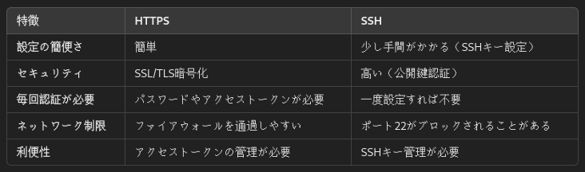
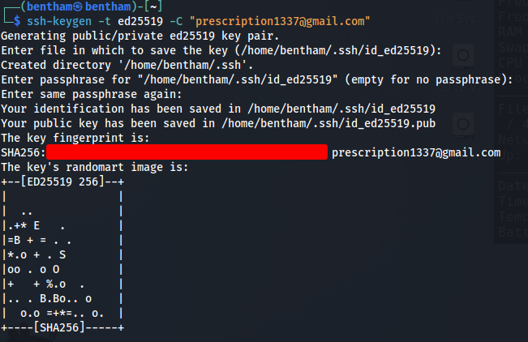
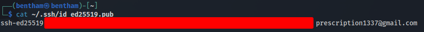
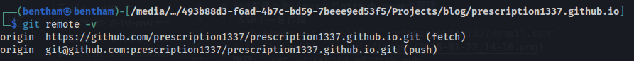
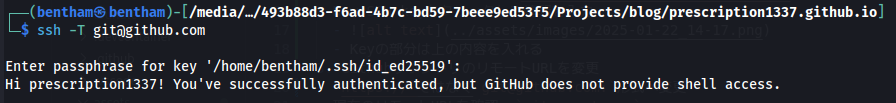

# SSHを使ったLinuxからgithub pageの管理
- LinuxのPCでも共通のgithub repositryを管理したいので、設定する。
- WindowsはHttpsでリポジトリにアクセスしているので、LinuxではSSHでのアクセスを試す。
- アクセス別の違い:
  - 
  - HTTPS を使う場合:
    - 初期設定が簡単で、SSHのセットアップが面倒だと感じる場合
    - 公共のWi-Fiや企業ネットワークなど、ファイアウォールで制限されている場合でも動作する可能性が高い
  - SSH を使う場合:
    - セキュリティを重視し、パスワードやトークンの入力を避けたい場合
    - 自分のローカル環境に安全な認証方法を確立したい場合や、作業効率を重視する場合
## 手順
1. SSHキーを作成
- `ssh-keygen -t ed25519 -C "prescription1337@gmail.com"`
  - 
- 確認: `cat ~/.ssh/id_ed22519.pub`
  - 
2. Githubにsshキーを登録
- Githubのキー管理に移動: `https://github.com/settings/keys`
- New SSH keyをクリックして情報を入力
  - 
  - Keyの部分は上の内容を入れる
3. GithubリポジトリのリモートURLを変更
- `https://`ではなく`git@github.com:`形式へ変更
- 現在のリモートURLを確認: `git remote -v`
  - もしHTTPSになっている場合（例: https://github.com/username/repository.git）、以下のようにSSH形式に変更
    - `git remote set-url origin --push git@github.com:prescription1337/prescription1337.github.io.git`
- 確認: `git remote -v`
  - 
4. SSH接続の確認
- SSH接続が正しく動作するか確認: `ssh -T git@github.com`
- 成功例：
  - 
5. 更新
- 現在のディレクトリ（およびそのサブディレクトリ）のすべての変更されたファイルをステージ（追加）する: `git add .`
- 変更を履歴として記録: `it commit -m "commitメッセージ"`
- ローカルリポジトリの変更をリモートリポジトリに反映させる: `git push origin main`