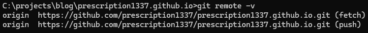

# SSHを使ったLinuxからgithub pageの管理
- LinuxのPCでも共通のgithub repositryを管理したいので、設定する。
- WindowsホストではHTTPSで、LinuxホストではSSHを使ってGit操作: ホストごとに使うプロトコルを設定。
- アクセス別の違い:
  - 
  - HTTPS を使う場合:
    - 初期設定が簡単で、SSHのセットアップが面倒だと感じる場合
    - 公共のWi-Fiや企業ネットワークなど、ファイアウォールで制限されている場合でも動作する可能性が高い
  - SSH を使う場合:
    - セキュリティを重視し、パスワードやトークンの入力を避けたい場合
    - 自分のローカル環境に安全な認証方法を確立したい場合や、作業効率を重視する場合
## 手順

- ステップ
  1. SSHキーを作成
      - `ssh-keygen -t ed25519 -C "prescription1337@gmail.com"`
          - 
      - 確認: `cat ~/.ssh/id_ed25519.pub`
          - 
  
  2. GithubにSSHキーを登録
      - Githubのキー管理に移動: [GitHub SSHキー設定](https://github.com/settings/keys)
      - "New SSH key"をクリックして情報を入力
          - 
          - Keyの部分には上記の公開鍵の内容を入力
  
  3. GithubリポジトリのリモートURLを変更
      - `https://`ではなく`git@github.com:`形式へ変更
      - 現在のリモートURLを確認: `git remote -v`
      - もしHTTPSになっている場合（例: https://github.com/username/repository.git）、以下のようにSSH形式に変更
          - `git remote set-url origin git@github.com:prescription1337/prescription1337.github.io.git`
      - 確認: `git remote -v`
          - 
      - fetch(pull)がHTTPSを利用しているので、変更
          - `git remote set-url origin git@github.com:prescription1337/prescription1337.github.io.git`
      - 再度確認: `git remote -v`
          - 
      - ちなみにwindowsで同じように確認するとhttps利用になっている
          - 
  
  4. SSH接続の確認
      - SSH接続が正しく動作するか確認: `ssh -T git@github.com`
      - 成功例：
          - 
  
  5. 更新
      - 現在のディレクトリ（およびそのサブディレクトリ）のすべての変更されたファイルをステージ（追加）する: `git add .`
      - 変更を履歴として記録: `git commit -m "commitメッセージ"`
      - ローカルリポジトリの変更をリモートリポジトリに反映させる: `git push origin main`

