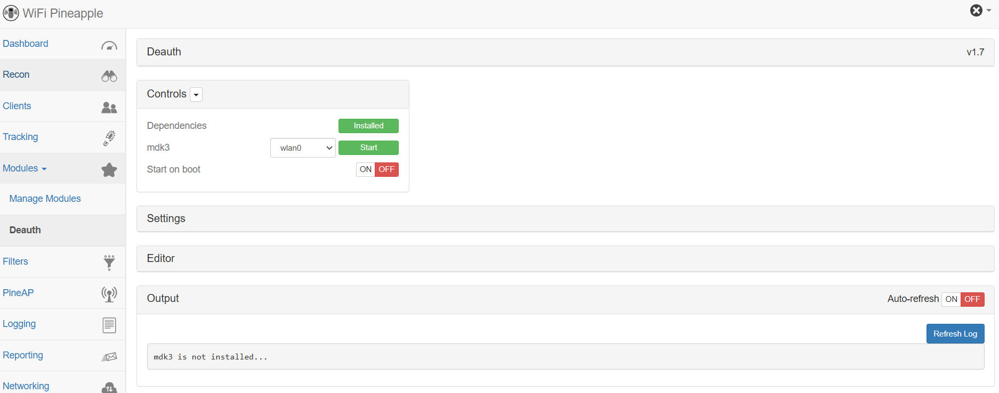

# WifiルーターをHak5のWiFi Pineappleへ

背景：
- WiFi Pineappleを試したかった。
- DIY決定。

ボトルネック:
- 今回使用する`MANGO GR-MT300N-V2`は日本でもグローカルネット社より出ているが、そちらでは要件を満たしていない可能性があったためGL.iNet社のデバイスを輸入。
- wifiアダプター`RT5370`では2.4Gしか対応できないため、`RT5572`を購入。（githubで互換性は確認済み）

結果：
- 成功

所感：
- かなり簡単にクローンの作成が出来た。
- 18000円 → 10117円 なのでコスパが良い。

課題：
- WiFi Pineappleで出来ることを実践の中で把握していく。

諸経費:  

| 品名              | 値段 | 到着まで | 備考                             |  
|------------------|--------|----------------|----------------------------------|  
| RT5572 (x2)         | 4947   | 11日         | No 5GHz channels 52–136 though |  
| GL-MT300N V2    | 3855   | 7日            |                                  |  
| USB Hub         | 474    | 0日            |                                  |  
| USBメモリ (16GB) | 841    | 0日            | 16GB                             |  
| **合計**        | **10,117** | -              |                                  |  

## 作成方法
- ステップ
  1. 使うデバイスの用意
  2. ファームウェアのダウンロード
      - `GL-MT300N v2 19.07.7`を選択してダウンロード
      - [wifi-pineapple-cloner-builds](https://gitlab.com/xchwarze/wifi-pineapple-cloner-builds)
  
  3. OpenWrtファームウェアのダウンロード
      - `GL-MT300N v2 19.07.7`を選択してダウンロード
        - [OpenWrt](https://firmware-selector.openwrt.org/)
          - 
  
  4. ファームウェアをルータにフラッシュ
      - Recovery Modeにする
        - LANケーブルでPCとルータを接続→Resetボタンを長押し→その状態でUSBケーブルでPCとルータを接続。
        - ルータにある3つのランプで左と真ん中が点灯状態になるまで待つ。
      - OpenWrtをフラッシュ
        - Windows 11（日本語環境）で「ネットワーク接続（Network Connections）」を確認
          - [コントロールパネル] → [ネットワークとインターネット] → [ネットワークと共有センター] → 左側のメニューから [アダプターの設定の変更] をクリック
        - Wifiの接続を切る
        - デバイスと接続しているイーサネットを選択 → プロパティ → IPV4を選択 → `192.168.1.2`と入力 → サブネットマスクは自動で入力される
        - `192.168.1.1`に接続 → ダウンロードしたOpenWrtファームウェアをアップロード → 3分ほど待つ → ルータの真ん中以外が点灯の状態になれば完了
          - 
          - 
      - Pineapple イメージをフラッシュ
        - もう一度`http://192.168.1.1/`にアクセス → `http://192.168.1.1/cgi-bin/`に進むのでパスワードを設定
          - 
        - System → Backup / Flase Firmware → 最下層まで行ってcloneのファームウェアをアップロード → keysettingのクリックを外してもう一度アップロードし3分待つ → ルータのランプ3つが点灯状態になれば完了（一番右は点滅状態で大丈夫）
          - 
  
  5. WiFi Pineappleを設定
      - 4.で設定したIPV4の設定を戻す
        - IP アドレスを自動的に取得する と DNSサーバーのアドレスを自動的に取得する にチェックを入れる
      - `172.16.42.1:1471`に接続するとWiFi Pineappleのインターフェースに入れる
          - 
      - `Get Started`をクリック。さらに進むとWifiの設定に行くので、デバイスにWifiアダプター`RT5370`を付けて、Resetボタンを一回押す。成功するとPopupが消えて設定画面へ。
      - Root Passwordなどを動画のように設定しCompleteをクリック → ルートでログイン
          - 
      - Reconなどで試してみる。
          - 

## Upgrade

- wifiアダプターのチップセットの確認 (2つ)：
  - Advanced >> USB & Storage: RT5572
    - 
  - Networking >> airmon-ng
    - 
- Setup (factory reset)
  - wifi adapter x2, usb hub, usb flash memory を装着
  - Configuration >> Factory Reset Pineapple
  - 全てのライトが点滅するまで待機 → dashboardでpopupが出たら進む → resetボタンを一度押す → Device Configurationを入力(動画を参照) → ログイン
- Internet & Missing Packages
  - Reconでlive scanが出来ない(Start → Stop → Loadが煩雑)
  - Live Reconするにはインターネットへのアクセスが必要なので接続する。
    - Networking → wlan2 → 自分のホームwifiで接続: 接続確認がGUI上で出来ない（バグ）
    - `ssh root@Pineapple`で接続しネットに接続しているか確かめる: `ping google.com`
      - 
    - Dashboard でNewsのロードも出来るはず。
  - 接続を確認したらMissing Packagesをインストール
    - usbドライブをフラッシュ: `wpc-tools format_sd`
    - フラッシュドライブのディレクトリへ: `cd /sd/`
    - サブディレクトリを全て削除: `rm -r *`
    - 1つ前のディレクトリに戻る: `cd ../`
    - Missing Packagesをインストール: `wpc-tools missing_packages`
  - Live Reconの確認: 成功
  - Scan Location の場所(スキャンの結果をusbに保存出来るように)を変更: `/sd/`
- Moduleをインストールしてさらにアップグレード（インストール方法を確認するのみ。）
  - Modules >> Get Modules でモジュールリストを取得(各モジュールの利用方法など:  [Study with WiFi Pineapple \| Prescription](https://prescription1337.github.io/posts/Study-with-WiFi-Pineapple/))
  - Deauthをインストール：install >> SD Card(USB)を指定。Module >> Deauth >> DependenciesをSD Card(USB)へインストール。
    - 
  - Evil Portalをインストール：同じ要領
  - 確認
    - 
- The OUI(Organizationally Unique Identifier) Database
  - Networking >> OUI Lookup >> Download 
  - MAC Addressの前半がOUIであり、デバイスの製造元を表している
  - 
  - 実践：Recon >> OUIを確認
- Custom Reset Button Actions: Configuration >> Button Script
  - Resetボタンを押した時のScriptで変更可能。
- Wireless Management via the Management AP
  - 器機の設定が終わったら有線接続から無線に変更しておく。
  - 最初のセットアップが完了したら、PCやスマホを Pineapple_Management にWi-Fi接続することで、今後はLAN接続なしでweb uiから管理できるようになる。
  - WiFi Pineapple は Management AP（管理用Wi-Fi） を作成しており、PCやスマホが このSSID（Pineapple_Management）に接続すると、Pineapple に直接アクセスできるネットワークが構成される。
  - 通常のLAN接続時（初回セットアップ時）
    - PC から USB-C Ethernet で Pineapple に接続
    - http://172.16.42.1:1471 で Web UI にアクセス
    - Wi-Fi（Pineapple_Management）経由の管理
  - PCやスマホを Pineapple_Management にWi-Fi接続
    - http://172.16.42.1:1471 で Web UI にアクセス
    - LAN接続なしでも、WiFi Pineapple を操作できる
  - ポイント: Pineapple_Management は 通常のWi-Fiルーターのように「インターネット」に接続しているわけではない ため、「No Internet, Secured」 と表示されるが、Pineapple の Web UI にはアクセス可能。

## 実験

-  [Study with WiFi Pineapple \| Prescription](https://prescription1337.github.io/posts/Study-with-WiFi-Pineapple/)

## 参照: 
- [Build a $23 Wi-Fi Pineapple in 6 Minutes — EASIEST Method! - YouTube](https://www.youtube.com/watch?v=udnxagkSzoA)
- [Upgrading the $23 Wi-Fi Pineapple for Maximum Hackability! - YouTube](https://www.youtube.com/watch?v=pHtpso21P0o)
- [github wifi-pineapple-cloner](https://github.com/xchwarze/wifi-pineapple-cloner)