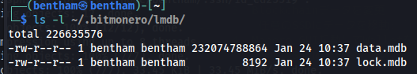

# LinuxにMonero Full Nodeを構築
背景
- Windowsメインホストの容量の枯渇。
- LinuxでCrypto系はすべて管理したかった。

## 導入と設定

1. ダウンロード  
   [Monero GUI Wallet](https://www.getmonero.org/downloads/#gui)

2. 解凍してフォルダに移動してインストール: `.\monerod`  
   Blockchainデータ(60GB~)の保存場所はデフォルトでルートディレクトリに保存される(`~/.bitmonero/lmdb/`)  
   24hほどかかった。  
     

3. Blockchainデータを変更  
   任意のSSDにデータを移動: `mv ~/.bitmonero /media/...`

4. Monero GUI起動してWalletを作成  
   シードの情報などを紙に書いて保存  
   Blockchain location(ブロックチェーンの保存場所)の設定画面で3で移動した場所を選択: `/media/.../.bitmonero`

5. 不要になったデータの削除: `rm -rf ~/.bitmonero`

6. シンボリックリンクを作成して起動準備
   わざわざ実行ファイルのある場所まで移動するのが面倒。
   `sudo ln -s /media/bentham/SSD1/Monero/monero-gui-v0.18.3.4/monero-wallet-gui /usr/local/bin/monero-wallet-gui`
- 仕組み:
   - シンボリックリンク作成:
      - `/usr/local/bin/monero-wallet-gui`にシンボリックリンクを作成した。
   - `/usr/local/bin/`:
      - この場所はシステムの PATH に含まれていて、実行可能なコマンドを探す場所。
   - `PATH`環境変数:
      - シェルがコマンドを実行するために参照するディレクトリのリスト。
   - コマンド実行の流れ:
      - ターミナルで monero-wallet-gui を入力。
      - シェルは PATH に含まれるディレクトリを順番に検索。
      - `/usr/local/bin/monero-wallet-gui`を見つけて、リンク先の実行ファイルを実行。

参考：
- [Linux Monero GUI Wallet With Full Node Tutorial](https://www.youtube.com/watch?v=8hrWaDVfqOU)
- [How Monero Users Get Traced (RUN YOUR OWN NODE!)](https://www.youtube.com/watch?v=WkphgF6Hn4w)

