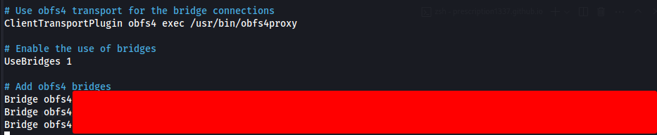

# LinuxにBitcoin Full NodeをBitcoin Knotsで構築

背景
- BTCは匿名性が低いことはなんとなく知っていた。
- 匿名性かつセキュアな環境でBTCを管理したかった。

所感
- Bridge導入でめちゃくちゃハマった。
- Sparrow Walletのクッキー生成でハマった。rpcの設定を`bitcoin.conf`で設定されているとbitcoin knotのクッキーが生成されない。
- これでBTCもかなり匿名性の高い方法で管理と取引ができるようになった。

課題
- Bisqの設定を見直し匿名性を上げる

---

## 導入手順
### 1. ダウンロード  
必要な依存関係のインストール:
```bash
sudo apt-get update
sudo apt-get install build-essential libtool autotools-dev automake pkg-config bsdmainutils python3
```

### 2. ライブラリのインストール
```bash
sudo apt-get install -y libevent-dev libboost-dev  # イベントライブラリ & ブーストライブラリ
sudo apt-get install libzmq3-dev  # ZMQライブラリ
sudo apt install systemtap-sdt-dev  # USDTライブラリ
sudo apt-get install -y qtbase5-dev qttools5-dev qttools5-dev-tools qtwayland5  # GUIサポート
sudo apt-get install -y libqrencode-dev  # QRコード生成ライブラリ（オプション）
```

### 3. GitHubからBitcoin Knotsのソースコードをクローン
```bash
git clone https://github.com/bitcoinknots/bitcoin.git
cd bitcoin
```

### 4. ビルドの構成と実行
```bash
./autogen.sh #ビルドシステムの初期化
./configure
make
```

#### エラー対処
`make: *** No targets specified and no makefile found. Stop.` の場合:
```bash
sudo apt-get install librsvg2-bin  # rsvg-convertのインストール
make  # 再実行
```

ビルド成功の確認:
```
Nothing to be done for 'all'
Nothing to be done for 'all-am'
```

### 5. ブロックチェーンの同期開始
```bash
./src/bitcoind -datadir=/media/bentham/SSD2/BTC/full_node_data
tail -f /media/bentham/SSD2/BTC/full_node_data/debug.log  # 進捗ログ確認
```
約12時間前後で完了。

### 6. 起動方法の変更
`nano ~/.bitcoin/bitcoin.conf` に以下を追加:
```
datadir=/media/bentham/SSD2/BTC/full_node_data
```
起動コマンド:
```bash
bitcoin-qt
bitcoind
```

- 
- 

---

## セキュアな設定

### 1. RPCのセキュリティ強化(RPCを利用するなら。今回はクッキーでの認証のためコメントアウトでよい)
設定ファイルを編集:
```bash
nano ~/.bitcoin/bitcoin.conf
```
以下を追加:
```bash
rpcuser=yourusername
rpcpassword=yourstrongpassword
rpcbind=127.0.0.1 #ローカルネットワークだけにアクセスを許可
```

### 2. ノードのセキュリティ強化
最大接続数の制限:
```bash
nano ~/.bitcoin/bitcoin.conf
maxconnections=50
```

### 3. 匿名性の強化
Torを使用した通信の匿名化:
```bash
proxy=127.0.0.1:9050
bind=127.0.0.1
listen=1
discover=1
dnsseed=0
onlynet=onion
```
Torの起動:
```bash
tor
bitcoin-qt
```

- 

#### Bridgeの設定 (ハマった)
1. [Tor公式サイト](https://bridges.torproject.org/) でobfs4ブリッジを取得。
2. [ブリッジのチェック](https://metrics.torproject.org/rs.html)
3. `nano /etc/tor/torrc` を編集し、取得したブリッジを追加。
- 
4. obfs4proxyをインストール:
```bash
sudo apt install obfs4proxy
```

Torの起動方法:
```bash
sudo systemctl start tor@default.service
```
- 


注意
- 通常の起動では使えるブリッジを設定しても接続できなかった: `tor`も`sudo systemctl start tor`不可。
- tor-browserでbuilt-in bridgeもカスタムブリッジも接続不可。
- windowsのPCで試すと、tor-browserでのブリッジ成功した。← 謎
`sudo systemctl status tor@default.service`: この起動方法でのみ成功した。


```bash
sudo systemctl status tor@default.service  # Tor起動確認
bitcoin-qt
```

---

## Sparrow Wallet導入
- Sparrow Wallet ダウンロード: [Download](https://sparrowwallet.com/download/)
- インストール: `sudo dpkg -i sparrow_2.0.0-1_amd64.deb`
-  `nano ~/.bitcoin/bitcoin.conf `修正
- 
- [Prerequistes](https://sparrowwallet.com/docs/connect-node.html#prerequistes)
- 起動: ` /opt/sparrow/bin/Sparrow`
※上記を起動前に`sudo systemctl status tor@default.service `と`bitcoin-qt`でフルノードをtorと接続しておく。
- 最初にwalletを作成。その後にどのようにfull nodeと接続するかを設定する。
   - クッキー利用
   - RPC利用
- full nodeが入っている場所と同じローカル環境で管理する場合はcookieによる認証が最も安全。今回はこの方法を利用する。
- 
- RPCを利用して認証したい場合: `nano ~/.bitcoin/bitcoin.conf `を修正する必要がある。
- RPCは他のデバイスや他のネットワークの範囲を指定したりもできるので柔軟性が高い設定ができるが、今回はローカルのみで最もセキュアな設定。
- 
※ハマった点: RPCを`nano ~/.bitcoin/bitcoin.conf `に設定した状態でフルノード動かしてもcookieファイルが生成されずにエラーが出る。
- 最後にwalletとfull nodeの接続にtorを使うかどうかを選択できる(Use Proxy)。
- 今回すでにfull nodeをBridgeを使ったtorの上で動かしているので、わざわざWalletをtorを通してfull nodeに接続する意味があまりない。
- しかもSparrow Walletの仕様上他の外部アドレスへの接続にはプロキシを使用されると公式にある。なので設定しない。しかしtorとwalletの接続は確認できた。
```bash
You can also configure a Tor proxy. Sparrow won’t use the proxy to connect to Bitcoin Core unless you specify a .onion address in the URL. But, it will use the proxy for all other external addresses, such as fetching exchange or fee rates. Although connecting to Bitcoin Core over Tor is possible, it is fairly slow. Consider using a private Electrum server instead if you need to connect over Tor.
```
- 
- 成功
- 
## 理解促進

### RPC (Remote Procedure Call) とは？
- ノードに対してブロックやトランザクション情報を取得したり、送金を行ったりする仕組み。
- 外部のコンピュータからも操作可能。
- 例:
  ```bash
  bitcoin-cli -rpcuser=yourusername -rpcpassword=yourstrongpassword getblockcount
  ```

---

## 参考
- [Bitcoin Knots GitHub Build Guide](https://github.com/bitcoinknots/bitcoin/blob/27.x-knots/doc/build-unix.md)

