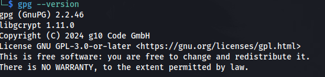
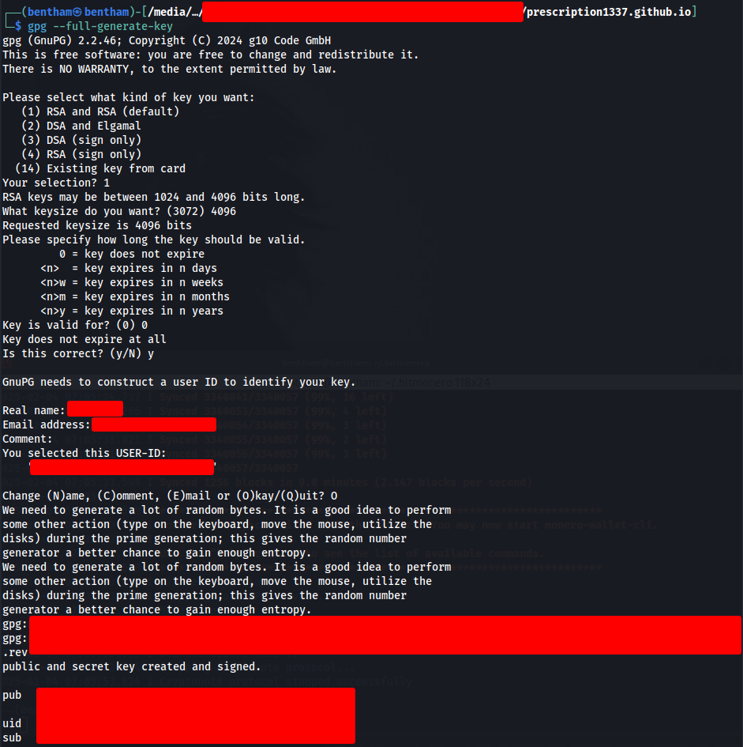
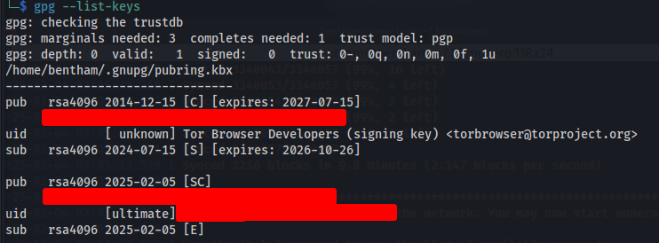
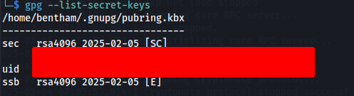
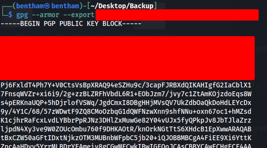

# PGP鍵の作成

背景
- あるサイトのアカウント登録に必要だった
- 第三者と匿名性の高い連絡手段を確保したかった

結果
- 成功

所感
- Kali にはGnuPGがプリインストールされているので楽

## 作成手順

- バージョンの確認: `gpg --version`
- 
- 新しいキーの作成: `gpg --full-generate-key`
- オプションとユーザー情報を指定: 
- 
- PGPキーの確認
- 作成したキーのリストを表示: `gpg --list-keys`
- 
- 秘密鍵も含めて確認する場合: `gpg --list-secret-keys`
- 
- 開鍵のエクスポート: `gpg --armor --export "your@email.com" > public_key.asc`
- ファイル public_key.asc が生成され、これを送ることで他者が暗号化通信に使用できる
- 秘密鍵のバックアップ: `gpg --armor --export-secret-keys "your@email.com" > private_key.asc`
- この private_key.asc は絶対に他人に渡さず、安全に保管
- 公開鍵の表示: `gpg --armor --export <自分のキーID>`
- 
- これで出てきたテキストが公開鍵なのでアカウント登録で使う

参照:
- [PGP - Wiki] (https://ja.wikipedia.org/wiki/Pretty_Good_Privacy)
