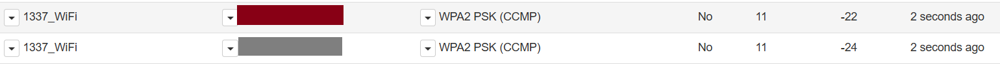

# Evil Twin Attack

所感: 
- WiFi Pineappleの仕様でアダプターが認識されなかったり、Access Point(AP)が表示されなかったりで少し時間がかかった。
- 公共のフリーWiFiに模したAPを作成して、認証情報を奪取するのは容易。

結果: 
- **成功**

課題: 
- ダウンロードしたカスタムポータルは英語なので、日本で利用するには自分でログインページを作成する必要がある。
- さらに実践を想定した実験を繰り返す。

## Evil Twin Attackとは

- **概要:** 正規のWiFiと同じSSIDの偽WiFiを作成し、ターゲットを接続させる。
- **目的・用途:** 認証情報の窃取、MITM攻撃。
- **使用モジュール / ツール:** Evil Portal, Occupineapple。

## 実行環境

- **ターゲット:** PoketWiFi (SSID: 1337_WiFi)
- **ターゲットに接続しているデバイス:** Android スマホ
- **Laptop (Windows):** WiFi Pineappleとの接続とWebUI操作
- **Laptop (Kali):** PW Crack用
- **WiFi Pineapple**

## ステップ
1. ターゲットWiFiの情報収集 → **Recon モジュール**
2. 偽のWiFi（Evil Twin）を作成 → **Networking モジュール**
3. ターゲットを Deauth 攻撃で切断 (公共WiFi利用の場合はスキップ) → **Deauth モジュール**
4. 偽のログインページを表示 & クライアントが入力した認証情報を取得 → **Evil Portal モジュール**

## 実践_01: 公共のオープンなFree WiFiを想定（テスト）

### 1. ターゲットWiFiの情報収集

- WiFi Pineapple の Web インターフェース にアクセス（172.16.42.1:1471）。
- **Recon:** スキャンを実行 し、ターゲットの WiFi 情報を取得。
   - **SSID（ネットワーク名）:** 1337_WiFi
   - **BSSID（MACアドレス）:** C0:5B:12:1E:88:DF
   - **チャンネル:** 6
        

### 2. 偽のWiFi（Evil Twin）を作成

- **現在のネットワーク設定:**
   - **wlan1:** Mode: Managed
   - **wlan0-1:** Mode: Master
   - **wlan2:** Mode Managed (ESSID: "接続先のWiFi SSID") → これは UI Networking → WiFi Client Mode で接続済。
- **SSID をターゲットと同じにする**（例：Free WiFi → Free WiFi）。
- **チャンネルを合わせる**（ターゲットAPと同じチャンネルに設定）。
   - **ターゲットがPW付きのWiFiなら** Management SSID を変更: Disable Open SSID チェック
   - **ターゲットがPW無しの公共WiFiなら** Open SSID を変更: Disable Management AP をチェック。
        

### 3. ターゲットを Deauth 攻撃で切断: スキップ

- **Deauth モジュール を開く。**
- ターゲットWiFiを選択（BSSIDを指定）。
- ターゲットのクライアントを選択（MACアドレスを指定）。
- Deauth 攻撃を開始。

### 4. 偽のログインページを表示

- **Evil Portal モジュール を開く。**
- **Basic を試す**
   - **Work Bench → Basic → Create New Portal**
   - **Controls → Captive Portal → Start**
   - **Activate**
   - スマホで設定した偽のWiFiをタップ。
   - **「WiFiネットワークにログインしてください」の通知が出る → Basicのデフォルトログイン画面が表示される。**
   - **Authorize を押すとWiFiに接続。**
   - **Modules → ConnectedClients で確認。**
      
      


- **カスタムログインページ を試す**
   - ダウンロード: [kleo/evilportals - Github](https://github.com/kleo/evilportals)
   - Googleログインページをテストするので、フォルダを移動: `scp -r C:/projects/wifi-pineapple/evilportals-master/evilportals-master/portals/google-login root@172.16.42.1:/sd/portals/google-login/`
   - うまくいかない場合は [WinSCP](https://winscp.net/eng/download.php) を使用。
   - 成功:
      
      
   - Modules >> Evil Portal >> Google Login Activated >> Start。
   - スマホとPCがWiFi接続時に認証情報を取得することに成功。
      
      

### **トラブルシューティング**

- **スマホやPCでポータルが出ずにログインされる場合:**
  - WiFi PineappleのDHCP Leasesを削除: `rm /tmp/dhcp.leases`
  - スマホ: 「設定」→「システム」→「リセット」→「Wi-Fi、モバイル、Bluetoothをリセット」
  - それでも上手く行かないときは、WiFi Pineapple 再起動。


## 実践_02: ターゲットが既に公共のオープンなFree WiFiに接続済の場合

- シナリオ：
   - ターゲットは既にCafeの無料WiFiを利用している。
   - 無料WiFiの利用にはEmailとPasswordを入力する必要がある(日本では一般的)。

- 流れ：
   - ターゲットのデバイスと接続先のAPを切断: DeAuth
   - デバイスは自動的に再接続を試みるため断続的に切断シグナルを送る: DeAuth
   - 同じ名前(SSID)の偽のAPをターゲットネットワーク上に表示させて、手動で接続を促す：Evil Portal

- 前提: 
   - Recon済み：実践_01参照
   - 偽の偽のWiFi（Evil Twin）を作成済み：実践_01参照

### 1. ターゲットWiFiの情報収集

- Recon: ターゲットのAPとチャンネルを合わせて、Reboot
   - 
   - 
   - ※ グレーが本物のAP

### 2. ターゲットデバイスの選定
- モニターモード有効化とネットワーク監視
   ```sh
   airmon-ng start wlan1
   airodump-ng --bssid GG:RR:AA:YY:XX:XX -c 11 -w /sd/handshake wlan1mon
   ```
   
   ターゲットはピンクのデバイス：通信量が多いので実際に利用している可能性大

### 3. APとデバイスの接続を切断し断続的に切断シグナルを送り、偽物APに接続させる
- デバイスを断続的に切断させる
   ```sh
   aireplay-ng --deauth 50 -a GG:RR:AA:YY:XX:XX -c PP:II:NN:KK:XX:XX wlan1mon
   ```
- 挙動：
   - WiFi_1337（本物）からデバイスは断続的に切断されるが、保存されていた別のWiFiに接続自動で接続された。
   - カフェの設定なので、保存されていた別のWiFiが近くに無い場合を想定できる。保存済のネットワークを削除して再度DeAuthをすると、今度はSIMのネットワークを利用した。
   - つまりDeAuthをすると、WiFi_1337（本物）はネットワークから消えないので、WiFi_1337(偽物)がデバイスのネットワーク上に現れない。さらに断続的にDeAuthを送ると、スマホの場合はSIM回線に自動で接続してしまう。
- 対策：
   - デバイスは 「同じSSIDのAPが2つある場合、より信号の強いAPを優先して接続する」 特性を利用
   - 本物のAPをDeAuthしつつ、偽APの信号を強くすることで、偽物のAPをデバイスに選ばせる。  
```sh
iwconfig wlan0-1 txpower 30 #送信電力を最大化
aireplay-ng --deauth 100 -a C0:5B:12:1E:88:DF -c FA:7C:10:DC:36:D6 wlan1mon
```
- 成功：
   - 実際に本物のAPが消え、同じ名前の偽物が表示されそこに接続を試みた。
   - クリックするとこちらで設定したログインページが表示された。認証情報入力も確認できた。
   


参照: 
- [Evil Portal Module - Wi-Fi Pineapple Mark VII](https://www.youtube.com/watch?v=EEJtdj8i4Jg)
- [kleo/evilportals - Github](https://github.com/kleo/evilportals)

