# Man-in-the-Middle Attack

所感: 


結果: 
- **成功**

課題: 

## Man-in-the-Middle Attackとは

- 概要:
   - 通信の途中に介入し、データを盗聴・改ざんする攻撃手法。
- 目的・用途:
   - 通信内容の盗聴（パスワード・クレデンシャル取得）
   - セッションハイジャック（Cookie窃取）
   - HTTPSダウングレード（SSL Strip）
- 被害者を偽サイトへ誘導（DNS Spoofing）
- 使用モジュール（WiFi Pineapple）/ ツール:
   - WiFi Pineappleモジュール: Evil Portal, tcpdump, DNS Spoof, SSL Strip
   - 外部ツール: Bettercap, Ettercap, Wireshark, mitmproxy

## 実行環境

- **ターゲット:** PoketWiFi (SSID: 1337_WiFi)
- **ターゲットに接続しているデバイス:** Android スマホ
- **Laptop (Windows):** WiFi Pineappleとの接続とWebUI操作
- **Laptop (Kali):** PW Crack用
- **WiFi Pineapple**

## ステップ

1. ターゲットの WiFi に偽装した AP (Evil Twin) を作成:  
  Networking モジュール を使って本物の AP と同じ SSID の AP を立ち上げる  
  ターゲットが自動接続するように オープン WiFi (パスワードなし) を設定 する  
2. ターゲットを偽 AP に接続させる:  
  Deauth 攻撃 で本物の AP から強制切断 (aireplay-ng)  
  偽の AP だけが表示されるようにする  
3. ターゲットの通信をキャプチャ & 改ざん:  
  tcpdump や Wireshark でパケットを取得 (平文の HTTP, DNS, クレデンシャル など)  
  ettercap, mitmproxy, sslsplit で通信の中身を盗聴または改ざん  
4. SSL ストリップ (HTTPS を HTTP にダウングレード):  
  sslstrip で HTTPS を HTTP に変換し、ログイン情報などを抜き取る  
5. データを取得 & 解析:  
  cat でログファイルを確認  
  Wireshark でパケット解析  
  クレデンシャル (ユーザー名・パスワード) やクッキー情報 を取得し、セッションをハイジャックする  

## 実践_01: 公共のオープンなFree WiFiを想定（テスト）

- 本物(Target,GRAY): 7, C0:5B:12:1E:88:DF
- 偽: 11,  94:83:C4:62:F0:D4

### 1. ターゲットWiFiの情報収集

- WiFi Pineapple の Web インターフェース にアクセス（172.16.42.1:1471）。
- **Recon:** スキャンを実行 し、ターゲットの WiFi 情報を取得。
   - **SSID（ネットワーク名）:** 1337_WiFi
   - **BSSID（MACアドレス）:** C0:5B:12:1E:88:DF
   - **チャンネル:** 7
      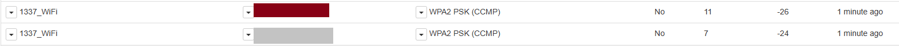

### 2. 偽のWiFi（Evil Twin）を作成

- **現在のネットワーク設定:**
   - **wlan1:** Mode: Managed
   - **wlan0-1:** Mode: Master
   - **wlan2:** Mode Managed (ESSID: "接続先のWiFi SSID") → これは UI Networking → WiFi Client Mode で接続済。
- **SSID をターゲットと同じにする**（例：Free WiFi → Free WiFi）。
- **チャンネルを合わせる**（ターゲットAPと同じチャンネルに設定）: 設定後Reboot
   - **ターゲットがPW付きのWiFiなら** Management SSID を変更: Disable Open SSID チェック
   - **ターゲットがPW無しの公共WiFiなら** Open SSID を変更: Disable Management AP をチェック。
- Reboot後にReconして偽APのチャンネル変更を確認：
   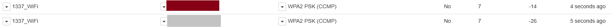

### 3. ターゲットデバイスの選定

- モニターモード有効化とネットワーク監視
   ```sh
   airmon-ng start wlan1 #iwconfigでwlan1mon が既にmonitor modeならスキップで良い。
   airodump-ng --bssid GG:RR:AA:YY:XX:XX -c 7 -w /sd/handshake wlan1mon
   ```
   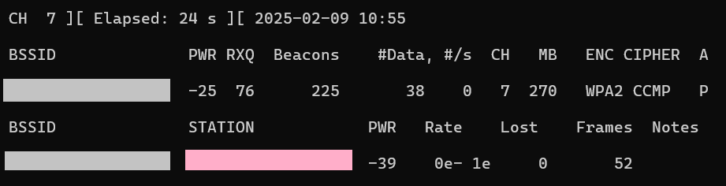
   ターゲットはピンクのデバイス：通信量が多いので実際に利用している可能性大。今回はテストなので1台しかネットワークに繋がっていないが、Framesがなるべく多いデバイスを選択する。
   ターゲット：12:D1:5F:69:41:FC

### 4. 偽APを立ち上げて接続させる: 失敗

- Evil Portalで偽APを立ち上げる
- 偽APのシグナルを強めてターゲットデバイスをDeAuthで本物のAPから断続的に切断させる
```sh
iwconfig wlan0-1 txpower 30 #送信電力を最大化
aireplay-ng --deauth 100 -a C0:5B:12:1E:88:DF -c 12:D1:5F:69:41:FC wlan1mon
```
- 何度も保存済みの本物APに接続仕様としてしまう。
- 施策
1. 本物のAPを完全に無効化する (DeAuth連打 + 本物のAPの電波干渉): 失敗
- 望む結果: 機器自体を落として、その間に同じSSIDの偽APをネットワーク上に表示させる
- 失敗：機器自体が落ちず、保存されたネットワークとしてターゲットのデバイスに存在し続けた。
- 学び：断続的なDeAuthによるターゲットのWiFi接続切断は成功したので、似たような他のSSID(WiFi_1337_5G)などにして偽APに接続させる方法は有効だと思う。
```sh
aireplay-ng --deauth 0 -a C0:5B:12:1E:88:DF wlan1mon #無限ループで本物のAPを落とす：失敗(落とせず)
mdk4 wlan1mon d -B C0:5B:12:1E:88:DF #より強力なDoS攻撃を試す: 失敗: (落とせず)
```
- mdk4 install:
```sh
opkg update #WiFi Pineappleのパッケージリストを更新
opkg list | grep mdk4 #opkg list | grep mdk4
opkg install mdk4 #mdk4をインストール
```
2．偽APの電波強度を本物より強くし、偽APのBSSIDを本物と同じにする
- バグによりPineAPを利用したSSIDの偽装が出来ない
- `Notice: In order to use some of these features, PineAP must first be enabled.`
- 参照: [problems-with-pineap-daemon-starting](https://forums.hak5.org/topic/39964-problems-with-pineap-daemon-starting/)
- 修正を試みる
- サイドバーのPineAPからでは上手く行かないので、コマンドラインから実行してみる。
- まずReconの際、`PineAP must first be enabled`と`start`が表示されるので、実行。
- 実行されているか確認: `ps aux | grep pineap`
- 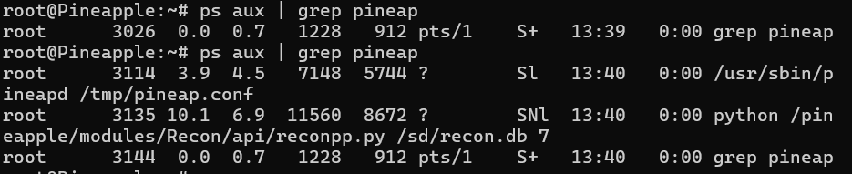
- PineAPデーモン（pineapd）が実行中: `/tmp/pineap.conf`設定ファイルを利用している。
- Reconを止めてもう一度確認するとPineAPデーモンは確認できなかった：つまり、PineAPは単独で起動していない。
- コマンドラインから起動してみる：`/usr/sbin/pineapd /tmp/pineap.conf`
- 実行されているか確認: `ps aux | grep pineap` 
- 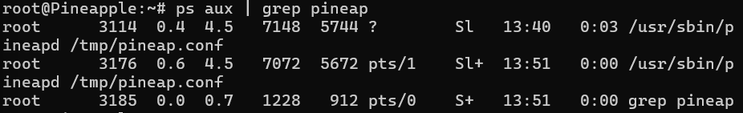
- PineAPデーモン（pineapd）が実行中: `/tmp/pineap.conf`設定ファイルを利用している。
- 実行確認できたので、UIのPineAPから`Source MAC`をターゲットと同じにして`Save Pine Settings`を実行。 → 失敗：`Notice: In order to use some of these features, PineAP must first be enabled.`
- 直接設定ファイルを変更する: `nano /tmp/pineap.conf`
- 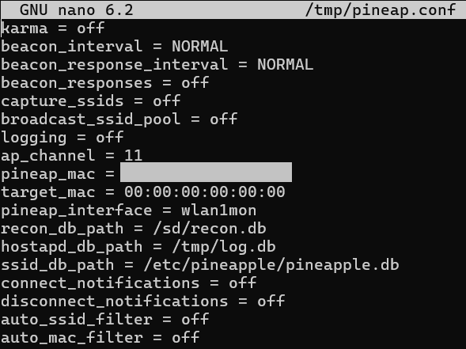
- しかし中身はしっかりターゲットのMACに変わっていた。適切に読み込まれていない可能性あり。
- 今度はPineAPで使われているインターフェースのMACを直接変更してみる：Networking >> Tools
- 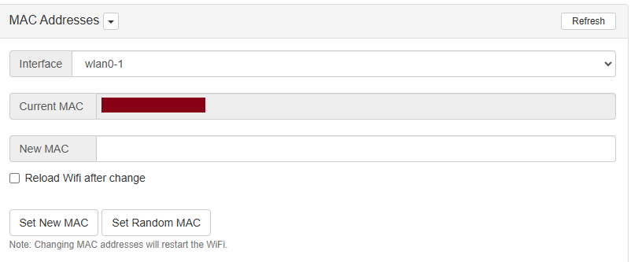
- wlan0-1がPineAPのインターフェースだと判明：変更しReboot → 成功。
- SSIDとBSSIDが完全に同じだと、本物のAPと偽APを区別するのが難しくなる。つまり、DeAuthパケットを送ると本物のAPと偽APの両方が影響を受ける可能性
- さらに2つ同じAPがネットワークに表示されていなくても、2つ存在していると、本物のAPとの接続が悪くなるというか切断されてしまう。
- DeAuthのターゲットを「本物のAPに接続中のクライアント」にする: `aireplay-ng --deauth 0 -a C0:5B:12:1E:88:DF -c 12:D1:5F:69:41:FC wlan1mon`
- いくら接続を邪魔しても、自動接続でこちらのAPに接続してこない。しかし本物のAPが落ちれば、保存済みのネットワークからこちらの偽APに接続してくる。
- 所感
- SSIDとBSSIDを完全に同じにするやり方は正直あまり実践的とは言えなかった。
- 全く同じにするとターゲット偽APがネットワーク上に出てこないうえに、本物APと接続しているデバイスが全く安定しない。
- これなら、似ているSSIDをもう一つ作って、DeAuthでターゲットを絞って自ら接続指せるほうが100倍効果的。
- 良かった点：SSIDとBSSIDが完全に同じ偽APを作ることができ、本物APが落ちさえすれば、保存されたネットワークはこちらと接続を試みることが分かった。

### 5. 偽APを立ち上げて接続させる: 成功
- 4では全く同じSSIDとBSSIDで上手く行かなかったので、似ているSSIDのAPを作成して接続させる
- 偽AP: 1337_WiFi_5Gに設定
- 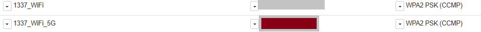
- デバイスの特定: `airodump-ng --bssid C0:5B:12:1E:88:DF -c 5 -w /sd/handshake wlan1mon`
- デバイス：12:D1:5F:69:41:FC
- Evil Portal立ち上げる
- 偽APのシグナルを強めてターゲットデバイスをDeAuthで本物のAPから断続的に切断させる
```sh
iwconfig wlan0-1 txpower 30 #送信電力を最大化
aireplay-ng --deauth 100 -a C0:5B:12:1E:88:DF -c 12:D1:5F:69:41:FC wlan1mon
```
- 被害者になったつもりでスマホを操作。接続が切れて何度かやり直したが上手くいかなかったので、5G回線にでログインした。
- 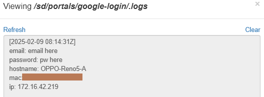

### 6. ターゲットの通信をキャプチャ

- 通信をキャプチャ: `tcpdump -i br-lan -w /sd/capture.pcap`
- WPA&WPA2 Crackで使用したコマンドとの違い：`tcpdump -i wlan1mon -w /sd/practice7.pcap`
- 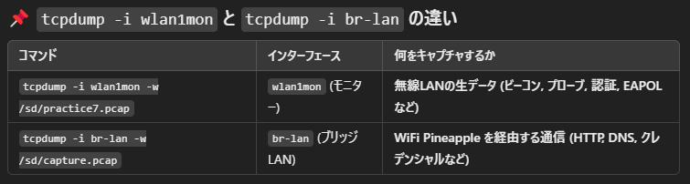
- 問題点: HTTPS通信は暗号化されているのでそのままでは読めない (sslstrip でダウングレードが必要)
- キャプチャファイルの移動:`scp root@172.16.42.1:/sd/capture.pcap C:\Users\ebisu\Desktop\`

### 7. Wiresharkで解析

- 重要なパケットを探す
   - HTTPリクエスト: GET / や POST / のパケットをチェック
   - クッキー情報: Set-Cookie ヘッダーを探す
   - 認証情報: username=xxxxx&password=xxxxx のようなデータ

- ターゲットデバイスで実行した動作
   - 楽天ラクマ(アプリ)へのログイン
   - Aliexpressへのログイン
   - Google Chromeでの検索

#### 7.1 楽天ラクマ(アプリ)のパケット分析

- 表示フィルター: `dns.qry.name contains "rakuten"`
  - 概要:「DNSクエリ名に 'rakuten' を含むパケット」 だけを表示
  - 理由: 
    - ラクマのアプリやウェブサイトにアクセスすると、必ず ラクマ関連のドメインのDNSクエリ が発生。
    - `rakuma.jp' のIPアドレスを教えて! → DNSサーバー`
    - 「いつ」「どのデバイスが」「ラクマのどのサーバーと通信しようとしたか」 を特定できる
    - ラクマに関係する通信の「痕跡」を見つける
    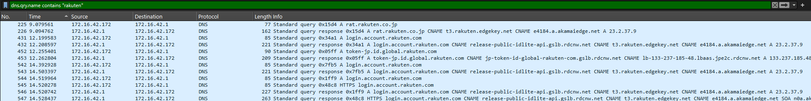
- 表示フィルター：`tls.handshake.type == 1`
  - 実際のログインリクエスト（HTTP POSTリクエスト） をキャプチャする必要がある
  - パケットには SNI（Server Name Indication） という情報が含まれており、これは 「このTLS通信はどのホスト（ドメイン）向けのものか？」 を示す。
  - 対象のデバイスがどのアプリやサービスを使用しているかが分かる