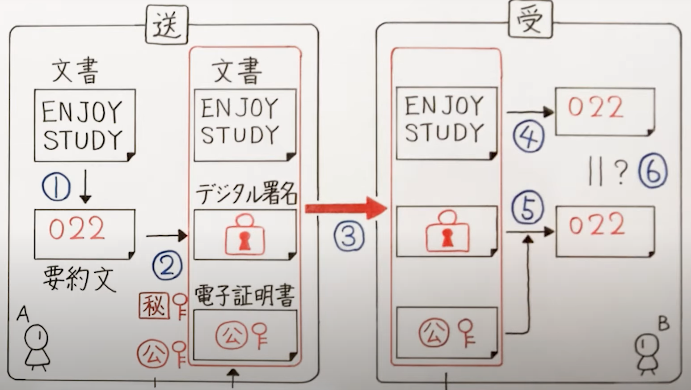
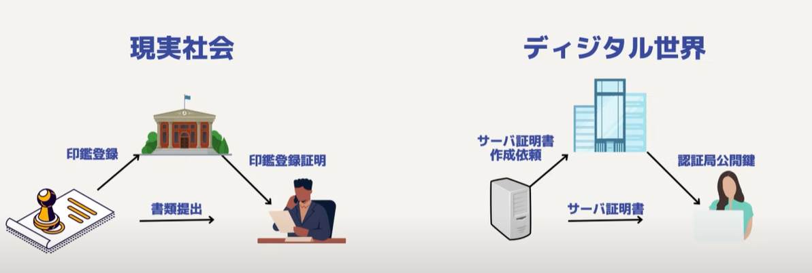

# Digital Signiture /デジタル署名

## 1. デジタル署名とは

- 公開鍵暗号の技術を使って**データの改ざんがないこと**を証明する仕組み
- 公開鍵暗号方式であるRSA暗号方式では、秘密鍵で暗号化して、対応する公開鍵で復号することができる。

## 2. デジタル署名の仕組み

- データ送信側（Aさん）：
1. `ハッシュ関数`で送りたい文書から`ハッシュ値(要約文)`を取得
2. `ハッシュ値`を`秘密鍵`で暗号化して出来たデータ:`デジタル署名`
3. 送りたい文書、`デジタル署名`、`電子証明書(公開鍵付き)`を送付
- データ受信側（Bさん）：
4. `ハッシュ関数`で受け取った文書から`ハッシュ値(要約文)`を取得
5. `デジタル署名`を`公開鍵(電子証明書の中)`で復号
6. 4と5で得られた`ハッシュ値`を比べる
- 

## 3. 電子認証とは

- 認証局が発行する`電子証明書`で、**`デジタル署名`が本人のものである**ことを証明する

## 4. 電子認証の仕組み

- 前持ってデータ送信側(Aさん)が`身分証明書`や`公開鍵`を認証局に提出
- `電子証明書`を発行してもらう。
- この公開鍵はAさん本人のものである事を証明している。

## サーバーとクライアントのやり取り

- 
- Webサーバーをインターネットに後悔したいサーバー管理者は認証局にサーバーを証明するためのデジタル証明書(=サーバー証明書)の作成を依頼。
- クライアントがインターネットを経由して、Webサーバーにアクセスすると、Webサーバーは自分自身を証明するサーバー証明書をクライアントに送る。
- クライアントはこのインターネットを経由して送られてきたサーバー証明書に対して懐疑的
- サーバー証明書の中にはデジタル署名というデータが入っているので、このデジタル署名を付けている認証局の公開鍵を入手して、正当性を確かめる

## サーバー証明書が発行されるまで

- サーバー証明書発行依頼（サーバー → 認証局）
  - どんなサーバーでどんな公開鍵を使うかなどの情報を渡す
- サーバー証明書を作成（認証局）
  - X.509で規定されたフォーマット通りに作成
  - 内容(=署名前証明書):
    - シリアル番号
    - 署名アルゴリズム
    - 発行者(認証局)
    - 有効期限
    - 発行対象(企業)
    - 発行対象の公開鍵
  - この署名前証明書を使って署名アルゴリズムで書かれた方法でハッシュ値を取得
  - このハッシュ値を認証局の秘密鍵を使って暗号化
  - この暗号化されたデータが認証局の署名(=デジタル署名)となる
  - この書類認証局の秘密鍵によって暗号化されているので、認証局の公開鍵を使って復号するとハッシュ値が出てくる。
- 作成された証明書はサーバー管理者に送られ、サーバーに格納される
- クライアントが接続してきたときにサーバー証明書を送る
- クライアントはこのサーバー証明書を認証局の公開鍵を用いて検証する
  - 公開鍵を用いてデジタル署名を復号 → 署名前証明書のハッシュ値が出てくる
  - クライアントは署名前証明書を署名アルゴリズムによって計算し、ハッシュ値を求める
  - この2つのハッシュ値を比べて正当性を確かめる。（もし同じなら、認証局の署名であると確定）
- サーバー証明書には接続先のサーバーの情報が入っており、Webサーバーの公開鍵の情報も入っているので、この公開鍵を使って接続先のサーバーと暗号通信できる(TLSハンドシェイク)

## 参照

- [デジタル署名と電子認証とは](https://www.youtube.com/watch?v=S5jJJAGC5vs)：〇
- [デジタル証明書 - 概要](https://www.youtube.com/watch?v=O1T2-rziJ_c) :〇
- [デジタル証明書 - 補足1](https://www.youtube.com/watch?v=iwbGqXWA_ys)
- [デジタル証明書の検証方法](https://www.youtube.com/watch?v=p7oVTL0BrYs)
- [図解 X.509 証明書](https://qiita.com/TakahikoKawasaki/items/4c35ac38c52978805c69)
- [HTTPS(SSL/TLS)図解で分かる！](https://www.youtube.com/watch?v=nH70Ph3RxZg)