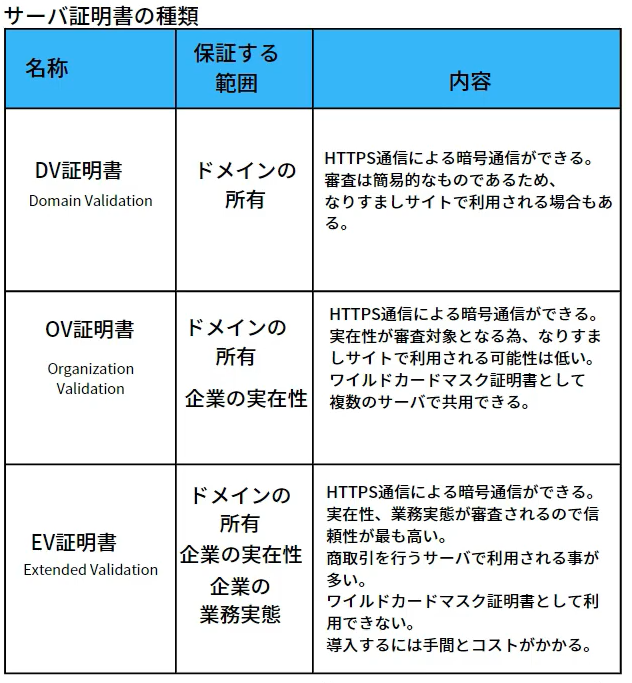

# Digital Signiture /デジタル署名

## 1. デジタル署名とは

- 公開鍵暗号の技術を使って**データの改ざんがないこと**を証明する仕組み
- 公開鍵暗号方式であるRSA暗号方式では、秘密鍵で暗号化して、対応する公開鍵で復号することができる。

## 2. デジタル署名の仕組み

- データ送信側（Aさん）：
1. `ハッシュ関数`で送りたい文書から`ハッシュ値(要約文)`を取得
2. `ハッシュ値`を`秘密鍵`で暗号化して出来たデータ:`デジタル署名`
3. 送りたい文書、`デジタル署名`、`電子証明書(公開鍵付き)`を送付
- データ受信側（Bさん）：
4. `ハッシュ関数`で受け取った文書から`ハッシュ値(要約文)`を取得
5. `デジタル署名`を`公開鍵(電子証明書の中)`で復号
6. 4と5で得られた`ハッシュ値`を比べる
- 

## 3. 電子認証とは

- 認証局が発行する`電子(デジタル)証明書`で、**`デジタル署名`が本人のものである**ことを証明する

## 4. 電子認証の仕組み

- 前持ってデータ送信側(Aさん)が`身分証明書`や`公開鍵`を認証局に提出
- `電子(デジタル)証明書`を発行してもらう。
- この公開鍵はAさん本人のものである事を証明している。

## サーバーとクライアントのやり取り

- 
- Webサーバーをインターネットに後悔したいサーバー管理者は認証局にサーバーを証明するためのデジタル証明書(=サーバー証明書)の作成を依頼。
- クライアントがインターネットを経由して、Webサーバーにアクセスすると、Webサーバーは自分自身を証明するサーバー証明書をクライアントに送る。
- クライアントはこのインターネットを経由して送られてきたサーバー証明書に対して懐疑的
- サーバー証明書の中にはデジタル署名というデータが入っているので、このデジタル署名を付けている認証局の公開鍵を入手して、正当性を確かめる

## デジタル署名 02

### 1. デジタル署名とは

- デジタル署名: メッセージの完全性を保証すると共に、メッセージの作成者を担保(否認防止)する仕組み
  - `完全性(Integrity)`: 情報が正確かつ完全な状態に保たれていること。情報が改ざんや破壊されず、正しい情報のまま維持されている状態を指す
  - イメージ: メッセージの作成者を保証するためのデジタルなハンコ

### 2. デジタル署名を利用したやり取り：

- デジタル署名を利用すると
  - データの完全性を保証
  - データ作成者がデジタル署名を行った人だと保証

1. 送信者は公開鍵暗号方式を利用して鍵ペアを作成
2. 受信者は何らかの方法で送信者の公開鍵を取得
3. 送信者は`ハッシュ関数`で送りたい文書から`ハッシュ値(要約文)`を取得
4. 送信者は`ハッシュ値`を`秘密鍵`で暗号化して`デジタル署名`を作成
5. 送信者は`送りたい文書`、`デジタル署名`を送付
6. 受信者: 2つのハッシュ値を比べる
  - `送られてきた文書`に対して同じ`ハッシュ関数`を利用して`ハッシュ値`を取得: 完全性を担保
  - `デジタル署名`に対して`公開鍵`を使って復号し`ハッシュ値`を取得: 作成者を担保
- 

### 3. MACとデジタル署名の使い分け

- [Message Authentication Code (MAC)](https://prescription1337.github.io/posts/Message-Authentication-Code-MAC/)
- 

## デジタル証明書

### 1. デジタル証明書とは

- デジタル証明書：デジタル署名を利用したやり取りのステップ2`送信者の公開鍵を取得`に関して、`この公開鍵の正当性を保証`する手段

- シーンによって様々な呼び方:
  - 公開鍵証明書
  - 電子証明書
  - サーバ証明書
  - クライアント証明書

### 2. デジタル証明書の中身

- 公開鍵を公開する時には、デジタル証明書を使って公開する
  - つまり、この`デジタル証明書の中に公開鍵の情報が含まれている`。
- デジタル証明書の中には、公開鍵の正当性を保証する様々な情報が含まれている。
- デジタル証明書は`X.509`フォーマットで規格化されている
- 

## サーバ証明書の種類

- サーバ証明書：サーバの公開鍵を渡す
- 

### 1. DV(Domain Validation)証明書

- 保証内容: 
  - ドメインの保持のみ
    - `CN`を確認できる：利用しているサーバのホスト名のみを保証
    - 

### 2. OV(Organization Validation)証明書

- 保証内容: 
  - ドメインの保持
  - 企業の実在性
    - `CN`と`O` を確認できる
    - 

### 3. EV(Extended Validation)証明書

- 保証内容:
  - ドメインの保持
  - 企業の実在性
  - 企業の実態
  - 

## PKI(Public Key Infrastructure)について

- デジタル(サーバ)証明書(公開鍵含む)はそのまま信じていいの？どこが発行しているもの？団体の正当性は？
- つまり、`誰が発行したのかで信頼性が変わる`。

### 1. PKIの仕組み

- PKI：`公開鍵`と`秘密鍵`の`対応関係を保証する`仕組み

- 流れ：
1. サーバ管理者は`秘密鍵`と`公開鍵`の鍵ペアを作成
2.`公開鍵`+`申請情報`を提供: (サーバ管理者 → 認証局)
3. `デジタル証明書`を取得: (認証局 → サーバ管理者)
4. `デジタル証明書`をサーバに格納: (サーバ管理者)
5. `デジタル証明書(サーバ証明書)`を送付: (サーバ → クライアント)
6. `デジタル証明書`の正当性を確認(`認証局の公開鍵`を使って認証局のデジタル署名を検証): (クライアント)
- 

### 2. 認証局のデジタル証明書作成

- 認証局(CA): 署名前証明書の部分を保証
- 認証局(CA)は、`署名前証明書`を`署名アルゴリズム`と`認証局の秘密鍵`を利用して計算を行い、`デジタル署名`を作成
- `認証局デジタル署名`の欄に認証局の`デジタル署名`を格納 (後でクライアントが`認証局の公開鍵`を使って認証局のデジタル署名を検証)
- クライアントが`認証極の公開鍵`を取得する方法は次回(`デジタル証明書の検証方法`)。

### 3. 認証局の階層構造

- 

## デジタル(サーバ)証明書の検証方法

- クライアントはどのように`認証局の公開鍵`取得して、サーバの`デジタル証明書`を検証するのか？
  - 認証局(CA)は、`署名前証明書`を`署名アルゴリズム`と`認証局の秘密鍵`を利用して計算を行い、`デジタル署名`を作成
  - `認証局デジタル署名`の欄に認証局の`デジタル署名`を格納 (後でクライアントが`認証局の公開鍵`を使って`認証局のデジタル署名`を検証)
  - PKIの流れ6を保証することができる。

- ルート証明書を検証する
  - Webブラウザにルート証明書はデフォルトでインストールされている。
  - つまり、ルート認証局の公開鍵は既にクライアントの手元にある。
  - 

## サーバー証明書が発行されるまで

- サーバー証明書発行依頼（サーバー → 認証局）
  - どんなサーバーでどんな公開鍵を使うかなどの情報を渡す
- サーバー証明書を作成（認証局）
  - X.509で規定されたフォーマット通りに作成
  - 内容(=署名前証明書):
    - シリアル番号
    - 署名アルゴリズム
    - 発行者(認証局)
    - 有効期限
    - 発行対象(企業)
    - 発行対象の公開鍵
  - この署名前証明書を使って署名アルゴリズムで書かれた方法でハッシュ値を取得
  - このハッシュ値を認証局の秘密鍵を使って暗号化
  - この暗号化されたデータが認証局の署名(=デジタル署名)となる
  - この書類認証局の秘密鍵によって暗号化されているので、認証局の公開鍵を使って復号するとハッシュ値が出てくる。
- 作成された証明書はサーバー管理者に送られ、サーバーに格納される
- クライアントが接続してきたときにサーバー証明書を送る
- クライアントはこのサーバー証明書を認証局の公開鍵を用いて検証する
  - 公開鍵を用いてデジタル署名を復号 → 署名前証明書のハッシュ値が出てくる
  - クライアントは署名前証明書を署名アルゴリズムによって計算し、ハッシュ値を求める
  - この2つのハッシュ値を比べて正当性を確かめる。（もし同じなら、認証局の署名であると確定）
- サーバー証明書には接続先のサーバーの情報が入っており、Webサーバーの公開鍵の情報も入っているので、この公開鍵を使って接続先のサーバーと暗号通信できる(TLSハンドシェイク)

## 参照

- [デジタル署名と電子認証とは](https://www.youtube.com/watch?v=S5jJJAGC5vs)
- [デジタル証明書 - 概要](https://www.youtube.com/watch?v=O1T2-rziJ_c) 
- [デジタル署名](https://www.youtube.com/watch?v=soTzEzqkk5Y):
- [デジタル証明書](https://www.youtube.com/watch?v=iwbGqXWA_ys):
- [サーバ証明書の種類](https://www.youtube.com/watch?v=e83ck35lYis):
- [PKIの仕組み](https://www.youtube.com/watch?v=KOp90QN2QZY):
- [デジタル証明書の検証方法](https://www.youtube.com/watch?v=p7oVTL0BrYs):
- [図解 X.509 証明書](https://qiita.com/TakahikoKawasaki/items/4c35ac38c52978805c69)
- [HTTPS(SSL/TLS)図解で分かる！](https://www.youtube.com/watch?v=nH70Ph3RxZg)