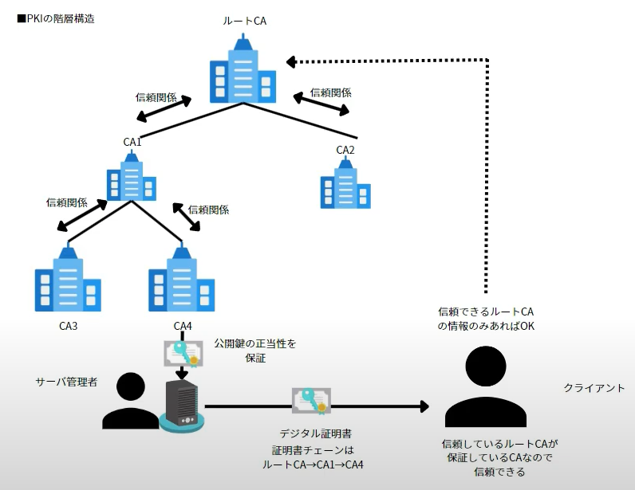

# Digital Signiture /デジタル署名

## 1. デジタル署名とは

- デジタル署名: 公開鍵暗号方式であり、メッセージの`完全性`を保証すると共に、メッセージの`作成者を担保(否認防止)`する仕組み
  - `完全性(Integrity)`: 情報が正確かつ完全な状態に保たれていること。情報が改ざんや破壊されず、正しい情報のまま維持されている状態を指す
  - `作成者を担保(否認防止)`：電子文書の作成者が本人に間違いないこと。

- 注意  
  ※ `デジタル署名の正当性`を確かめるには、`認証局(CA)`が発行した`電子証明書(の中にある公開鍵)`が必要

- [公開鍵暗号方式とは](https://prescription1337.github.io/posts/Encryption/)

## 2. デジタル署名の仕組み

デジタル署名を利用すると: 
- データの`完全性を保証`（改ざんされていないことを確認）
- データの`作成者を保証`（誰が署名したのか確認）

- 流れ
1. 送信者は公開鍵暗号方式を利用して**鍵ペア（秘密鍵・公開鍵）**を作成
2. 受信者は何らかの方法で送信者の公開鍵を取得
3. 送信者は`ハッシュ関数(SHA-256など)`で送りたい文書から`ハッシュ値(要約文)`を取得
4. 送信者は`ハッシュ値`を`秘密鍵`で暗号化し。`デジタル署名`を作成
5. 送信者は`送りたい文書`と`デジタル署名`を送付
6. 受信者が検証: ハッシュ値を比べる
  - `送られてきた文書`に対して、`同じハッシュ関数`を使って`ハッシュ値`を取得 → 完全性を保証  
  - `デジタル署名`を`公開鍵`で復号し、`ハッシュ値`を取得 → 作成者を保証  
- 

## 3. デジタル署名だけでは不十分

1. 送信者の公開鍵が本当にその人のものか保証できない
- デジタル署名の検証には、送信者の公開鍵が必要。
- しかし、その公開鍵が本当に正しい送信者のものかどうかは、受信者が自分で確認しなければならない。
- 攻撃者が偽の公開鍵を渡してきたら？
  - 例えば、受信者が公開鍵をインターネット上でダウンロードする場合(`2. 受信者は何らかの方法で送信者の公開鍵を取得`)、攻撃者が途中で偽の公開鍵にすり替えることが可能（中間者攻撃）。
  - その場合、受信者はハッカーが作成した文書と、ハッカーの秘密鍵で署名されたデジタル署名を受け取る。
  - そして、受信者はハッカーの公開鍵でデジタル署名を復号し、「正しい署名」と誤認してしまう。
  - つまり、偽の送信者を本物だと信じ込んでしまう。

- 対策
  - 公開鍵が信頼できる組織や人物のものであることを保証するため、`認証局（CA） `がその`公開鍵`を証明する仕組みが必要。
  - つまり、その`公開鍵`は`○○団体`や`○○会社`、`○○さん`などの`公開鍵`であると、`認証局（CA）`が`デジタル証明書`を発行して、保証しますよ！ということ。

## 4. デジタル証明書とは

- デジタル証明書：
  - デジタル署名を利用したやり取りのステップ2`送信者の公開鍵を取得`に関して、`この公開鍵の正当性を保証`する手段
  - つまり`「この公開鍵は本物ですよ！」`と`認証局（CA）`が保証する電子的な証明書

- 注意:シーンによって様々な呼び方がある
  - 公開鍵証明書
  - 電子証明書
  - サーバ証明書
  - クライアント証明書

## 5. デジタル証明書の仕組み(PKI)

- PKI（Public Key Infrastructure）は、`認証局（CA）`が`公開鍵の正当性を保証する`仕組み。

- 

- 流れ：

1. **サーバ管理者が`鍵ペア`を作成**  
   - 秘密鍵と公開鍵をペアで生成。

2. **サーバ管理者が`認証局（CA）`に`公開鍵`と`申請情報`を送信**  
   - `申請情報`には、サーバ名、会社名、所在地、公開鍵などの情報が含まれます。

3. **`認証局(CA)`が`申請情報`を検証**  
   - サーバ管理者が提供した情報が正当かどうかを認証局が確認。

4. **`認証局（CA）`が`デジタル証明書`を発行し、サーバ管理者に提供**  
   - 認証局は、以下の流れで証明書を作成してサーバ管理者に渡します：
     1. `署名前証明書`を作成（サーバ情報や公開鍵などを含む）
     2. `署名前証明書`を**ハッシュ関数**（SHA-256など）で処理し、**ハッシュ値**を生成
     3. **署名アルゴリズム**（例えばRSAやECDSA）を用いて、この**ハッシュ値**を`認証局の秘密鍵`で暗号化して、**認証局のデジタル署名**を作成
     4. 完成したデジタル証明書：`署名前証明書` + `署名アルゴリズム`による暗号化された**認証局のデジタル署名**

5. **サーバ管理者がサーバに`デジタル証明書`を格納**  
   - サーバにこの証明書をインストール。

6. **クライアントがサーバにアクセス**  (SSL/TSL Handshake のServer Certificateに該当)
   - クライアントはサーバから`デジタル証明書`（サーバ証明書）を受け取る。
   - この証明書内に、`公開鍵`が含まれており、それが`認証局(CA)`によって保証されたものであることが確認できます。

7. **クライアントがデジタル証明書の正当性を確認**  
   - クライアントは、証明書内の**認証局のデジタル署名**を**認証局の公開鍵**を使って検証することで、証明書が本物かどうかを確認する。  

   1. **認証局の公開鍵の取得**  
      - Webブラウザには、**信頼できる認証局（CA）の公開鍵**があらかじめインストールされている。  

   2. **デジタル署名の復号**  
      - クライアントは、**認証局の公開鍵**を使って、**認証局のデジタル署名**を**署名アルゴリズム**（例：RSAなど）で復号し、**署名前の証明書のハッシュ値**を取得する。  

   3. **証明書のハッシュ値を比較**  
      - **比較するハッシュ値**：  
        1. **署名前の証明書のハッシュ値（認証局の署名を復号して得られるもの）**  
           - 認証局（CA）が署名をする前に、**証明書の内容（公開鍵・サーバ名など）をハッシュ関数（SHA-256 など）で処理**して得たハッシュ値。  
           - クライアントは、認証局の公開鍵を使って署名を復号することで、このハッシュ値を取得する。  
        2. **サーバ証明書の現在のハッシュ値（クライアントが自分で計算するもの）**  
           - クライアントは、サーバ証明書に書かれている情報（公開鍵、サーバ名、有効期限など）をハッシュ関数（SHA-256 など）で処理し、新たにハッシュ値を計算する。  
      - **ハッシュ値が一致すれば、証明書が改ざんされていないことが確認できる。**  

   4. **証明書の正当性の確認**  
      - **ハッシュ値が一致した場合**、クライアントは証明書が認証局によって適切に署名されており、改ざんされていないと判断する。  
      - **認証局（CA）の階層構造**  
        - 認証局は、ルート認証局（最上位のCA）をトップとした階層構造になっており、上位のCAが下位のCAの正当性を保証している。  
          -   
        - Webブラウザには**ルート認証局の証明書**がデフォルトでインストールされており、これを使って証明書チェーンをたどりながら下位のCAを検証する。  
          -   

## 6. デジタル証明書(サーバ証明書)の種類

- サーバ証明書：サーバの公開鍵を渡す
- 

### 6.1 DV(Domain Validation)証明書

- 保証内容: 
  - ドメインの保持のみ
    - `CN`を確認できる：利用しているサーバのホスト名のみを保証
    - 

### 6.2 OV(Organization Validation)証明書

- 保証内容: 
  - ドメインの保持
  - 企業の実在性
    - `CN`と`O` を確認できる
    - 

### 6.3 EV(Extended Validation)証明書

- 保証内容:
  - ドメインの保持
  - 企業の実在性
  - 企業の実態
  - 

## ボーナス: MACとデジタル署名の使い分け

- [Message Authentication Code (MAC)](https://prescription1337.github.io/posts/Message-Authentication-Code-MAC/)
- 

## 参照

- [デジタル署名と電子認証とは](https://www.youtube.com/watch?v=S5jJJAGC5vs)
- [デジタル証明書 - 概要](https://www.youtube.com/watch?v=O1T2-rziJ_c) 
- [デジタル署名](https://www.youtube.com/watch?v=soTzEzqkk5Y):
- [デジタル証明書](https://www.youtube.com/watch?v=iwbGqXWA_ys):
- [サーバ証明書の種類](https://www.youtube.com/watch?v=e83ck35lYis):
- [PKIの仕組み](https://www.youtube.com/watch?v=KOp90QN2QZY):
- [デジタル証明書の検証方法](https://www.youtube.com/watch?v=p7oVTL0BrYs):
- [図解 X.509 証明書](https://qiita.com/TakahikoKawasaki/items/4c35ac38c52978805c69)
- [HTTPS(SSL/TLS)図解で分かる！](https://www.youtube.com/watch?v=nH70Ph3RxZg)