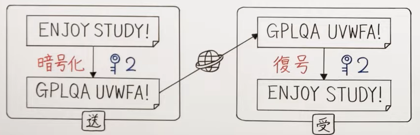
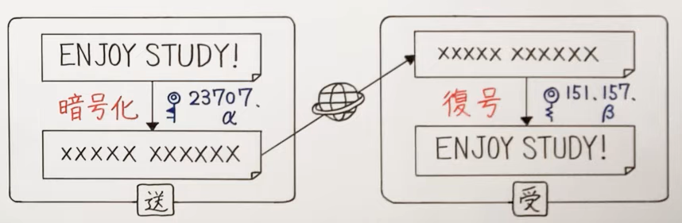
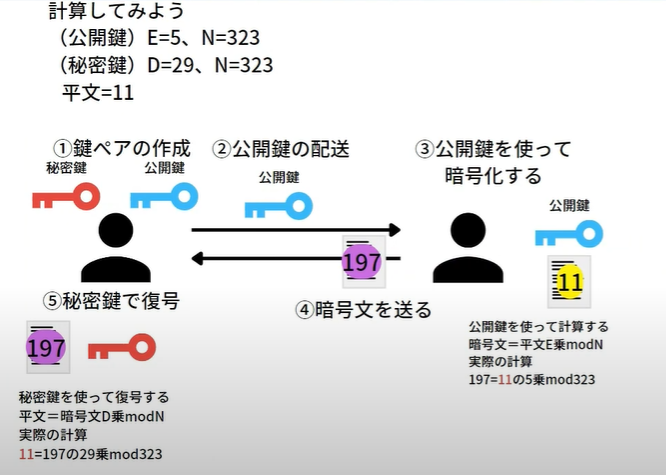

# Encryption / 暗号化

- 暗号化: 情報を送るときに、盗聴されても解読できない形式に変換すること
- 2つの暗号化
  - 共通鍵暗号方式(Symmetric Encryption): 送受信双方は同じ秘密鍵を使用して、暗号&復号する
    - 
  - 公開鍵暗号方式(Asymmetric Encryption): 送信側は公開鍵で暗号化、受信側は秘密鍵で復号化
    - RSA暗号の図
    - 
- セッション鍵方式：
  - 上記の2つの方式を合わせたもの。
  - 平文は共通鍵方式、共通鍵は公開鍵暗号方式で送る方式。

## 共通鍵暗号方式 - Symmetric Encryption

- 暗号化と復号に同じ鍵を使用する暗号方式。送信者と受信者が事前に同じ鍵を共有することで、暗号化と復号が可能  

- 仕組み:  
1. 送信者と受信者が共通鍵(秘密鍵)を共有する
2. 送信者が共通鍵で通信内容を暗号化する
3. 受信者が同じ共通鍵で通信内容を復号する  

- 暗号の種類:  
  - ブロック暗号: 平文を固定長のブロックに分割して暗号化
  - ストリーム暗号: 平文を1bitないしは1byte単位で暗号化

## 公開鍵暗号方式 -  Asymmetric Encryption

- 公開鍵と秘密鍵の2つの鍵ペアを使用して情報を暗号化・復号化する方式  

- 仕組み: 
1. 受信側が鍵ペアを作成し、公開鍵を外部に公開する
2. 送信側が受信者の公開鍵でデータを暗号化して送信する
3. 受信側が自身の秘密鍵でデータを復号する  

- 暗号の種類: 
  - RSA暗号
  - DSA署名方式
  - ECDSA署名方式
  - 楕円曲線暗号（ECC）

### RSA暗号

- 桁数の大きな整数を素因数分解するのが困難である特性を利用
- 
- linux: `openssle genrsa`

## 参照

- [共通鍵暗号方式と公開鍵暗号方式](https://www.youtube.com/watch?v=BbuGVf_oNSc)
- [RSA](https://www.youtube.com/watch?v=FmoOn5HFNx4)
- [電子政府における調達のために参照すべき暗号のリスト（CRYPTREC暗号リスト）](https://www.cryptrec.go.jp/list/cryptrec-ls-0001-2022r1.pdf)
- [RSA暗号による公開鍵暗号方式を5分で絶対に理解する](https://www.youtube.com/watch?v=CUhDu5praMQ)