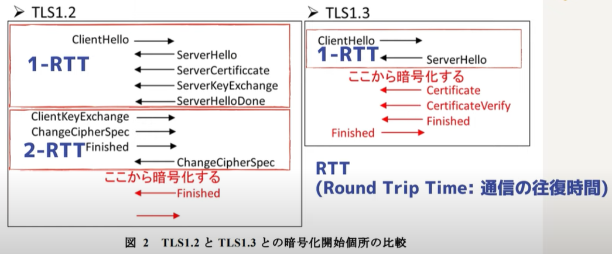
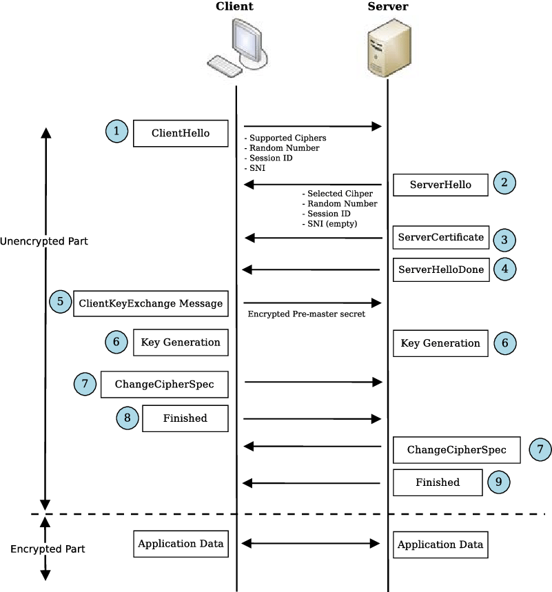
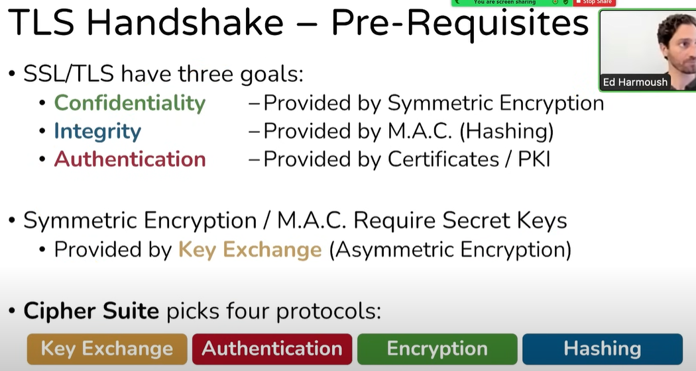
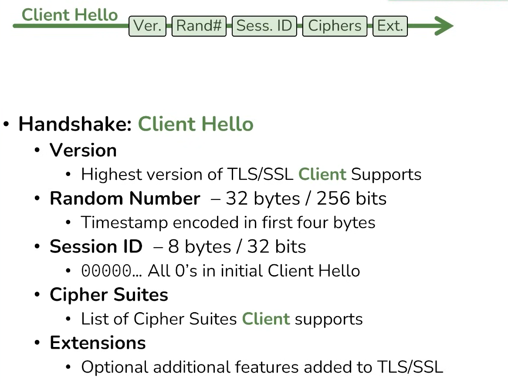
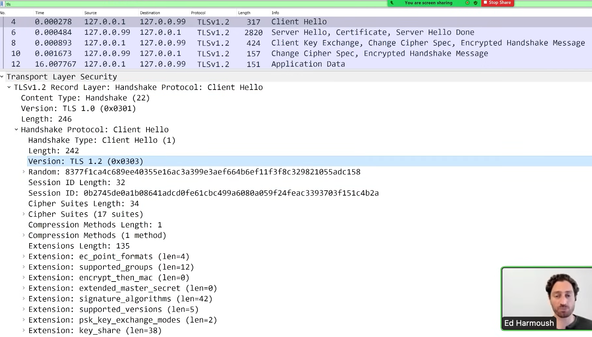
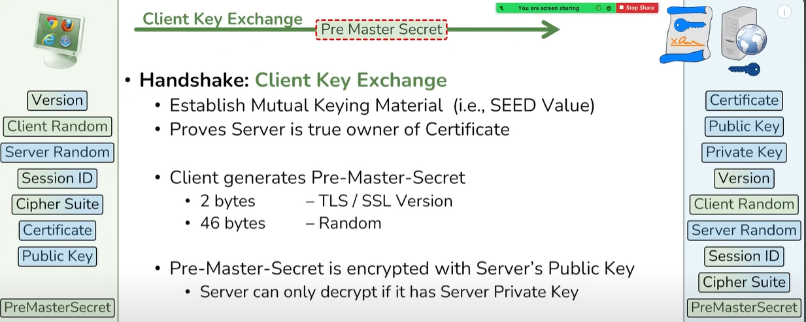
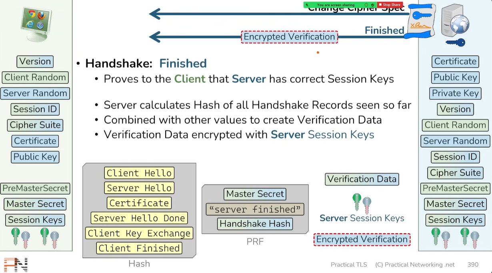
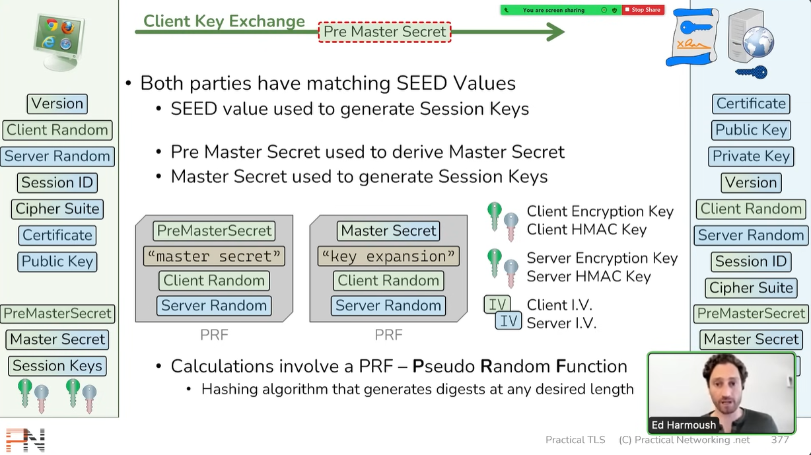
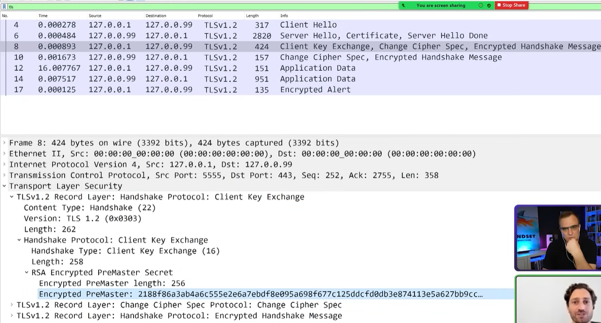

# SSL/TLS Handshake

- 通信の暗号化を行うために、証明書の確認と鍵交換を行うプロセス。
- サーバーが信頼できることを証明し、クライアントとサーバーが共通の秘密鍵を使ってデータを暗号化できる状態にする。
- 

## TLS 1.2 のハンドシェイクの流れ

- 

### 1. Client Hello（クライアント → サーバー）
- クライアントがサーバーに接続を要求。
- **含まれる情報:**  
  - 利用可能なTLSバージョン（例えば、TLS 1.2, TLS 1.3）  
  - セッションID  
  - 利用可能な暗号スイート（暗号や認証方法を文字列で指定）  
    - 構成: `鍵交換_署名_暗号化_ハッシュ関数`
    - 
    - IETFで規格化されているので、自由な組み合わせで出来るわけではない
  - クライアントが生成したランダム値（後で鍵生成に使用）
- 

- **補足:**  
- 暗号スイートについてのちに解説
  - 例：`TLS_ECDHE_RSA_WITH_AES_128_GCM_SHA256` の意味:  
    - **ECDHE** による鍵交換  
    - **RSA** を使った認証  
    - **AES** の共通鍵を使った鍵長128ビット  
    - **暗号モード** は **GCM**  
    - **MAC** で使うハッシュ関数は **SHA256**  
  - **MitMによるダウングレード攻撃 (FREAK)**  
    - Client Hello に含まれる暗号スイートを強度の低いものに改ざんし、サーバーに送る。

---

### 2. Server Hello（サーバー → クライアント）
- サーバーがクライアントの要求を受け入れ、通信を開始する準備を整える。
- **含まれる情報:**  
  - サーバーが選んだ **TLSバージョン**  
  - サーバーが選んだ **暗号スイート**  
  - サーバーが生成した **ランダム値（後で鍵生成に使用）**
- 
- 重要：
  - ここまでで、お互いがどのくらいの情報を持っているのか把握しておく。
  - まだ平文でやり時が行われている。つまりWiresharkで`tls`でフィルターすれば全てみれる
  - 
---

### 3. Server Certificate（サーバー → クライアント）
- サーバーの **証明書**（公開鍵が含まれており、サーバーの正当性を証明するため）を送信。

- **クライアントの動作: サーバー証明書の確認**
  - クライアントは、サーバーの証明書を受け取り、それが信頼できる**証明書機関（CA）**によって発行されていることを確認。
  - 証明書が有効でない場合、接続は中断されることがある。
- ここでクライアントは`サーバ証明書`の中の`公開鍵`を取得
- 詳しい説明: 
  - [デジタル証明書の仕組み(PKI)](https://prescription1337.github.io/posts/Digital-Signature/)
  - 上記の5. デジタル証明書の仕組み(PKI)の流れ6を参照。
  - 証明書の検証（ハッシュ値の比較）はSSL/TSL Handshake `Server Hello Doneの後`

- **Certificate Request（サーバー → クライアント）【スキップされることが多い】**
  - 多くの場合、クライアントが本物かどうかの認証は行われない。

---

### 4. Server Hello Done（サーバー → クライアント）

---

### 暗号スイートについて

- 例：`TLS_RSA_WITH_AES_256_GCM_SHA384`
- TLS_RSA_WITH_AES_256_GCM_SHA384 の各アルゴリズムが**どのタイミングで使われるのか**、TLSハンドシェイクの流れと共に説明する。  

---

#### **1. TLSハンドシェイクの流れとアルゴリズムの適用タイミング**  

- 復習

1. **クライアントが「ClientHello」を送信**  
   - クライアントは、サーバーに対して「自分が対応可能な暗号スイート」を提示する。  
   - 例: `TLS_RSA_WITH_AES_256_GCM_SHA384` も候補の1つとして提示する。  

2. **サーバーが「ServerHello」を返す**  
   - サーバーは、クライアントが提示した暗号スイートの中から**1つを選択**して応答する。  
   - **(ここで TLS_RSA_WITH_AES_256_GCM_SHA384 が選ばれる)**  

3. **サーバーが「Certificate」と「ServerHelloDone」を送信**  
   - サーバーは、自分のRSA公開鍵を含む**デジタル証明書（サーバ証明書）**をクライアントに送る。  
   - これにより、クライアントはサーバーの正当性を検証できる。  

---

##### **2. 各アルゴリズムの役割と適用タイミング**  

| **アルゴリズム** | **役割** | **適用タイミング** |
|-----------------|----------|----------------|
| **TLS_RSA** (RSA鍵交換) | **クライアントとサーバー間の鍵交換** <br> クライアントは「プレマスターシークレット（PMK）」を生成し、サーバーのRSA公開鍵で暗号化して送信する。サーバーは自分のRSA秘密鍵で復号する。 | **ClientKeyExchange時** |
| **AES_256_GCM** (共通鍵暗号) | **通信データの暗号化** <br> 事前に交換した共通鍵（マスターシークレットから派生）を使って、通信データをAES-GCMで暗号化・復号する。 | **ハンドシェイク完了後のデータ通信時** |
| **SHA384** (MAC/認証) | **メッセージ認証・データ改ざん検出** <br> AES-GCMではMAC（メッセージ認証コード）を内部に持つため、SHA384は**鍵導出**（PRF: 擬似乱数関数）に使われる。 | **鍵の生成 & HMAC認証時** |

---

##### **3. より詳しい流れ**
(1) **鍵交換 (`TLS_RSA`)**
   - クライアントが「プレマスターシークレット (PMK)」を生成  
   - サーバーのRSA公開鍵で**PMKを暗号化**し、サーバーに送信 (`ClientKeyExchange`)  
   - サーバーは、自分の**RSA秘密鍵で復号**し、PMKを取得  

(2) **共通鍵の生成 (`SHA384` の役割)**
   - クライアントとサーバーは、PMKと他の情報（ClientRandom, ServerRandom）を組み合わせて、**マスターシークレット**を生成  
   - さらに、マスターシークレットをSHA384を使った**鍵導出関数（PRF）**で処理し、実際にデータ暗号化に使う「セッション鍵」を生成  

(3) **データ暗号化 (`AES_256_GCM`)**
   - 通信データは**AES-256-GCMを使って暗号化**し、安全な通信を実現  
   - GCM（Galois/Counter Mode）なので、**認証タグ (Authentication Tag)** も生成し、データの完全性を保証  
   - **→ 追加のMACを送らずに改ざん検知ができる**（これはAES-GCMの特徴）  

---

##### **4. まとめ**


| **アルゴリズム** | **役割** | **タイミング** |
|---------------|----------------|----------------------|
| **RSA (TLS_RSA)** | 鍵交換（プレマスターシークレットのやり取り） | `ClientKeyExchange` |
| **SHA384** | 鍵導出（共通鍵の生成） | 鍵スケジュール時 (`PRF`) |
| **AES-256-GCM** | 通信データの暗号化・改ざん検出 | アプリケーションデータの暗号化 |

TLS_RSA_WITH_AES_256_GCM_SHA384 は、**RSAで鍵交換 → SHA384で鍵導出 → AES-256-GCMでデータ暗号化** という流れになっているよ。

- 理解
- `TLS_RSA`の表記があるなら、CAに届けでたときに、公開鍵はRSAで鍵ペアを作成してたということ。

---

##### **5. 補足: RSAを使わない鍵交換方式**

- TLS 1.2まではこの RSA鍵交換（TLS_RSA） がよく使われたけど、今は楕円曲線ディフィー・ヘルマン（ECDHE） などの前方秘匿性がある方式が推奨されている。
（TLS_RSAは一度秘密鍵が漏れると、過去の通信もすべて復号できてしまうリスクがある）

- だから、最近のTLS 1.2/1.3では TLS_ECDHE_RSA_WITH_AES_256_GCM_SHA384 みたいに、RSAは認証のみに使って、鍵交換はECDHEで行う方式が一般的になってる。


### 5. Client Key Exchange（クライアント → サーバー）
- **Pre-master secret (PMK)**（鍵を作成するための情報）を送信。
  - Pre-master secret は、**サーバー証明書に含まれる公開鍵で暗号化** されている。
  - **Pre-master secret(48 bytes)**を送信する2つの目的
    - Establish Mutual Keying Material (Seed Valueなど): 多くの鍵を作る元で公開鍵方式を用いる。
    - Proves Server is true owner of Certificate: 証明書が持ち主である証明
- PMKの中身
- プレマスターシークレット（PMK, Pre-Master Secret）は、**TLS 1.2（RSA鍵交換の場合）では、クライアントがランダムに生成する 48 バイト（384 ビット）の値**   

- この PMK は以下のルールに従って作られる：  
  - **最初の 2 バイト**（16 ビット）：クライアントが使用する TLS バージョン  
  - **残りの 46 バイト**（368 ビット）：完全ランダムな値  

---

| **バイト数** | **内容** | **説明** |
|------------|---------|---------|
| 2 バイト | TLS バージョン | 例: `0x0303`（TLS 1.2） |
| 46 バイト | ランダム値 | 暗号的に安全なランダムデータ |

**例（バイナリ表現）**
```
03 03 AB CD EF 12 34 56 78 9A BC DE F0 12 34 56
78 9A BC DE F0 12 34 56 78 9A BC DE F0 12 34 56
78 9A BC DE F0 12 34 56 78 9A BC DE F0 12 34 56
```
- （最初の `03 03` は TLS 1.2 のバージョン、それ以降はランダムデータ）


- **サーバー側の動作:**
  - 受け取った Pre-master secret を、**自分の秘密鍵で復号** し、元の Pre-master secret を取り出す。  
  - （鍵そのものではなく、鍵を作成するための情報を復号する。）

- 

---

### 6. Key Generation（サーバー & クライアント）
- クライアントとサーバーは、それぞれのランダム値と Pre-master secret を使って **master secret** を作成。
- さらに、**master secret**を`SHA384`を使った**鍵導出関数（PRF）**で処理し、実際にデータ暗号化に使う`セッション鍵`を生成
- どのように作成されるか？以下をハッシュ関数のようなもの（PRF）に渡す。
  - **master secret**
  - **"ランダム値"**: ClientHelloで共有したもの
  - **"ランダム値"**: ServerHelloで共有したもの
- **master secret をもとに、以下の鍵(Session Keys)が作成される:**
  - クライアント用 **MAC鍵**
  - クライアント用 **暗号化鍵**
  - クライアント用 **暗号化IV（初期ベクトル）**
  - サーバー用 **MAC鍵**
  - サーバー用 **暗号化鍵**
  - サーバー用 **暗号化IV（初期ベクトル）**

- 実際にこれらの`セッション鍵`はどのタイミングでいつ利用されるのか？
  - TLSハンドシェイクが完了した後、実際のデータ通信（例えばHTTPSでのリクエストやレスポンス）では、`Session Keys（セッション鍵） `が使用される
  - 最下部参照

- **補足:**  
  - **初期ベクトル（IV）** は、同じ平文を同じ暗号鍵で暗号化しても、常に異なる暗号文にするためのデータ。

### 7. Change Cipher Spec（クライアント → サーバー）
- 以後の通信が **暗号化** されることを通知。

---

### 8. Finished（クライアント → サーバー）
- 暗号化通信が始まる前に、これまでの通信が改ざんされていないことを確認するため、ハッシュ値を送信（**Finished message**）。
- 両者はこのハッシュ値を検証し、問題がなければ通信が開始される。
- 

---

### 9. Change Cipher Spec（サーバー → クライアント）

---

### 10. Finished（サーバー → クライアント）
- 
---

### **補足: TLS 1.3 との違い**
TLS 1.3では、以下の改善が行われています:
- **ハンドシェイクの高速化**（ラウンドトリップ回数が削減）
- **RSAによる鍵交換の廃止**（**ECDHEのみ** を使用）
- **強力な暗号スイートのみを採用**
- **Change Cipher Spec メッセージの省略**

---

### **Session Keys（セッション鍵）の使われるタイミング**  

- TLSセッション中、**master secret（マスターシークレット）** からクライアントとサーバーで使う暗号鍵やMAC鍵が派生され、それぞれの通信に利用される。各鍵の役割と使われるタイミングを説明。  
- 1-3は復習
---

## **1. Master Secret の生成**
クライアントとサーバーは、鍵交換プロセス（RSAやECDHEなど）を経て、共通の**Master Secret（マスターシークレット）** を生成する。

```plaintext
Master Secret = PRF(Pre-Master Secret, "master secret", ClientHello.Random + ServerHello.Random)
```

---

## **2. Session Keys（セッション鍵）の生成**
Master Secret から以下の6つの鍵が生成される：

```plaintext
Session Keys = PRF(Master Secret, "key expansion", ServerHello.Random + ClientHello.Random)
```

- **クライアント用**
  - **MAC鍵（Client MAC Key）**
  - **暗号化鍵（Client Encryption Key）**
  - **暗号化IV（Client IV, Initialization Vector）**
  
- **サーバー用**
  - **MAC鍵（Server MAC Key）**
  - **暗号化鍵（Server Encryption Key）**
  - **暗号化IV（Server IV, Initialization Vector）**

---

## **3. 各鍵の役割と使うタイミング**
それぞれの鍵がどのタイミングで使われるかを見ていく。

### **(1) MAC鍵（Client MAC Key / Server MAC Key）**
- **タイミング:** データ送信時
- **役割:** データの整合性（改ざん検知）を保証するためにHMACを計算する  
- **仕組み:**  
  - 送信側（クライアント or サーバー）は、メッセージのハッシュ値を計算し、HMACを付ける  
  - 受信側はHMACを再計算して照合し、データ改ざんの有無を確認する

**例（HMAC-SHA384を使用する場合）**
```plaintext
MAC = HMAC-SHA384(Client MAC Key, Message)
```

---

### **(2) 暗号化鍵（Client Encryption Key / Server Encryption Key）**
- **タイミング:** データ送信時
- **役割:** メッセージを暗号化する
- **仕組み:**  
  - 送信側は暗号化鍵を使ってデータを暗号化
  - 受信側は同じ鍵を使って復号

**例（AES-256-GCMの場合）**
```plaintext
Ciphertext = AES-256-GCM-Encrypt(Client Encryption Key, Plaintext, IV)
```

---

### **(3) 暗号化IV（Client IV / Server IV）**
- **タイミング:** 各暗号化メッセージごとに使用
- **役割:** 同じメッセージでも異なる暗号文になるようにする（暗号の安全性を向上）
- **仕組み:**  
  - AES-GCM の場合、IV はカウンターとしても使われ、各メッセージごとに異なる値をセット
  - CBC モードの場合はランダムなIVをセット

**例（AES-256-GCMの場合）**
```plaintext
Ciphertext = AES-256-GCM-Encrypt(Client Encryption Key, Plaintext, IV)
```

---

## **4. まとめ（タイミングと役割）**

| 鍵の種類 | 使われるタイミング | 役割 |
|----------|----------------|------|
| **MAC鍵** | メッセージ送信時 | HMACを計算し、データ改ざんを防ぐ |
| **暗号化鍵** | メッセージ送信時 | メッセージを暗号化・復号する |
| **暗号化IV** | 各メッセージごとに使用 | 同じデータでも異なる暗号文にする |

---

## **5. データ送信の具体的な流れ**
例: **クライアント → サーバー へ暗号化データ送信**（TLS_AES_256_GCM_SHA384 の場合）

1. **データ整合性の確認**
   - クライアントは **Client MAC Key** を使って HMAC を計算し、メッセージに付与  

2. **データ暗号化**
   - クライアントは **Client Encryption Key** を使ってメッセージを AES-GCM で暗号化  

3. **IVを適用**
   - クライアントは **Client IV** を適用し、暗号文をサーバーへ送信  

4. **サーバー側の処理**
   - サーバーは **Server Encryption Key** を使って復号  
   - サーバーは **Client MAC Key** を使ってHMACを再計算し、改ざんチェック  

---

## **6. まとめ**
TLS では Master Secret から派生した **Session Keys** を使って、通信を暗号化し、改ざん防止を行う。  
- **MAC鍵** → データ改ざん防止（HMAC 計算）  
- **暗号化鍵** → データ暗号化（AES など）  
- **IV** → 暗号化時の初期ベクトル（異なる暗号文を生成）  

これらの鍵は**クライアントとサーバーがそれぞれ持っていて**、TLS セッションの間ずっと使われる。

---

### ハッカー視点の整理

- シナリオ: Master keyは自分で導き出せるのか？ 
  - Master keyaの材料
    - `ClientRandom`: 平文で取得可
    - `ServerRandom`: 平文で取得可
    - `Pre-Master Secret（PMK）`: クライアントがサーバの公開鍵で暗号化済 → 復号にはサーバの秘密鍵が必要
  - PMKの取得方法:
    1. 偽のサーバー（中間者攻撃 MITM）
      - クライアントを 本物のサーバー ではなく、攻撃者の偽サーバー に接続させる
      - クライアントは偽サーバーの 攻撃者の公開鍵 を使って PMK を暗号化する
      - 攻撃者はその 秘密鍵を持っている ので、PMK を復号
      - これを防ぐには、正しいサーバー証明書（CAの署名付き）を検証する必要がある。
    2. サーバーの秘密鍵を盗む
      - もし攻撃者がサーバーの秘密鍵 (d) を盗めば、過去の通信もすべて復号できる。
      - これが「RSA の前方秘匿性（Forward Secrecy）がない問題」と呼ばれる。
      - TLS 1.3 では RSA 鍵交換を廃止し、すべて PFS（Perfect Forward Secrecy）対応の鍵交換（ECDHE など）に変更された。
  - MITM 攻撃の流れ（HTTPS版 / TLS 1.2 の RSA鍵交換）の詳細
    1. **クライアントが HTTPS サーバーに接続しようとする**
      - 例: ユーザーが `https://bank.com` にアクセス。
      
    2. **攻撃者が通信をハイジャックして「偽サーバー」に接続させる**
      - ここで **攻撃者は中間に割り込む方法を使う**:
        - **Evil Twin Attack**（偽の Wi-Fi AP を作る）  
        - **ARP Spoofing**（ローカルネットワークでゲートウェイを偽装）  
        - **DNS Spoofing**（bank.com の IP を偽サーバーに変更）  
        - **Rogue Gateway**（クライアントの通信を強制的に自分のプロキシを経由させる）  

    3. **攻撃者の偽サーバーが「偽の証明書」を提示**
      - クライアントは本来 `bank.com` の本物の証明書を受け取るべき。
      - しかし攻撃者の「偽のサーバー」 (`evil-bank.com`) は、攻撃者が用意した **自作の証明書** を提示。
      - クライアントは **正しく証明書を検証しないと、この偽証明書を信じてしまう！**

    4. **クライアントが攻撃者の公開鍵で PMK を暗号化して送信**
      - TLS 1.2 の RSA 鍵交換では、クライアントは PMK を **サーバーの公開鍵で暗号化** して送信する。
      - しかし、**この時点でクライアントは攻撃者の公開鍵を使ってしまっている！**
      - → **攻撃者は自分の秘密鍵で PMK を復号できる！**
      
    5. **攻撃者が「本物のサーバー」にも接続**
      - クライアントから取得したリクエストを、そのまま本物の `bank.com` に送信。
      - その時、攻撃者は本物の `bank.com` の証明書を検証し、本物の PMK を使って鍵を確立。
      - つまり **攻撃者はクライアントとサーバーの「橋渡し」をしているだけに見える。**

    6. **MITM 攻撃が成功し、通信を完全に復号可能に！**
      - **クライアントと攻撃者の間の通信**：攻撃者が PMK を知っているので、すべて復号できる。
      - **攻撃者とサーバーの間の通信**：攻撃者が本物の PMK を使うので、サーバーも問題なく動作する。
      - これにより、**クライアントの送信するすべてのデータ（ログイン情報、クレジットカード情報など）を盗める！**

---

- 具体的な MITM 攻撃シナリオ

| 攻撃手法 | どうやってクライアントを偽サーバーに接続させるか？ | 必要なツール |
|----------|---------------------------------|----------------|
| **Evil Twin Attack** | クライアントのWi-Fiを偽APに接続させる | WiFi Pineapple, Hostapd, Airbase-ng |
| **ARP Spoofing** | クライアントの ARP テーブルを書き換え、ゲートウェイを攻撃者のPCにする | Bettercap, Ettercap, arpspoof |
| **DNS Spoofing** | `bank.com` へのアクセスを `evil-bank.com` に誘導 | Bettercap, dnsspoof |
| **SSL Strip（HTTPSダウングレード）** | クライアントをHTTPに誘導し、暗号化を回避 | sslstrip |

---


### **ハッカー視点: どのセッションキーを取得すると何が見れるか？**  

- `session key` をハッカーが取得する方法：
　　- **pre master secret**, **Master Secret**, **クライアント用の鍵(MAC鍵&暗号化鍵)**、**サーバー用の鍵(MAC鍵&暗号化鍵)**のどれかを取得して、Wiresharkに計算させてsession keyにする。
    - それを用いて復号できる。
    - 
- Wiresharkで**pre master secret**を取得できるが、これを復号するには、サーバーの秘密鍵が必要なので、これだけだと無理。次の図は暗号化された**pre master secret**
- 
- 動画58分からサーバ秘密鍵を使った**pre master secret**の復号化及び、Sessin keyの再生成を確認できる。
- [TLS Handshake Deep Dive and decryption with Wireshark](https://www.youtube.com/watch?v=25_ftpJ-2ME)

---

#### **🔑 どのキーが最も重要か？**  

| **取得された鍵** | **影響・攻撃可能なこと** | **説明** |
|---------------|--------------------|----------|
| **Client Encryption Key** （クライアント暗号化鍵） | **クライアント→サーバーの通信を復号可能** | 例: `GET /login` や `POST /password` などのリクエストの内容が見れる。ユーザーが送信したログイン情報、クッキー、APIトークンなども盗める。 |
| **Server Encryption Key** （サーバー暗号化鍵） | **サーバー→クライアントの通信を復号可能** | 例: `HTTP/1.1 200 OK` のレスポンスボディ（Webページの内容、個人情報、機密データなど）が見れる。 |
| **Client MAC Key** （クライアントMAC鍵） | **クライアント→サーバーの通信を改ざん可能** | クライアントが送るHMACを生成できるため、改ざんがバレない。例: `POST /transfer?amount=1000` を `POST /transfer?amount=1000000` に改ざん可能。 |
| **Server MAC Key** （サーバーMAC鍵） | **サーバー→クライアントの通信を改ざん可能** | 例: `HTTP/1.1 200 OK` のレスポンスを書き換えて、フィッシングページやマルウェアを埋め込む。 |
| **Client IV** （クライアント初期ベクトル） | **一部の暗号文の復号に影響を与える可能性あり** | 通常、IVだけではデータを復号できないが、もし暗号化アルゴリズムの実装が脆弱であれば、暗号文のパターンを推測しやすくなる可能性がある。 |
| **Server IV** （サーバー初期ベクトル） | **一部の暗号文の復号に影響を与える可能性あり** | クライアントIVと同様、単体では意味を持たないが、特定の攻撃（例えばビットフリップ攻撃）を仕掛ける手助けになる。 |
| **Master Secret** （マスターシークレット） | **すべてのセッションキーを計算可能 → 完全復号可能** | クライアントとサーバー間の全ての通信が復号でき、改ざんも可能。これはTLS通信の「究極の鍵」となる。 |
| **Pre-Master Secret** （プレマスターシークレット） | **Master Secret を導出できるため、最終的に全復号可能** | マスターシークレットが生成できるため、最終的に全セッションキーを取得可能。 |
| **サーバーのRSA秘密鍵** | **すべてのセッションキーを復元可能（RSA鍵交換の場合）** | クライアントが送信したプレマスターシークレットを復号できるため、結果的にMaster Secretを取得でき、全ての通信が復号可能。 |

---

### **🎭 ハッキングシナリオ**

| **攻撃手法** | **必要なセッションキー** | **可能になること** |
|--------------|-----------------------|-----------------|
| **盗聴攻撃（Eavesdropping）** | Client Encryption Key / Server Encryption Key | クライアントやサーバーの送信データを復号し、機密情報を盗み出す |
| **改ざん攻撃（Man-in-the-Middle, MITM）** | Client MAC Key / Server MAC Key | データを書き換え、ユーザーの操作を乗っ取る（例: 銀行振込の送金先変更） |
| **リプレイ攻撃（Replay Attack）** | Client IV / Server IV | 同じリクエスト・レスポンスが繰り返されることを検出し、パターン解析を行う |
| **完全なセッション乗っ取り** | Master Secret / Pre-Master Secret / サーバーのRSA秘密鍵 | すべてのセッションキーを生成でき、全通信を復号・改ざんできる |

---

### **🔥 まとめ**

- **Client Encryption Key / Server Encryption Key** を取得すると、HTTPS通信を完全に盗聴可能。  
- **Client MAC Key / Server MAC Key** を取得すると、データ改ざんが可能になり、MITM攻撃が成立する。  
- **IV（初期ベクトル）** だけでは完全な復号はできないが、パターン解析には利用できる。  
- **Master Secret または RSA秘密鍵** を取得されると、HTTPS通信の完全な復号・改ざんが可能になり、通信の秘密性が崩壊する。  

### **結論 👉 最も重要な鍵は「Client Encryption Key」と「Server Encryption Key」！**
これらが盗まれると、HTTPSの意味がなくなる。

## TLS 1.3 のハンドシェイクの流れ

- [安全な通信を実現するTLS 1.3のプロトコル概要をTCPクライアント／サーバーの拡張を例に紹介](https://www.shoeisha.co.jp/book/article/detail/346)

### 1. Client Hello（クライアント → サーバー）
- クライアントがサーバーに接続を要求し、**1つのメッセージに複数の情報を含める**（TLS 1.2 より簡素化）。
- **含まれる情報:**  
  - サポートする **TLSバージョン**（TLS 1.3 のみ）  
  - サポートする **暗号スイート**（例: `TLS_AES_128_GCM_SHA256`）  
    - **クライアントが生成したランダム値**  
  - **鍵交換情報**（クライアントの公開鍵）  
  - **拡張機能**（例えば、0-RTT の有効化）

---

### 2. Server Hello（サーバー → クライアント）
- サーバーがクライアントの要求を受け入れ、通信の準備を整える。
- **含まれる情報:**  
  - サーバーが選んだ **暗号スイート**  
  - サーバーが生成した **ランダム値**  
  - サーバーの **公開鍵**（鍵交換のため）

---

### 3. 暗号鍵の交換 & 鍵導出（サーバー & クライアント）
- クライアントとサーバーは、お互いの公開鍵を用いて、**共通の秘密鍵（Pre-Master Secret）を生成**。
- これにより、**ECDHE**（楕円曲線ディフィー・ヘルマン鍵交換）を用いた鍵交換が行われる。

- **鍵導出（Key Derivation）:**
  - 生成された Pre-Master Secret と、Client Hello / Server Hello のランダム値を使い、**Master Secret** を作成。
  - Master Secret から、**セッション鍵**（データ暗号化に使用する鍵）を導出する。

---

### 4. Encrypted Extensions（サーバー → クライアント）
- サーバーが追加の情報を送る（例: ALPN、セッション再開用データなど）。
- **この時点で、以降の通信はすべて暗号化される**（TLS 1.2 より早い段階で暗号化開始）。

---

### 5. Certificate & Certificate Verify（サーバー → クライアント）
- **証明書の送信**
  - サーバーが自身の **証明書（X.509証明書）** を送信。
  - クライアントはこれを検証し、サーバーが本物であることを確認する。

- **証明書の署名検証**
  - サーバーは自身の秘密鍵を使い、証明書に署名したデータを送信。
  - クライアントは、サーバーの公開鍵を用いて署名を検証し、データの改ざんがないことを確認する。

---

### 6. Finished（クライアント → サーバー / サーバー → クライアント）
- クライアントとサーバーが「**TLSハンドシェイクが正常に完了した**」ことを確認するため、**Finishedメッセージ** を交換。
- **Finishedメッセージにはハッシュ値が含まれ、過去の通信が改ざんされていないことを証明する**。

---

### 7. アプリケーションデータの送信開始（暗号化通信開始）
- TLS 1.3 のハンドシェイクが完了し、暗号化されたデータの送受信が可能になる。
- **TLS 1.2 に比べて、より早い段階でデータが暗号化されるため、高速で安全な通信が実現される**。

---

## **TLS 1.3 の改善点（TLS 1.2 との違い）**
| 項目 | TLS 1.2 | TLS 1.3 |
|------|--------|--------|
| **ハンドシェイク回数** | 6～10回 | 4回 |
| **鍵交換方式** | RSA, ECDHE | **ECDHE のみ** |
| **対称鍵の導出** | Master Secret 方式 | HKDF（ハッシュ関数ベース） |
| **暗号スイート** | 多様なオプション | **AES-GCM / ChaCha20 のみ** |
| **セキュリティ強化** | 脆弱な暗号スイートあり | **不要な機能削除、より安全** |
| **0-RTT（0ラウンドトリップ再開）** | なし | **あり（早い再接続が可能）** |

---

## **補足: 0-RTT（Zero Round Trip Time）**
- TLS 1.3 では、**0-RTT** による **高速セッション再開** が可能。
- 一度通信したサーバーに対して、過去の鍵を再利用し、**1ラウンドトリップなし（0-RTT）で通信を開始できる**。
- **メリット**: 遅延が減るため、より高速な接続が可能。
- **デメリット**: **リプレイ攻撃のリスク** があるため、一部のデータは 0-RTT で送信すべきではない。

---

## **まとめ**
- **TLS 1.3 のハンドシェイクはシンプル化され、より高速になった。**
- **不要な暗号スイートを削除し、安全性が向上。**
- **0-RTT による超高速セッション再開が可能だが、リプレイ攻撃のリスクもある。**

---


## 参照

- [TLS Handshake](https://www.youtube.com/watch?v=3ImpkOVg0YQ)
- [TLS1.2詳細](https://www.youtube.com/watch?v=fiooR6iXkCA)
- [TLS1.2補足](https://qiita.com/n-i-e/items/41673fd16d7bd1189a29)
- [TLS1.2 Wireshark](https://kuniiskywalker.github.io/2017/09/06/ssl-connect/)
- [TLS1.3詳細](https://www.youtube.com/watch?v=Ig67jwfZU4U)
- [SSL, TLS, HTTPS Explained](https://www.youtube.com/watch?v=j9QmMEWmcfo)
- [TLS Handshake Deep Dive and decryption with Wireshark](https://www.youtube.com/watch?v=25_ftpJ-2ME)
- [Wireshark](https://www.youtube.com/watch?v=aEss3CG49iI)
- [What happens when you type a URL into your browser?](https://www.youtube.com/watch?v=AlkDbnbv7dk)
- [HTTP 1 Vs HTTP 2 Vs HTTP 3!](https://www.youtube.com/watch?v=UMwQjFzTQXw)
- [TLS 暗号設定ガイドライン](https://www.ipa.go.jp/security/crypto/guideline/gmcbt80000005ufv-att/ipa-cryptrec-gl-3001-3.1.0.pdf)
