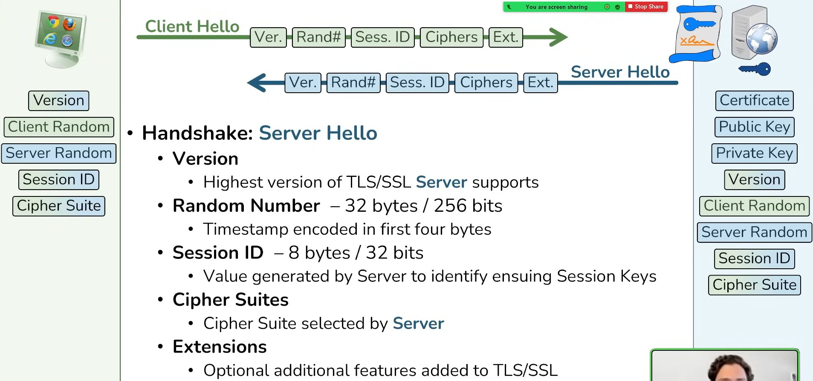

# SSL/TLS Handshake

- 通信の暗号化を行うために、証明書の確認と鍵交換を行うプロセス。
- サーバーが信頼できることを証明し、クライアントとサーバーが共通の秘密鍵を使ってデータを暗号化できる状態にする。
- 

## TLS 1.2 のハンドシェイクの流れ

- 

### 1. Client Hello（クライアント → サーバー）
- クライアントがサーバーに接続を要求。
- **含まれる情報:**  
  - 利用可能なTLSバージョン（例えば、TLS 1.2, TLS 1.3）  
  - セッションID  
  - 利用可能な暗号スイート（暗号や認証方法を文字列で指定）  
    - 構成: `鍵交換_署名_暗号化_ハッシュ関数`
    - 
    - IETFで規格化されているので、自由な組み合わせで出来るわけではない
  - クライアントが生成したランダム値（後で鍵生成に使用）
- 

- **補足:**  
  - 例：`TLS_ECDHE_RSA_WITH_AES_128_GCM_SHA256` の意味:  
    - **ECDHE** による鍵交換  
    - **RSA** を使った認証  
    - **AES** の共通鍵を使った鍵長128ビット  
    - **暗号モード** は **GCM**  
    - **MAC** で使うハッシュ関数は **SHA256**  
  - **MitMによるダウングレード攻撃 (FREAK)**  
    - Client Hello に含まれる暗号スイートを強度の低いものに改ざんし、サーバーに送る。

---

### 2. Server Hello（サーバー → クライアント）
- サーバーがクライアントの要求を受け入れ、通信を開始する準備を整える。
- **含まれる情報:**  
  - サーバーが選んだ **TLSバージョン**  
  - サーバーが選んだ **暗号スイート**  
  - サーバーが生成した **ランダム値（後で鍵生成に使用）**
- 
- 重要：
  - ここまでで、お互いがどのくらいの情報を持っているのか把握しておく。
  - まだ平文でやり時が行われている。つまりWiresharkで`tls`でフィルターすれば全てみれる
  - 
---

### 3. Server Certificate（サーバー → クライアント）
- サーバーの **証明書**（公開鍵が含まれており、サーバーの正当性を証明するため）を送信。

- **クライアントの動作: サーバー証明書の確認**
  - クライアントは、サーバーの証明書を受け取り、それが信頼できる**証明書機関（CA）**によって発行されていることを確認。
  - 証明書が有効でない場合、接続は中断されることがある。
- ここでクライアントは`サーバ証明書`の中の`公開鍵`を取得

- **Certificate Request（サーバー → クライアント）【スキップされることが多い】**
  - 多くの場合、クライアントが本物かどうかの認証は行われない。

---

### 4. Server Hello Done（サーバー → クライアント）

---

### 5. Client Key Exchange（クライアント → サーバー）
- **Pre-master secret**（鍵を作成するための情報）を送信。
  - Pre-master secret は、**サーバー証明書に含まれる公開鍵で暗号化** されている。
  - **Pre-master secret(48 bytes)**を送信する2つの目的
    - Establish Mutual Keying Material (Seed Valueなど): 多くの鍵を作る元で公開鍵方式を用いる。
    - Proves Server is true owner of Certificate: 証明書が持ち主である証明

- **サーバー側の動作:**
  - 受け取った Pre-master secret を、**自分の秘密鍵で復号** し、元の Pre-master secret を取り出す。  
  - （鍵そのものではなく、鍵を作成するための情報を復号する。）

- 

---

### 6. Key Generation（サーバー & クライアント）
- クライアントとサーバーは、それぞれのランダム値と Pre-master secret を使って **master secret** を作成。
- どのように作成されるか？以下をハッシュ関数のようなもの（PRF）に渡す。
  - **master secret**
  - **"ランダム値"**: ClientHelloで共有したもの
  - **"ランダム値"**: ServerHelloで共有したもの
- **master secret をもとに、以下の鍵(Session Keys)が作成される:**
  - クライアント用 **MAC鍵**
  - クライアント用 **暗号化鍵**
  - クライアント用 **暗号化IV（初期ベクトル）**
  - サーバー用 **MAC鍵**
  - サーバー用 **暗号化鍵**
  - サーバー用 **暗号化IV（初期ベクトル）**

- **補足:**  
  - **初期ベクトル（IV）** は、同じ平文を同じ暗号鍵で暗号化しても、常に異なる暗号文にするためのデータ。

- session key をハッカーが取得する方法：
　　- **pre master secret**, **Master Secret**, **クライアント用の鍵(MAC鍵&暗号化鍵)**、**サーバー用の鍵(MAC鍵&暗号化鍵)**のどれかを取得して、Wiresharkに計算させてsession keyにする。
    - それを用いて復号できる。
    - 
- Wiresharkで**pre master secret**を取得できるが、これを復号するには、サーバーの秘密鍵が必要なので、これだけだと無理。次の図は暗号化された**pre master secret**
- 
- 動画58分からサーバ秘密鍵を使った**pre master secret**の復号化及び、Sessin keyの再生成を確認できる。
- [TLS Handshake Deep Dive and decryption with Wireshark](https://www.youtube.com/watch?v=25_ftpJ-2ME)
---

### 7. Change Cipher Spec（クライアント → サーバー）
- 以後の通信が **暗号化** されることを通知。

---

### 8. Finished（クライアント → サーバー）
- 暗号化通信が始まる前に、これまでの通信が改ざんされていないことを確認するため、ハッシュ値を送信（**Finished message**）。
- 両者はこのハッシュ値を検証し、問題がなければ通信が開始される。
- 

---

### 9. Change Cipher Spec（サーバー → クライアント）

---

### 10. Finished（サーバー → クライアント）
- 
---

### **補足: TLS 1.3 との違い**
TLS 1.3では、以下の改善が行われています:
- **ハンドシェイクの高速化**（ラウンドトリップ回数が削減）
- **RSAによる鍵交換の廃止**（**ECDHEのみ** を使用）
- **強力な暗号スイートのみを採用**
- **Change Cipher Spec メッセージの省略**

---

## TLS 1.3 のハンドシェイクの流れ

### 1. Client Hello（クライアント → サーバー）
- クライアントがサーバーに接続を要求し、**1つのメッセージに複数の情報を含める**（TLS 1.2 より簡素化）。
- **含まれる情報:**  
  - サポートする **TLSバージョン**（TLS 1.3 のみ）  
  - サポートする **暗号スイート**（例: `TLS_AES_128_GCM_SHA256`）  
    - **クライアントが生成したランダム値**  
  - **鍵交換情報**（クライアントの公開鍵）  
  - **拡張機能**（例えば、0-RTT の有効化）

---

### 2. Server Hello（サーバー → クライアント）
- サーバーがクライアントの要求を受け入れ、通信の準備を整える。
- **含まれる情報:**  
  - サーバーが選んだ **暗号スイート**  
  - サーバーが生成した **ランダム値**  
  - サーバーの **公開鍵**（鍵交換のため）

---

### 3. 暗号鍵の交換 & 鍵導出（サーバー & クライアント）
- クライアントとサーバーは、お互いの公開鍵を用いて、**共通の秘密鍵（Pre-Master Secret）を生成**。
- これにより、**ECDHE**（楕円曲線ディフィー・ヘルマン鍵交換）を用いた鍵交換が行われる。

- **鍵導出（Key Derivation）:**
  - 生成された Pre-Master Secret と、Client Hello / Server Hello のランダム値を使い、**Master Secret** を作成。
  - Master Secret から、**セッション鍵**（データ暗号化に使用する鍵）を導出する。

---

### 4. Encrypted Extensions（サーバー → クライアント）
- サーバーが追加の情報を送る（例: ALPN、セッション再開用データなど）。
- **この時点で、以降の通信はすべて暗号化される**（TLS 1.2 より早い段階で暗号化開始）。

---

### 5. Certificate & Certificate Verify（サーバー → クライアント）
- **証明書の送信**
  - サーバーが自身の **証明書（X.509証明書）** を送信。
  - クライアントはこれを検証し、サーバーが本物であることを確認する。

- **証明書の署名検証**
  - サーバーは自身の秘密鍵を使い、証明書に署名したデータを送信。
  - クライアントは、サーバーの公開鍵を用いて署名を検証し、データの改ざんがないことを確認する。

---

### 6. Finished（クライアント → サーバー / サーバー → クライアント）
- クライアントとサーバーが「**TLSハンドシェイクが正常に完了した**」ことを確認するため、**Finishedメッセージ** を交換。
- **Finishedメッセージにはハッシュ値が含まれ、過去の通信が改ざんされていないことを証明する**。

---

### 7. アプリケーションデータの送信開始（暗号化通信開始）
- TLS 1.3 のハンドシェイクが完了し、暗号化されたデータの送受信が可能になる。
- **TLS 1.2 に比べて、より早い段階でデータが暗号化されるため、高速で安全な通信が実現される**。

---

## **TLS 1.3 の改善点（TLS 1.2 との違い）**
| 項目 | TLS 1.2 | TLS 1.3 |
|------|--------|--------|
| **ハンドシェイク回数** | 6～10回 | 4回 |
| **鍵交換方式** | RSA, ECDHE | **ECDHE のみ** |
| **対称鍵の導出** | Master Secret 方式 | HKDF（ハッシュ関数ベース） |
| **暗号スイート** | 多様なオプション | **AES-GCM / ChaCha20 のみ** |
| **セキュリティ強化** | 脆弱な暗号スイートあり | **不要な機能削除、より安全** |
| **0-RTT（0ラウンドトリップ再開）** | なし | **あり（早い再接続が可能）** |

---

## **補足: 0-RTT（Zero Round Trip Time）**
- TLS 1.3 では、**0-RTT** による **高速セッション再開** が可能。
- 一度通信したサーバーに対して、過去の鍵を再利用し、**1ラウンドトリップなし（0-RTT）で通信を開始できる**。
- **メリット**: 遅延が減るため、より高速な接続が可能。
- **デメリット**: **リプレイ攻撃のリスク** があるため、一部のデータは 0-RTT で送信すべきではない。

---

## **まとめ**
- **TLS 1.3 のハンドシェイクはシンプル化され、より高速になった。**
- **不要な暗号スイートを削除し、安全性が向上。**
- **0-RTT による超高速セッション再開が可能だが、リプレイ攻撃のリスクもある。**

---

## 参照

- [TLS Handshake](https://www.youtube.com/watch?v=3ImpkOVg0YQ)
- [TLS1.2詳細](https://www.youtube.com/watch?v=fiooR6iXkCA)
- [TLS1.2補足](https://qiita.com/n-i-e/items/41673fd16d7bd1189a29)
- [TLS1.3詳細](https://www.youtube.com/watch?v=Ig67jwfZU4U)
- [SSL, TLS, HTTPS Explained](https://www.youtube.com/watch?v=j9QmMEWmcfo)
- [TLS Handshake Deep Dive and decryption with Wireshark](https://www.youtube.com/watch?v=25_ftpJ-2ME)
- [Wireshark](https://www.youtube.com/watch?v=aEss3CG49iI)
- [What happens when you type a URL into your browser?](https://www.youtube.com/watch?v=AlkDbnbv7dk)
- [HTTP 1 Vs HTTP 2 Vs HTTP 3!](https://www.youtube.com/watch?v=UMwQjFzTQXw)
- [TLS 暗号設定ガイドライン](https://www.ipa.go.jp/security/crypto/guideline/gmcbt80000005ufv-att/ipa-cryptrec-gl-3001-3.1.0.pdf)
