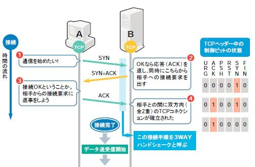
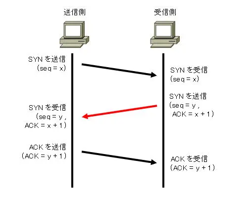

# TCP 3-Way Handshake

- データを送受信する前に、3回のパケットをやり取りして コネクションを確立し、仮想回線を作ること。
- このプロセスにより、信頼性のある通信の準備が整う。
- 
- 

## TCPを使用している主なプロトコル

✅ TCPを使用するすべてのプロトコル（例えば、HTTPS、FTP、SSH、SMTPなど）は、最初に 3-way ハンドシェイク を行って、接続を確立する。  
✅ 3-way ハンドシェイク によって、送信側と受信側が通信の準備ができていることを確認し、データ転送を安全に行うことができる。 

| プロトコル  | 用途                                    | ポート番号  | 特徴                                           |
|------------|-----------------------------------------|------------|------------------------------------------------|
| **HTTPS**  | ウェブサイトの暗号化通信                 | 443        | HTTPの暗号化版で、セキュリティが強化されている         |
| **FTP**    | ファイル転送                            | 21（制御用） 20（データ用）| ファイルのアップロードやダウンロードを行う                     |
| **SSH**    | セキュアなリモートシェルアクセス         | 22         | 安全にリモートアクセスでき、ファイル転送も可能               |
| **SMTP**   | メール送信（メールの送信サーバー間通信） | 25（非暗号化）465（SSL/TLS）| メールサーバー同士でメールを送信                           |
| **POP3**   | メール受信（サーバーからクライアントへの受信）  | 110（非暗号化） 995（SSL/TLS）| サーバーからメールをダウンロードし、ローカルに保存                |
| **IMAP**   | メール受信（サーバー上で管理）            | 143（非暗号化） 993（SSL/TLS）| メールをサーバー上で管理し、複数端末からアクセス可能              |
| **Telnet** | リモートシェルアクセス（暗号化なし）      | 23         | 古典的なリモートアクセス方法、セキュリティに欠ける               |
| **RDP**    | リモートデスクトップアクセス             | 3389       | リモートPCのデスクトップ環境にアクセス                       |
| **BGP**    | インターネットのルーティング              | 179        | 異なるネットワーク間でルーティング情報を交換、インターネットの経路選択に使用 |
| **DNS**    | ドメイン名の解決                        | 53（TCP/UDP）| ドメイン名をIPアドレスに変換（TCPはゾーン転送などに使用）         |

---

- これらのプロトコルは、インターネットやネットワーク内で多く使用されており、**データの信頼性や順序の保証**が求められる通信に最適。

## 参照

- [TCP/IP階層モデル](https://www.youtube.com/watch?v=BzEOXMZmru8)
- [パケットの中身を見てTCP/IPを絶対に理解したい](https://www.youtube.com/watch?v=fmN3xrqEz_0&t=1s)
- [【#18 CCNA 】【2章TCP/IP】スリーウェイハンドシェイク](https://www.youtube.com/watch?v=qj1HPyIFW8E)
- [TCP three-way handshaking](https://www.infraexpert.com/study/tcpip9.html)
- [TCPの制御（スリーウェイハンドシェイク）](https://net-skills.net/intro-menu1/three-way-handshake/)