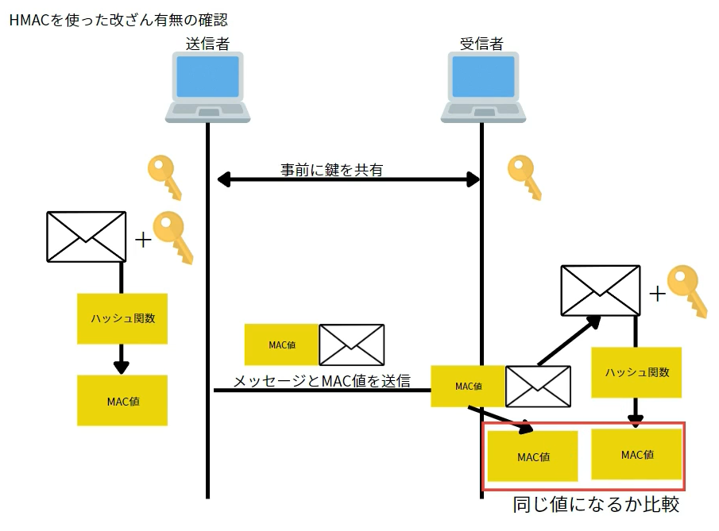

# Message Authentication Code / MAC

## 1. メッセージ認証符号(MAC)とは

- `メッセージ認証符号(MAC)`: メッセージの完全性を保証するための仕組み
  - `完全性(Integrity)`: 情報が正確かつ完全な状態に保たれていること。情報が改ざんや破壊されず、正しい情報のまま維持されている状態を指す
- 注意: 
  ※ 文書の完全性は担保されるが、作成者の特定は不可(鍵を持っている人全員)。
  ※ もし作成者を担保したい場合：`公開鍵暗号方式`を使った`デジタル署名`を利用

## 2. メッセージ認証符号(MAC)の作成方法

- MACの生成方法の1つであるHMAC(Hash based Message Authentication Code)
  - データの完全性とメッセージ認証を同時に検証できる。
- HMACの仕組み：
  - お互いが共通して持っている`秘密鍵`と`メッセージ`を`ハッシュ関数`に渡して`MAC値`を生成
  - 共通鍵暗号方式
- 仕組み
  1. 受信側の共通鍵(秘密鍵)を送信側と共有
  2. 送信側で、共通鍵とデータをハッシュ関数に渡して、ハッシュ値(`MAC値`)を取得
  3. データとハッシュ値(`MAC値`)を送信
  4. 受信側は受け取った文書と持っていた共通鍵(秘密鍵)をハッシュ関数に渡して、ハッシュ値(`MAC値`)を取得。
  5. ハッシュ値を比べ、同じなら文書の改竄がないことが保証される(`完全性`)。
  

## 3. メッセージ認証符号(MAC)は作成者を判断できない

- メッセージの作成者を特定することはできない。
- つまり、送信者か受信者のどちらがメッセージを作成したのか分からない。
  - 両者とも同じ秘密鍵を持っているため。
- もし作成者を担保したい場合：`公開鍵暗号方式`を使った`デジタル署名`を利用する必要がある。

## 参照

- [メッセージ認証符号 - MAC](https://www.youtube.com/watch?v=OzGi7aB1fN0)
