# Poco F1にNetHunter Proを導入

背景
- Wardrivingのテストのため

所感

- ブートローダーのアンロック時のMi Unlock Toolで少しハマるが問題なく導入できた

結果
- 成功

課題
- デバイスを最大限活用できるようにする

## 導入と設定

### 1. ブートローダーをアンロック

- デバイスを購入: Poco F1 シムフリー 中古を購入
- ブートローダーをアンロック
  - Mi Unlock Tool をダウンロード: [Mi Unlock Tool](https://en.miui.com/unlock/download_en.html)
  - Guide通りに進めてロックを解除: [OFFICIAL GUIDE](https://new.c.mi.com/global/post/101245?utm_source=miui&utm_medium=official_web_faq&utm_campaign=official_web_miui)

### 2. TWRPでデータを削除

- [TWRP Img ダウンロード](https://dl.twrp.me/beryllium/)
- [SDK Platform-Tools ダウンロード](https://developer.android.com/tools/releases/platform-tools?hl=ja)
- 解凍してディレクトリを移動: `cd C:\projects\android\platform-tools-latest-windows\platform-tools`
- デバイスをFASTBOOTモードにしてPCと接続
- デバイスの認識を確認: `.\fastboot devices`
- `twrp.img`を同じフォルダに移動
- TWRPをフラッシュ: `.\fastboot flash recovery twrp.img`
- TWRPを直接起動`.\fastboot boot twrp.img`
- スマホの画面が変わりTWRPに入り、中のデータを消去：`「Wipe」→「Format Data」を実行`
- kaliの`img`を同じフォルダに移動
- TWRP から Fastboot モードに戻る: `Reboot` → `Bootloader` を選択
- kaliのbootイメージをフラッシュ: `.\fastboot flash boot nethunterpro-20241215-sdm845-phosh.boot-beryllium-ebbg.img`
- リブート: `.\fastboot reboot`

### 3. kaliでの設定

- PW: `1234`でログイン
- Terminalで`sudo apt update&&sudo apt upgrade -y`
 - 401 Errorが出た場合: `sudo vi /etc/apt/sources.list`で下のように書き換える
```
deb http://http.kali.org/kali kali-rolling main non-free contrib
deb-src http://http.kali.org/kali kali-rolling main non-free contrib
```

## Wardriving

- 流れ
  1. Wi-Fiスキャン & ハンドシェイクキャプチャ: Airmon-ng / Airodump-ng / Aireplay-ng
  2. GPS情報をリアルタイムで取得: GPSD + GPS受信機
  3. GPSデータとWi-Fiデータをマッピング: Giskismet

### 1. 

- 準備
- スマホでの操作が面倒なので、windowsからssh接続して操作する
- windowsで`putty`をインストール
- スマホでssh起動  
```bash
systemctl status ssh
sudo systemctl enable ssh
sudo systemctl start ssh

```
- スマホのipで指定して接続
- スマホにWiFiアダプタを認識させる
- ドライバのインストール`sudo apt install realtek-rtl88xxau-dkms`
- カーネルヘッダーをインストール`sudo apt install linux-headers-$(uname -r)`
- もう一度ドライバのインストール: `sudo apt install --reinstall realtek-rtl88xxau-dkms`
- ドライバを認識させる: `sudo modprobe 88xxau`

### 2. 

1. カーネルとコンパイラの不一致
  - カーネル (`6.6.58-sdm845-nh`) は `aarch64-linux-gnu-gcc 12.2.0`でビルドされているのに、`gcc 14.2.0 でドライバ`をビルドしようとしたため、互換性の問題が発生。
  - 対策：
    - カーネルとヘッダーのバージョン確認：`一致`
      - カーネルバージョンの確認: `6.6.58-sdm845-nh`
        - 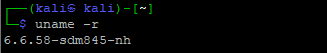
      - カーネルヘッダーの確認: `linux-headers-6.6.58-sdm845-nh (バージョン 6.6.58-2, arm64 向け)`
        - 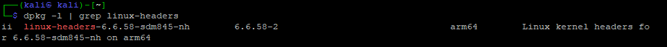

2. 実行バイナリのアーキテクチャ不一致
  modpost や fixdep などのスクリプトが「実行形式が違う（Exec format error）」とエラーを出した。
  これは、異なるアーキテクチャ（x86_64向けのバイナリなど）が混ざっていた可能性が高い。

3. DKMS周りの不整合
  古いドライバが適切に削除されず、dkms remove しても不完全な状態が残っていた。
  手動で `/lib/modules/...` 内のファイルを削除する必要があった。

- カーネルをビルドした環境と同じコンパイラでドライバをビルドし、余計なバイナリの混入を防ぐこと


## OTG

- nethunter pro on pocof1 でOTGが動作しないバグがある
  - https://gitlab.com/kalilinux/nethunter/build-scripts/kali-nethunter-pro/-/issues/13
  - https://wiki.postmarketos.org/wiki/OnePlus_6_(oneplus-enchilada)

- OTG有効化を試す  
1. OTGの状態を確認(有効/無効): 
  - ファイルの場所を探す: `find /sys/devices -name "*otg*"`
    - 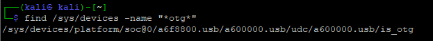
  - 状態を確認: `cat /sys/devices/platform/soc@0/a6f8800.usb/a600000.usb/udc/a600000.usb/is_otg`
    - `無効(0)`を確認
    - 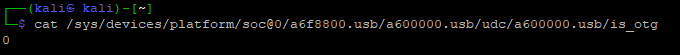
2. 有効化：
  - 書き込み権限付与: `sudo chmod +w /sys/devices/platform/soc@0/a6f8800.usb/a600000.usb/udc/a600000.usb/is_otg`
  - 有効化: `echo 1 | sudo tee /sys/devices/platform/soc@0/a6f8800.usb/a600000.usb/udc/a600000.usb/is_otg`
    - 有効化不可
    - 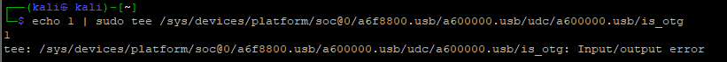

- `dr_mode` を "host" に変更してみる: 不可

- Kali Phoshを利用してみる
1. イメージファイルのダウンロードしてフォルダ移動: `ebbg`
  - `kali_phosh_sdm845_20241104.img`
  - `boot_beryllium-ebbg_20241104.img`
2. フラッシュ&リブート
  - `fastboot flash userdata kali_phosh_sdm845_20241104.img`
  - `fastboot flash boot boot_beryllium-ebbg_20241104.img`
  - `fastboot reboot`
    - 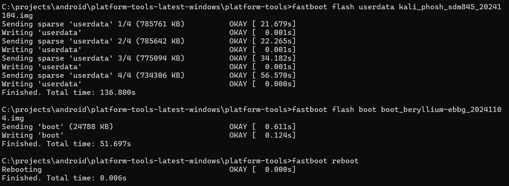

- Enable OTG
- tmpフォルダ作成：`mkdir tmp`
- 移動：`cd tmp`
- コピーdtbファイル：`cp /usr/lib/linux-image-6.6-sdm845/qcom/sdm845-xiaomi-beryllium-ebbg.dtb .`
- Install dtc tool: `sudo apt install device-tree-compiler -y`
- Decomlile the DTB file to DTS file: `dtc -o a.dts sdm845-xiaomi-beryllium-ebbg.dtb`
- ファイルの確認: `file a.dts`
  - 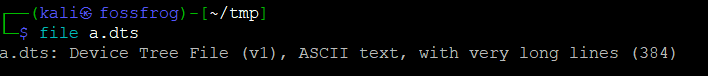
  - DTBファイルがテキストファイルになっているのを確認
- このtxtファイルの`dr_mode`の値を修正: `peripheral`→`host`
  - 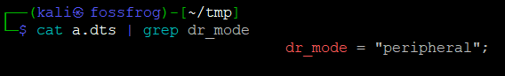
  - `sed -i 's/dr_mode = "peripheral"/dr_mode = "host"/g' a.dts`
  - 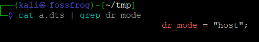
- DTS fileをDTB fileに再度コンパイル
  - 古いDTBファイルを削除: `rm sdm845-xiaomi-beryllium-ebbg.dtb`
  - `dtc -o host.dtb a.dts`
    - 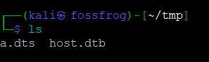
  - 古いDTSファイルを削除: `rm a.dts`
- concatenate the DTB and kernel into a single file: `cat /boot/vmlinuz-6.6-sdm845 host.dtb > kernel-dtb`
  - 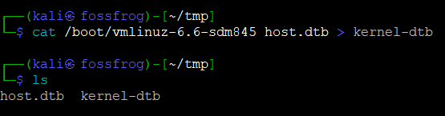
  - 古いファイルを削除: `rm host.dtb`
- rootへ
  - root パスワードを設定: `sudo passwd root`
  - rootへ: `su`
    - 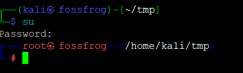
- extract the boot.img from the boot partition using the `dd` command
  - `dd if=/dev/disk/by-partlabel/boot of=boot.img`
   - 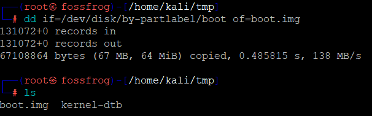
- replace the modified DTB-appended kernel in the boot.img
  - `abootimg -u boot.img -k kernel-dtb`
    - 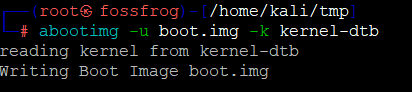
  - 古いイメージの削除: 
    - `rm kernel-dtb`
  - 名前の変更
    - `mv boot.img host_boot.img`
- 注意:
  - Only externally powered OTG will work on the POCO F1, and when using the host DTB, the device can't be used as a peripheral or client device, meaning you can't perform HID attacks.
- ブートイメージをフラッシュしてOTGが動くか確認する
  - `dd if=host_boot.img of=/dev/disk/by-partlabel/boot`
    - 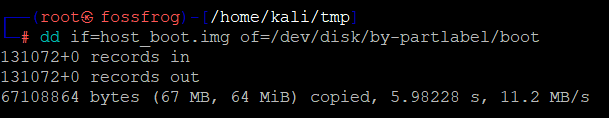
  - `sync` and `reboot`
  - リブート出来たらsshに再接続してログを確認: `dmesg -W`

## 公式を再インストール

- 準備：
- データを削除して綺麗にする
- Fastboot モードに入る
- 電源 + 音量下ボタンを長押し
- デバイス認識の確認：`.\fastboot devices`
- ブートローダーアンロックの確認: `.\fastboot oem device-info`
- 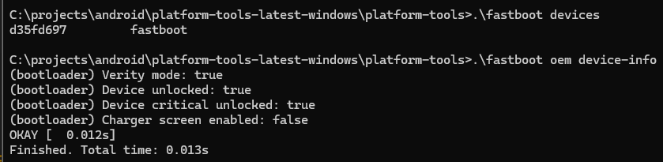
- TWRPをフラッシュ: `.\fastboot flash recovery twrp.img`
- TWRPを直接起動: `.\fastboot boot twrp.img`
- スマホの画面が変わりTWRPに入り、中のデータを消去：「Wipe」→「Format Data」を実行
- userdataの削除：`.\fastboot erase userdata`
- userdataをフラッシュ：`.\fastboot flash userdata nethunterpro-20241215-sdm845-phosh.rootfs.img`
- bootイメージをフラッシュ: `.\fastboot flash boot nethunterpro-20241215-sdm845-phosh.boot-beryllium-ebbg.img`
- リブート: .\fastboot reboot

- 参照
  - [Kali Phosh for PinePhone and Qcom Phones](https://github.com/Shubhamvis98/kali-pinephone/releases)
  - [Flashing Kali Phosh on Android - A Quick Guide to Dual Booting - fossfrog](https://www.youtube.com/watch?v=rieHfDGKCeg)


## デバイスの有効活用例

### **1. 無線ネットワーク攻撃**
- **Wi-Fi監査・侵入テスト**（Wifite, Aircrack-ng, Reaver）
- **Evil Twin Attack（偽アクセスポイント）**（hostapd, Mana Toolkit）
- **Bluetoothハッキング**（BlueZ, Bluesniff, Ubertooth）
- **NFC/ RFID クローン**（Proxmark3対応）

### **2. ネットワーク・サービスのペンテスト**
- **ポートスキャン・サービス調査**（Nmap, Netcat）
- **MITM攻撃（中間者攻撃）**（Ettercap, Bettercap）
- **トラフィックキャプチャ・解析**（tcpdump, Wireshark, tshark）
- **クライアント攻撃**（Responder, Evilginx2, Beef-XSS）

### **3. 物理攻撃**
- **USB HID攻撃**（BadUSB, DuckHunter HID）
- **キーロガー・バックドア埋め込み**（Metasploit, Empire）
- **Rubber Ducky風スクリプトの実行**（DuckHunter）

### **4. クラウド・リモート攻撃**
- **VPN・Torを使った匿名性の確保**
- **SSHやMetasploitでのリモートアクセス**
- **クラウドC2（Cobalt Strike, Sliver, Mythic）を活用した攻撃**  

### **5. モバイルデバイスのハッキング**
- **Androidアプリのリバースエンジニアリング**（APKTool, Frida, Objection）
- **モバイルペネトレーションテスト**（Drozer, MobSF）

**USB-C OTG**経由でBadUSBデバイスやRubber Duckyを利用することも可能。

## 参照

- [How To UNLOCK Bootloader Of Poco F1](https://www.youtube.com/watch?v=v5ytDelaa4w)
- [How to unlock bootloader and install twrp in poco f1](https://www.youtube.com/watch?v=jK-6AovD3w0&)
- [Kali NetHunter Pro](https://www.kali.org/docs/nethunter-pro/)
- [Install kali linux on android natively | Kali Nethunter pro installation 2024](https://www.youtube.com/watch?v=OiU_VK8GXY4)

## 参照2

- Wardriving
- [What is Wardriving?](https://www.youtube.com/watch?v=QYcfcC-1AGA)
- [Portable ESP32-based Wardriver](https://jhewitt.net/portable_wardriver)
- [wardriver_rev3 - github](https://github.com/JosephHewitt/wardriver_rev3)