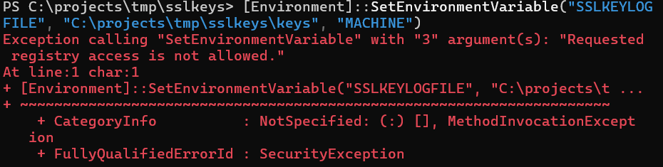
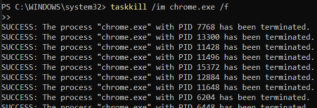
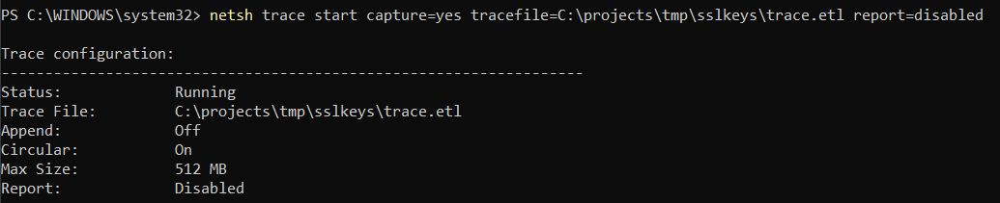
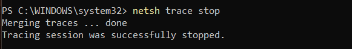
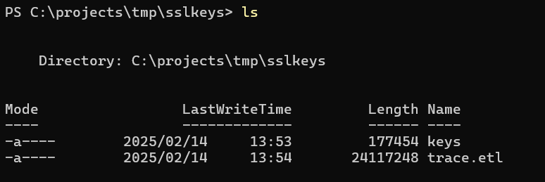
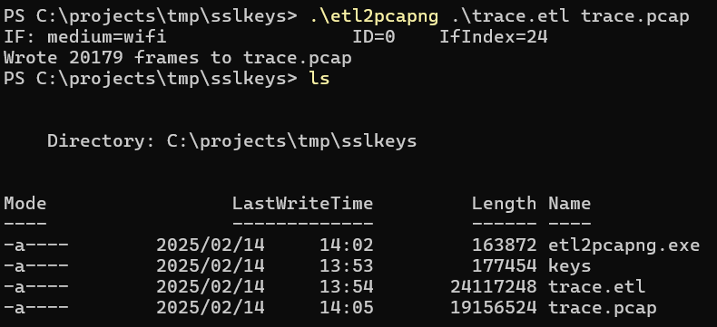
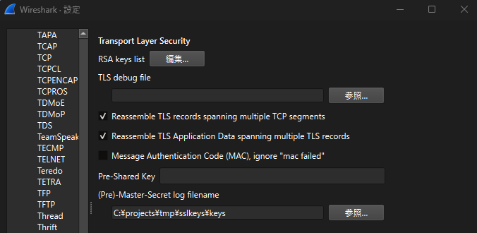
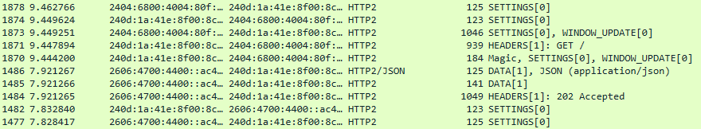

# HTTP/HTTPS通信の解読

## HTTP 通信の流れ

1. クライアント → サーバー: [TCP ハンドシェイク]  
2. クライアント → サーバー: [HTTP リクエスト送信]  
3. サーバー → クライアント: [HTTP レスポンス送信]  
4. クライアント ⇄ サーバー: [セッション維持（Cookie / セッション ID）]  
5. クライアント ⇄ サーバー: [通信終了（TCP 切断）]  

## HTTPS 通信の流れ

1. クライアント → サーバー: [TCP ハンドシェイク]
2. クライアント → サーバー: [SSL/TLS ハンドシェイク（証明書交換 & 鍵共有）]
3. クライアント → サーバー: [HTTP リクエスト送信]
4. サーバー → クライアント: [HTTP レスポンス送信]
5. クライアント ⇄ サーバー: [セッション維持（Cookie / JWT）]
6. クライアント ⇄ サーバー: [通信終了（TCP 切断）]

## メモ

- **SSL/TLS で暗号化された通信（HTTPS）はファイアウォールが中身を直接見ることができない**ため、悪意のあるコンテンツ（マルウェア、ウイルスなど）が送られてきても、ファイアウォールは検知できない。
  - 「SSL/TLS で暗号化された通信」とは、TLS HandshakeのChange Cipher Spec の後のデータのこと。
- **ポート 443 での HTTPS 通信でも同様**で、暗号化されているため、通常のファイアウォールでは内容を解析できない。
- 防ぐには`プロキシ`や`NGFW（次世代ファイアウォール）`を導入し、`HTTPS通信を復号&スキャン`出来るようにする。
  - Outboud SSL Decryption: ネットワーク内のユーザーがインターネットにアクセスする通信を復号する
  - Inboud SSL Decryption (Inspection): 外部から自社サーバーへの HTTPS 通信を復号して検査する

### Outboud/Inbound SSL Decryption

- Outboud SSL Decryption (SSL Forward Proxy):
  - **仕組み:**  
    1. 社内クライアント → **プロキシ（復号）** → インターネット → 外部サイト  
    2. プロキシが HTTPS 通信を復号してスキャン後、再暗号化して送信  
  - **例:** 社員がアクセスした **偽の銀行サイト** を検知・ブロック  

- Inboud SSL Decryption
  - **仕組み:**  
    1. 外部クライアント → インターネット → **プロキシ（復号）** → 社内サーバー  
    2. 復号後に **攻撃検知（WAF, NGFW）を実施** し、安全ならサーバーへ転送  
  - **例:** 攻撃者が **SQL インジェクションを仕込んだ HTTPS リクエスト** を送信 → 復号してブロック  

| | **Outbound SSL Decryption** | **Inbound SSL Decryption** |
|---|---|---|
| **通信の向き** | 社内ユーザー → インターネット | 外部ユーザー → 自社サーバー |
| **目的** | マルウェア・フィッシングサイト対策 | サーバー攻撃対策（WAF, NGFW） |
| **検査対象** | ユーザーのリクエストやレスポンス | 外部からのリクエスト |
| **例** | 社員が怪しいサイトにアクセスするのを防ぐ | サーバーへの攻撃（SQLi, XSS）を検知 |

- **どちらも HTTPS を一度復号するので、管理や運用にはリスクがある！**

## 実践_01 

- 環境
  - Windows 11

- 流れ：
  1. `SSLKEYLOGFILE` 環境変数を設定
  2. Chrome を強制終了
  3. `netsh` でトラフィックをキャプチャ
  4. `.etl` を `.pcap` に変換
  5. Wireshark で復号

### 1. `SSLKEYLOGFILE` 環境変数を設定

- `SSLKEYLOGFILE`という環境変数をセットし、`TLS セッションキー`を`ログファイル`に保存
  - コマンド(PS)：`[Environment]::SetEnvironmentVariable("SSLKEYLOGFILE", "C:\projects\tmp\sslkeys\keys", "MACHINE")`
    -  `SetEnvironmentVariable` を `"MACHINE" レベル（システム全体）`に設定しようとしたときに、`管理者権限`が不足している 
    - 
  - コマンド(PS)：`[Environment]::SetEnvironmentVariable("SSLKEYLOGFILE", "C:\projects\tmp\sslkeys\keys", "USER")`
    - 管理者権限が使えない場合、MACHINE ではなく USER レベルで設定
    - これでも Chrome や Firefox で SSL/TLS キーを記録できる
  - Chrome や Firefox などのブラウザが `Pre-Master Secret,Master Secret,Session Keys`など、セッションごとの鍵情報 を `C:\projects\tmp\sslkeys\keys` に書き出す

### 2. Chrome を強制終了

- コマンド: `taskkill /im chrome.exe /f  `
  - 
  - Chrome が起動中だと、`SSLKEYLOGFILE` の設定が反映されないため、一度強制終了し再起動させる

### 3. `netsh` でトラフィックをキャプチャ

- コマンド：`netsh trace start capture=yes tracefile=C:\projects\tmp\sslkeys\trace.etl report=disabled`
  - 管理者権限必須（無い場合はWiresharkでキャプチャ）
  - 
- キャプチャ停止: `netsh trace stop`
  - 
- ファイルが生成されているか確認: `ls`
  - 

### 4. `.etl` を `.pcap` に変換

- etl2pcapngをダウンロード: [etl2pcapng](https://github.com/microsoft/etl2pcapng)
- コマンド: `.\etl2pcapng .\trace.etl trace.pcap`
  - 

### 5. Wireshark で復号

- Wiresharkで`trace.pcap`を開く
- keyを適応
  - 
- SSL/TLS の復号成功
  - 

### 6. 終了

- SSL/TLSの秘密鍵が keys ファイルに保存されるようになっているので、この設定を停止
  - `[Environment]::SetEnvironmentVariable("SSLKEYLOGFILE", $null, "USER")`

## 参照

- [SSL Handshake Decryption From Scratch: Step-by-Step Guide](https://www.youtube.com/watch?v=gl-ljR-5Cv0)\
- [Decrypting TLS browser traffic with Wireshark](https://embracethered.com/blog/posts/2023/decrypt-wireshark-traffic-https-netsh/)

- [SSL, TLS, HTTPS Explained](https://www.youtube.com/watch?v=j9QmMEWmcfo)
- [TLS Handshake Deep Dive and decryption with Wireshark](https://www.youtube.com/watch?v=25_ftpJ-2ME)
- [Wireshark](https://www.youtube.com/watch?v=aEss3CG49iI)
- [What happens when you type a URL into your browser?](https://www.youtube.com/watch?v=AlkDbnbv7dk)
- [HTTP 1 Vs HTTP 2 Vs HTTP 3!](https://www.youtube.com/watch?v=UMwQjFzTQXw)
