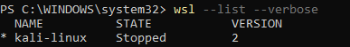
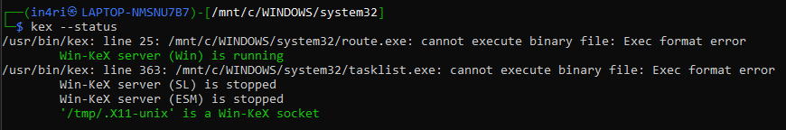
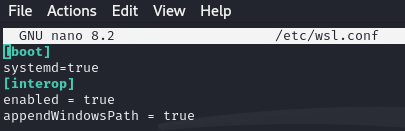

# Setting Up Hack The Box

## 1. HTBに登録

- [HACK THE BOX](https://www.hackthebox.com/)

## 2. Kali Linux on Windows11 (WSL2) 環境構築＆設定

- WSLとkaliのインストール
 - インストール：`wsl --install`
 - WSL2をデフォルトに設定：`wsl --set-default-version 2`
  - Kali Linuxをインストール: `wsl --install -d kali-linux`
    - 
- インストール後の設定:
  - パッケージを更新とインストール: `sudo apt update && sudo apt upgrade -y`
  - kali標準ツールのインストール: `sudo apt install -y kali-linux-default`
- KaliのGUIを使えるようにする
  - KeXのインストール: `sudo apt install -y kali-win-kex`
  - window mode + multiscreenで起動: `kex --win -s -m`
    - バグで起動しない
      - 
    - ファイルの修正(追加): `sudo nano /etc/wsl.conf`
      - 
    - 起動成功
- Win-KeXのGUIのショートカット作成
  - Windows Terminal を開く: Windowsキー + X → ターミナル（管理者） を選択
  - 設定を開く: 右上の「下ボタン」 をクリック →「設定」 を開く
  - 新しいプロファイルを作成: 左の「プロファイルの追加」 をクリック
    - 「名前」 → Kali-Kex-Window
    - 「コマンドライン」 → wsl -d kali-linux kex --wtstart -s -m
    - 「管理者として実行する」 → オン にする
    - 「保存」 をクリック
  - ショートカットから起動: Windows Terminal を開く → 「下ボタン」→「Kali-Kex-Window」 をクリック

## 3. THBに接続

- THBサーバへ接続
  - ovpnファイルをダウンロード
  - kaliに移す: `cp /mnt/c/projects/HTB/lab_in4ri.ovpn ~/`
  - 接続: `sudo openvpn --config ~/lab_in4ri.ovpn`
  - 成功

- SSHでの課題マシンへの接続
- 

## 4. THBの構造

HTB（Hack The Box）の構造は大きく分けて以下のようになってる：

### **HTBの主な要素**
1. **Machines（マシン）**  
   - 難易度：Easy / Medium / Hard / Insane  
   - **Active（現役マシン）** → フラグを取得するとポイントが入る  
   - **Retired（引退マシン）** → VIPメンバーならWriteup（攻略記事）が見れる  

2. **Challenges（チャレンジ）**  
   - Web, Crypto, Forensics, Reversing などカテゴリごとに問題がある  
   - CTF形式で、スキルアップ向け  

3. **Labs（ラボ環境）**  
   - **Starting Point** → 超初心者向けのハンズオン  
   - **Pro Labs** → 実戦形式のRed Team演習  
   - **Enterprise Labs** → 企業向けのセキュリティ演習  

4. **Endgames & Battlegrounds**  
   - 上級者向けのシナリオベースの演習  
   - 他のプレイヤーと競いながら攻略する環境  

---

### **どう始める？**
1. **まずは「Starting Point」**  
   - HTBの基本的な使い方やネットワーク接続、VPN設定を学べる  
   - 最初の「Pwnbox」を使えば、VPNなしでもOK  

2. **次に「Easy」マシン**  
   - `nmap` スキャンして、サービスの調査・エクスプロイトを試す  
   - 例：「Blue」（SMB脆弱性）や「Lame」（初歩的なLinux権限昇格）  

3. **問題が解けなかったら？**  
   - HTBのフォーラムやDiscordでヒントを探す  
   - Retired MachinesをVIPで見て、Writeupを参考にする  

---

### **おすすめの進め方**
✅ **Starting Point** → **Easy Machines** → **Medium Machines**  
✅ Web, Privilege Escalation, Enumeration など得意分野を伸ばす  
✅ Retired MachinesでWriteupを見ながら学ぶ  
✅ 徐々に難易度を上げる（Medium以上は時間がかかる）  

## 参照

- [Kali WSL](https://www.kali.org/docs/wsl/wsl-preparations/)
- [WSL2とKali Linuxでサイバーセキュリティの学習環境を作ろう](https://zenn.dev/forwardone/articles/f30a0ee8ffd1c2)
- [Kexバグ修正](https://github.com/microsoft/WSL/issues/9887)
- 

