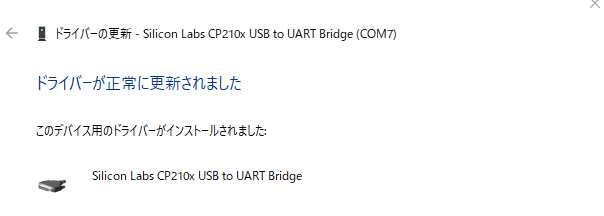
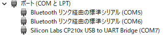
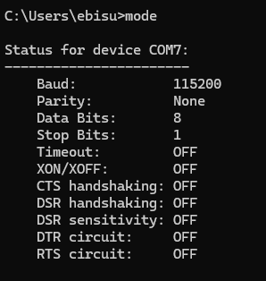
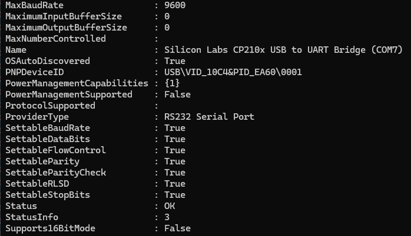
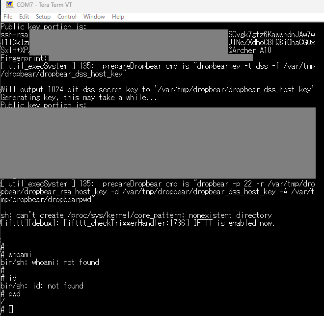
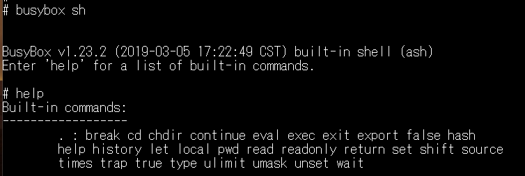
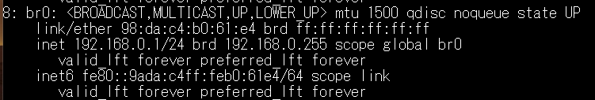

# UARTを利用したルートシェル取得ガイド

- Hardware hackingをやってみたかった
- UARTにフォーカス

## 準備

- 道具
- IoT camera / or some WiFi Router: 〇
- Digital Multimeter: 〇
- UART USB-X: 〇 / tigared board (https://1bitsquared.de/products/tigard)
- Flash Programmer: 〇

## 0. ガイド

### 1. はじめに
本ガイドでは、IoTデバイスのハッキングにおいて重要な役割を果たす **UART (Universal Asynchronous Receiver/Transmitter)** プロトコルの基礎を学び、実際にUARTを利用してルートシェルを取得する方法を説明します。

UARTは、組み込みデバイス（ルーター、スマートカメラ、スマート家電など）のデバッグ用インターフェースとして広く使用されています。このインターフェースを活用すると、デバイスの内部構造を調査したり、脆弱性を解析したりすることが可能になります。

---

### 2. UARTとは？
UARTは、シリアル通信を行うためのプロトコルで、組み込みデバイスの **デバッグや製造時のテスト** によく使用されます。UARTを通じて、デバイス内部の **シェル（コマンドライン環境）** にアクセスできることがあり、適切な設定がされていれば **ルート権限** を取得できる場合があります。

**UARTの主な特徴：**
- 2本のデータ線（RX, TX）と1本のグラウンド線（GND）で通信。
- 通信速度（ボーレート）が決まっており、送信側と受信側で一致している必要がある。
- ルーターやIoT機器では、ファームウェアのデバッグや開発中のログ取得に利用される。
- **セキュリティ対策が不十分な場合、UART経由でルートシェルにアクセスできることがある。**

---

### 3. UARTインターフェースの特定
IoTデバイスを分解すると、基板上に **UARTインターフェース** が存在することが多いです。通常、以下の3つのピンを探します：
- **TX（Transmit）**：デバイスからの出力（PCがこれを受信）
- **RX（Receive）**：デバイスへの入力（PCがここにデータを送る）
- **GND（Ground）**：電位差をゼロにするための基準線

#### 3.1 UARTピンを探す方法
1. **基板上のラベルを探す**
   - 「TX」「RX」「GND」と書かれたピンヘッダがある場合、それがUARTインターフェースである可能性が高い。

2. **マルチメータを使用する**
   - GNDピンを特定するために、基板の金属部分と接続して **導通テスト** を行う。
   - RXとTXの電圧を測定し、通常 **TXピンはアイドル時に3.3Vまたは5Vの電圧** を示す。

3. **ロジックアナライザを使用する**
   - データが流れているか確認するためにロジックアナライザを使用する。
   - 送信データのパターンからUART通信であるかを特定できる。

---

### 4. UART接続の準備
#### 4.1 必要な機材
- **USB-UARTアダプタ（FTDI, CP2102 など）**
- **ジャンパーワイヤ**（UARTピンとUSB-UARTアダプタを接続する）
- **ターミナルソフトウェア**（PuTTY, minicom, screen など）
- **マルチメータ or ロジックアナライザ（ピンの特定用）**

#### 4.2 UARTをPCに接続
1. **デバイスのUARTピンとUSB-UARTアダプタを接続する**
   - `TX` → `RX`（クロス接続）
   - `RX` → `TX`（クロス接続）
   - `GND` → `GND`（そのまま接続）

2. **ターミナルソフトウェアで接続する**
   - 例: Linuxで`screen`を使用する場合
     ```bash
     screen /dev/ttyUSB0 115200
     ```
   - 115200は一般的なボーレート（通信速度）
   - Windowsなら **PuTTY** や **Tera Term** で同様の設定を行う。

3. **シリアル通信を開始し、ログインプロンプトを確認**
   - デバイスの電源を入れると、ブートメッセージやログインプロンプトが表示されることがある。

---

### 5. UART経由でルートシェルを取得する
#### 5.1 ルートシェルが開いているか確認
UART接続後、以下のようなログインプロンプトが表示された場合、デバイスにログインできる可能性があります。
```
Login: root
Password:
```
試しに `root` でログインを試みる。

#### 5.2 制限付きシェルを回避する方法
1. **パスワード不要でルートシェルが取得できる場合**
   - 一部のデバイスでは、UART経由で接続するだけでルート権限のシェルにアクセスできることがある。
   ```
   # whoami
   root
   ```

2. **ログインが求められる場合**
   - 初期パスワードを試す（`admin`, `root`, `1234`, `password` など）
   - `/etc/passwd` や `/etc/shadow` のダンプを試みる。

3. **読み取り専用コンソールでも情報収集可能**
   - `dmesg`, `cat /proc/mounts`, `ls /dev` などを試し、デバイス情報を収集する。
   - クラッシュログを調査し、脆弱性を見つける手がかりにする。

---

### 6. 応用編：UART通信をハイジャックする
**問題: メーカーがUARTコンソールを無効化している場合**
- `RX`ラインが切断されている場合、PCBトレースを解析し、ブリッジ（ペーパークリップなどで接続）する。
- ブートローダーの中断を試みる（`Ctrl+C`, `Enter` 連打でU-Bootに入る）。
- ファームウェアのダンプを試みる。

---

### 7. まとめ
- UARTは、IoTデバイスのハッキングやセキュリティ調査において非常に重要なインターフェースである。
- 正しい機材と接続方法を理解することで、デバイス内部の情報を取得し、ルートシェルへのアクセスが可能になる。
- メーカーがUARTを無効化している場合でも、ハードウェア的な改造やソフトウェア的なテクニックで制限を回避できることがある。

## 実践

- Target: TP-Link Archer A10
- 参考: 
  - https://forum.openwrt.org/t/add-support-for-tp-link-archer-a10/121448/26
  - https://openwrt.org/toh/tp-link/ec330-g5u_v1#openwrt_installation_using_serial_console

- UARTの特定: ◎
- 接続: 
  - CP2102 USB to UART Bridge Controllerのドライバをインストール
    - https://www.silabs.com/developer-tools/usb-to-uart-bridge-vcp-drivers?tab=downloads
    - 
  - PuTTYで上手く接続できないので、Tera Termを利用する
  - ダウンロードしてインストール
    - https://github.com/TeraTermProject/teraterm/releases/tag/v5.3
  - うまくいかないので、TXとRXを入れ替えると、USBが赤色→青色へ
    - COM7として認識
    - 
    - 
  - `Get-WmiObject Win32_SerialPort`
    - 
  - いったん電源を消して、接続も解除
  - すると接続に成功した。
    - ログには、dropbear という軽量SSHサーバーが起動していることが判明
    - 
  - 権限とユーザーの確認: `cat /etc/passwd`
    - 
  - admin ユーザーが root として設定されているが、パスワードがハッシュ化されている。
    - https://github.com/therealunicornsecurity/therealunicornsecurity.github.io/blob/master/_posts/2020-10-11-TPLink.md
    - PW: `admin:1234`と判明
  - rootとしてログインしようと試みたが、`su`や`sudo`が使えない。
  - busybox コマンドを使ってシェルにアクセス: `busybox sh`
    - 
  - rootにいけないので、SSHで外部から接続してみる。
    - IPアドレスを特定：`ip addr`
    - `192.168.0.1`
    - 
  - dropbearの起動：
    - ファイルを確認：`ls /var/tmp/dropbear`
      - 
    - `dropbear -p 22 -r /var/tmp/dropbear/dropbear_rsa_host_key -d /var/tmp/dropbear/dropbear_dss_host_key -A /var/tmp/dropbear/dropbearpwd`
  - ホストから確認：`ps aux | grep dropbear`
    - 表示されない
  - `netstat -tuln`でオープンポートを表示
    - 


## 参照

- [DEF CON 32 - Anyone can hack IoT- Beginner’s Guide to Hacking Your First IoT Device - Andrew Bellini](https://www.youtube.com/watch?v=YPcOwKtRuDQ&t=11s)
- [Hacker's Guide to UART Root Shells](https://www.youtube.com/watch?v=01mw0oTHwxg)
