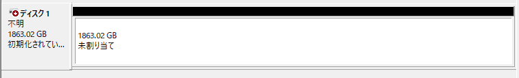
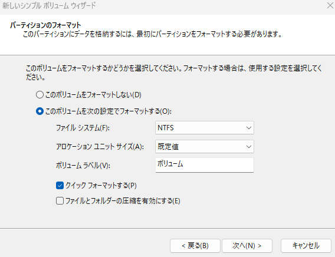
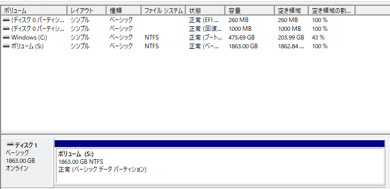
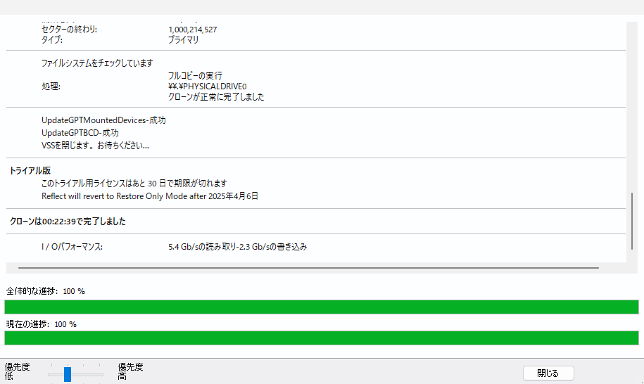

# Thinkpad X1 Carbon 6gen 

## 概要

背景：
- Touchpad, Keyboardの故障によりパーツ交換の必要性が出た
- この際、m.2ssdも500GB → 2TBにして、wifi、バッテリーもアップグレードしたかった。

交換パーツ：  

| パーツ                          | 価格 (円) |
|--------------------------------|----------|
| Palmrest + Keyboard 02HL884   | 21652    |
| Touchpad                      | 3374     |
| 内蔵無線LANカード (Intel AX210) | 2149     |
| m.2 SSD (2TB)                 | 15000    |
| NVMe M.2 SSD用USBアダプター    | 1738     |
| バッテリー（他のラップトップから流用） | 0        |
| **合計**                      | **43913** |

結果：

- 成功

所感：

- 簡単にメインLaptopの中身を換装できた。
- T440pとは違い、分解に適したモデルでは無かった。

## 1. 新しいssdにデータをクローン

ツール：[Macrium Reflect Free Edition]
- New SSD
- 初期化
- フォーマット
- クローン

1. 初期化
- 「ディスクの管理」で新しいSSDが 「ディスク〇（不明・未初期化）」 となっているのでまず初期化
- 「ディスクの管理」を開く（Win + X →「ディスクの管理」）
- 未割り当てのディスク（例：「ディスク1」）を右クリック
- 「ディスクの初期化」を選択
- 「GPT（GUIDパーティションテーブル）」を選択（2TB以上ならGPT推奨）
- 
2. フォーマット
- 「未割り当て」の場合はフォーマットが必要
- SSDの未割り当て領域を右クリック
- 「新しいシンプルボリューム」を選択
- **NTFS（またはexFAT）**でフォーマット
- ドライブレター（例：D:）を指定
- 
- 完了後、エクスプローラーに表示されるか確認
- 
3. クローン: Macrium Reflect
- [Macrium Reflect 使い方](https://4ddig.tenorshare.com/jp/partition-manager/macrium-reflect.html)
- 

## 2. Thinkpad X1 Carbon 6gen を分解

- バッテリー取り外し
- SSD・WLAN・WWANの無線モジュールを外す
- ファンの取り外し+クリーニング
- システムボード取り外し
- その他すべて取り外して移管
- Palmrestに移す
- 起動
- 未割当ての領域があるので、ドライブCを拡張。
  - ここでパーティション同士が隣同士である必要があるため、ツールを使って順番を変更
  - [MiniTool Partition Wizard ](https://www.partitionwizard.jp/free-partition-manager.html)
  - ドライブCを拡張

## 3 パーツのリサイクル

- もともと入っていたm.2ssd(500GB)をクリーニング
- 外付けSSDとして再利用

## 参考

- [Guide: Lenovo ThinkPad X1 Carbon](https://jp.ifixit.com/Device/Lenovo_ThinkPad_X1_Carbon_6th_Gen)
- [ThinkPad X1 Carbon 分解修理](https://zen-consulting.net/2022/04/08/repair-thinkpadx1carbon/)