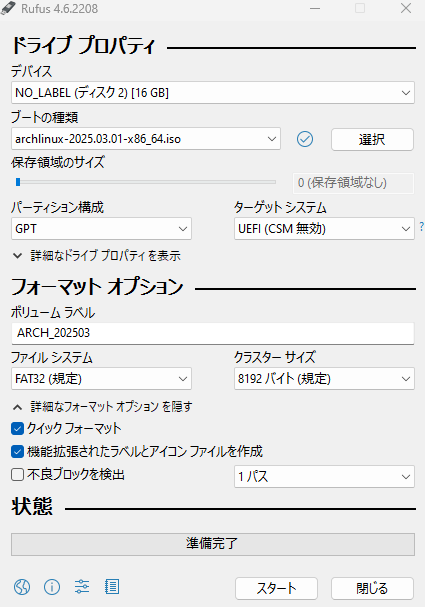

# Thinkpad X1 Carbon 6gen 

## 概要

背景：
- メインのPCのm.2ssdを交換した際に出た500GBのssdを有効活用したかった
- Arch Linux を試したかった。

結果：
- 成功

所感：
- 動画を参考に簡単にできた

## 1. 導入先のssdのクリーニング

- windowsを利用
  - `diskpart`
  - `list disk`
  - `select disk 1`
  - 個別にパーティションを消す場合: `list partition`
    - `select partition 1`
    - `delete partition override`
  - disk全体を消す場合：`clean`

## 2. USBにArch Linuxのisoを焼く

- Rufusを利用
- 設定してスタート
  - 

## 3 設定とインストール

- mainのBIOSに入ってbootの順番を変える。(USB)
- wifiに接続
  - `iwctl`
  - `device list`
  - `station wlan9 scan`
  - `station wlan0 get-networks`
  - `station wlan0 connect "SSID"`
  - PWを入れる
  - `exit`
  - 接続確認：`ping google.com`
- インストール
  - `archinstall`
  - 以下を参考に設定する
    - [How to Install Arch Linux: Step-by-Step Guide (archinstall)](https://www.youtube.com/watch?v=LiG2wMkcrFE)
  - `Installation completed without any errors.`が出れば完了
  - `sudo shutdown now`
  - USBを取り外す
  - 起動して確認

## 4. 設定

- システム情報の確認
  - `neofetch`
- 日本語入力: 成功
  - [Arch Linuxの初期設定](https://qiita.com/poyotanp/items/e59336dd6b42283fda2e#fn-1)
- 