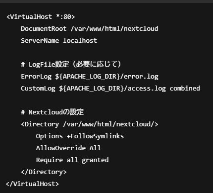
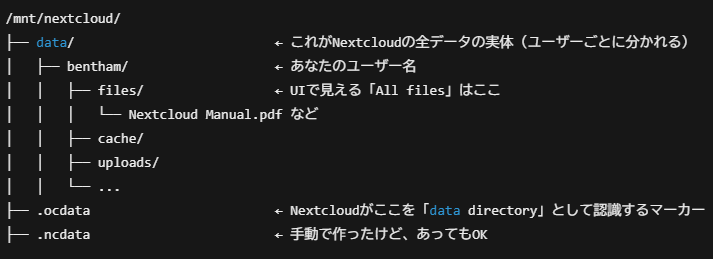

# Building Desktop PC

## 概要

背景：
- 軽量Linuxサーバー, NAS, マイニング等様々な用途に対応できる環境を作りたかった
- 出来るだけ低コストで試験的に実装してみたかった。
- マザーボードやGPUなどの理解も同時に深めたかった

結果：
- 

所感：
- 

## 1. 構成

- ケース、ストレージ(6TB HDD, 500GB HDD)、WiFiカードは転用で余っていたパーツを利用 
- 実質：49,763円 

| パーツ                           | 型番                                                        | 値段   |
|----------------------------------|-----------------------------------------------------------|--------|
| **タワーケース**                 | IW-PE663                                                   | 0      |
| **マザーボード + CPU + メモリセット** | QIYIDA X99 Motherboard + Xeon E5 2680 V4 + 32GB DDR4 REG ECC | 11,068 |
| **電源ユニット（PSU）**           | Thermalright TR-TGFX850 750W                               | 11,071 |
| **CPU冷却**                       | Lightless-3fan (LGA2011-X79-X99-E5対応)                   | 1,292  |
| **GPU**                           | SOYO AMD Radeon RX5700XT 8GB GDDR6 Memory                  | 20,147 |
| **6TB HDD**                       | ST6000DM003                                               | 14,800 |
| **500GB HDD**                     | ST500LM021                                                | 1,000  |
| **無線LANカード**                 | Intel 8265NGW                                            | 500    |
| **HUADISK NVMe M.2 SSD 1TB**     | HUADISK NVMe M.2 SSD 1TB (read:2100MB/s)                   | 5,185  |
| **合計**                          |                                                           | 66,063 |

## マザーボード

- マザボの選び方：
- 1. 使いたいCPUを決める
- 2. CPUに対応したチップセットを決める
- 3. マザーボードを決める（ソケットタイプに注意）

- CPU Socket Type：
  - 型番：`LGA2011-v3 (Socket R3)`
  - CPUとマザーボードを接続するための物理的な規格で、マザーボードには、対応するCPUソケットがあり、対応するCPUしか取り付けられない。CPUクーラーを選ぶ際も注意する。
  - [LGA2011詳細](https://ja.wikipedia.org/wiki/LGA2011)

- Chipset：
  - 型番：`Intel X99 Express`
  - 役割：CPUやメモリ、PCIe、USB、SATAなどの接続を制御する役割
  - 対応するCPUやメモリの種類があり、事前に調べる必要がある
    - [Intel X99 Express 対応CPU一覧](https://www.intel.com/content/www/us/en/products/sku/81761/intel-x99-chipset/compatible.html) + Intel Xeon E5 v3 / v4 シリーズ（Haswell-EP / Broadwell-EP）: Xeon E5-1600 v3/v4 + Xeon E5-2600 v3/v4

- Size：
  - `QIYIDA X99 Motherboard`は`Micro-ATX`
  - サイズ：`ATX` / `Micro-ATX` / `Mini-ITX`
    - ケース選びにも関わってくる部分
    - `ATX`: 標準的なサイズで、拡張性に優れており、組みやすい。キャプチャーボードを入れたいならこれ。
    - `Micro-ATX`: 少し小さめで、手ごろなモデルが多い。
    - `Mini-ITX`: 小さい。拡張性は無く、値段は高め。

- RAM(Random Access Memory)：
  - 購入メモリ：`DDR4-3200 REG ECCメモリ（サーバーやワークステーション向け）16GB×2`
　- 役割：CPUが計算や処理を行うために必要なデータを一時的に保存

- VRMフェーズ
  - 8つ確認
  - 役割：CPUに供給される電圧を調整するパーツで数が多いほど電圧を一定に保てる。

- メモ
  - `Chipset`が様々なCPUに対応していても`Socket Type`によって取り付けられるCPUが決まる
  - `Chipset`が様々なMemory(DDR4, DDR5など)に対応していても、マザーボードによってどちらかしか対応してない場合がある。

## 3. M.2 SSDにUbuntu Server 22.04 LTSをインストール

- M.2 SSDの準備
  - Windowsキー + X を押して「ディスクの管理」を開く
  - GPTを選ぶと、初期化されて未割当の状態になる。
    - 
- USBの準備
  - OSのisoをダウンロード：[Ubuntu Server 22.04 LTS](https://ubuntu.com/download/server)
  - RufusでisoをUSBに焼く
    - 
- 設定とインストール
  - サブ機のBIOSに入ってbootの順番を変える。(USB)
  - 再起動して、USBからブートする
  - Try or Install Ubuntu Serverを選ぶ
  - 動画を参照しながらインスト―ルを行う

## 4. 構築

- system information確認
  - `landscape-sysinfo`
- ネットワーク設定：
  - `sudo nano /etc/netplan/50-cloud-init.yaml`
  - `sudo netplan apply`
- GUIのインストール
  - `sudo apt install xfce xfce4-goodies xrdp -y`
  - `sudo systemctl enable xrdp`
- Login画面のインストール
  - `sudo apt install gdm3`
  - `sudo dpkg-reconfigure gdm3`
  - `sudo systemctl start gdm3`
  - `sudo reboot`
  - GUIが表示されたら成功
- Wi-Fiを表示可能に設定を変更
  - `sudo nano /etc/NetworkManager/NetworkManager.conf`
  - `managed=true`に変更
  - `sudo nano /etc/netplan/50-cloud-init.yamal`
    - `renderer: NetworkManager`を`version`の下に追加
  - `sudo netplan apply`
  - `sudo systemctl restart NetworkManager`
  - `nmcli device`: connectedになっていれば成功
  - GUIのSystemからWi-Fiの表示を確認
- ブラウザ
  - `sudo apt install firefox`
- Nextcloud
  - 準備：
    - HDDをクラウドで利用できるようにする。ここにObsidianのvaultをおいてどのデバイスからでもアクセス可能にさせる
    - Linuxでは、すべてのストレージは「どこかのフォルダ」に“マウント”しないと使えないので、どこかのフォルダにマウントポイントを指定する
    - `lsblk`：デバイス名の確認
    - `sudo mount /dev/sdb1 /mnt/nextcloud`
      - `/dev/sdb1`(HDDのパーティション)を`/mnt/nextcloud`を通じて中見を見れる
    - `df -h | grep nextcloud`：マウントされているか中身を確認。
      - 昔のデータが入っていたので、完全に削除してフォーマットし、クリーンな状態にする
      - `sudo umount /mnt/nextcloud`
      - `sudo fdisk /dev/sdb` → `d` → `w`: パーティションを削除
      - `sudo fdisk /dev/sdb` → `n` → `w`: パーティションを新しく作成
      - `sudo mkfs.ext4 /dev/sdb1`: ファイルシステムを新しく作成（フォーマット）
    - もう一度マウント：`sudo mount /dev/sdb1 /mnt/nextcloud`
 - Nextcloudをインストールしていく
   - MariaDBをインストール
     - 用途：
       - Nextcloudのデータを保存するために必要な**データベース管理システム（DBMS）**
       - Nextcloudは、ユーザー情報、ファイルメタデータ、設定情報、アプリケーションの設定など、多くの情報をデータベースに保存する
     - `sudo apt install mariadb-server -y`: インストール
     - `sudo systemctl daemon-reload`
     - `sudo mysql_secure_installation`: MariaDBのセキュリティ設定
   - NextcloudのデータベースをMariaDBに作成
     - `sudo mysql -u root -p`: MariaDBにログイン
     - `CREATE DATABASE nextcloud CHARACTER SET utf8mb4 COLLATE utf8mb4_general_ci;`: Nextcloud用のデータベースを作成
     - `SHOW DATABASES;`: DBが作成されたか確認
     - `CREATE USER 'bentham'@'localhost' IDENTIFIED BY 'yourpassword';`: Nextcloud用のデータベースユーザーを作成
     - `SELECT User, Host FROM mysql.user;`: ユーザーが作成されたか確認
     - `GRANT ALL PRIVILEGES ON nextcloud.* TO 'bentham'@'localhost';`: 適切な権限を付与
     - `SHOW GRANTS FOR 'yourusername'@'localhost';`: 権限が適切に設定されたのか確認
     - `FLUSH PRIVILEGES;`: 変更を適応
     - `EXIT;`: MariaDBを終了
   - ApacheとPHPをセットアップ：
     - 用途：Nextcloudをホストするために、ApacheとPHPをインストールする必要がある
     - `sudo apt install apache2 libapache2-mod-php -y`: インストール
     - `sudo apt install php php-gd php-json php-mysql php-curl php-xml php-zip php-mbstring php-bz2 php-intl php-imagick php-xmlrpc php-gmp php-soap -y`: PHPの必要な拡張モジュールをインストール
     - `sudo systemctl enable apache2`: Apacheを有効化
     - `sudo systemctl start apache2`: Apacheを起動
     - `sudo systemctl status apache2`: 起動確認
   - Nextcloudのダウンロードとインストール
     - `cd /var/www/html`
     - `sudo wget https://download.nextcloud.com/server/releases/nextcloud-31.0.2.zip`
     - `sudo apt install unzip`
     - `sudo unzip nextcloud-31.0.2.zip`: 解凍
     - `sudo chown -R www-data:www-data /var/www/html/nextcloud`: NextcloudのファイルをApacheがアクセスできるように所有権を設定
     - `sudo nano /etc/apache2/sites-available/nextcloud.conf`: NextcloudをWebサーバーで動作させるために、Apacheを設定
       - 
     - Apacheの設定を有効にして、Apacheを再起動
       - `sudo a2ensite nextcloud.conf`
       - `sudo a2enmod rewrite`
       - `sudo systemctl restart apache2`
   - Nextcloudのセットアップ
     - ブラウザで、`http://{your-server-ip}/nextcloud` にアクセス
     - Nextcloudのインストール画面が表示されるので、設定。
     - installをクリック：Error `cannot create or write into the data directory /mnt/nextcloud`
       - `sudo chown -R www-data:www-data /mnt/nextcloud`: データディレクトリの所有者を変更
       - `sudo chmod -R 755 /mnt/nextcloud`: 適切な権限を設定
     - installをクリック → ページ(`http://nextcloud/index.php/core/apps/recommended`)に移動された
       - Error: `Hmm. We're having trouble finding that site`
       - `sudo mount /dev/sdb1 /mnt/nextcloud`：マウントをやり直す
       - `sudo nano /etc/fstab`: 永続的なマウントを設定
         - `/dev/sdb1 /mnt/nextcloud ext4 rw,auto,user,exec,suid 0 2`
       - `sudo mkdir /mnt/nextcloud/data`: /mnt/nextcloud ディレクトリ内にデータディレクトリを作成
       - www-data ユーザーとグループに所有権を変更
         - `sudo chown -R www-data:www-data /mnt/nextcloud`
         - `sudo chmod -R 755 /mnt/nextcloud`
         - `sudo touch /mnt/nextcloud/.ncdata`: 手動で .ncdata を作成
         - `echo "# Nextcloud data directory" | sudo tee /mnt/nextcloud/.ncdata`
       - ダッシュボードにアクセス出来た：`http://{your-server-ip}/nextcloud/index.php/apps/dashboard/`
  - Nextcloudを設定：
    - `Security & Setup warnings`にはエラーが表示されているので、上から解消していく
    - 赤エラー:1
      - 
      - 解消：
        - `sudo -u www-data php /var/www/html/nextcloud/cron.php`: 手動で実行し成功。
        - ダッシュボードで更新してエラー解消を確認
        - `sudo crontab -u www-data -e`: 自動実行を設定
          - `*/5 * * * * php -f /var/www/html/nextcloud/cron.php`
          - `www-data` ユーザーが5分ごとに`cron.php`をコマンドラインで実行するようにした。
          - つまり、Nextcloudのバックグラウンド処理が自動で定期実行される状態
    - 赤エラー2: 
      - `Accessing site insecurely via HTTP. You are strongly advised to set up your server to require HTTPS instead. Without it some important web functionality like "copy to clipboard" or "service workers" will not work! For more details see the documentation`
      - 解消：自己署名証明書でHTTPS化（ローカル向け）
        - OpenSSLで証明書を作る
          - `sudo openssl req -x509 -nodes -days 365 -newkey rsa:2048 -keyout /etc/ssl/private/nextcloud-selfsigned.key -out /etc/ssl/certs/nextcloud-selfsigned.crt`
            - Common Name には nextcloud.local とか your-server-ip を書くと吉
        -  ApacheにSSL設定を追加
          - `sudo nano /etc/apache2/sites-available/nextcloud-ssl.conf`
          - 
        - サイトを有効化してApache再起動
          - `sudo a2enmod ssl`
          - `sudo a2ensite nextcloud-ssl.conf`
          - `sudo systemctl restart apache2`
        - ブラウザでアクセス：`https://your-server-ip/nextcloud でアクセス`
          - 「この接続は安全ではありません」みたいな警告は出るけど、「続行」を押せばOK（自己署名証明書だから）
    - 赤エラー3: 
      - `The PHP memory limit is below the recommended value of 512MB. Some features or apps - including the Updater - may not function properly.`
      - 解消：
        - `sudo apt install libapache2-mod-php8.3`: Apache + PHP 8.3 用のモジュールをインストール
        - `php -v`: phpのバージョン確認 → `8.3.6`
        - `php --ini`: 該当の php.ini を探す
        - `sudo nano /etc/php/8.3/apache2/php.ini` → `memory_limit = 512M`に変更
        - `sudo systemctl restart apache2`: Apacheを再起動
    - 黄エラー: 1
      - `Server has no maintenance window start time configured. This means resource intensive daily background jobs will also be executed during your main usage time. We recommend to set it to a time of low usage, so users are less impacted by the load caused from these heavy tasks`
      - 解消：
        - `sudo nano /var/www/html/nextcloud/config/config.php`
          - `'maintenance_window_start' => 5,`: UTCで午前5時、つまり日本時間で午前2時に設定
    - 黄エラー: 2
      - `One or more mimetype migrations are available. Occasionally new mimetypes are added to better handle certain file types. Migrating the mimetypes take a long time on larger instances so this is not done automatically during upgrades. Use the command occ maintenance:repair --include-expensive to perform the migrations`
      - 解消：
        - `sudo -u www-data php /var/www/html/nextcloud/occ maintenance:repair --include-expensive`
    - 黄エラー：3
      - `Some headers are not set correctly on your instance - The Strict-Transport-Security HTTP header is not set (should be at least 15552000 seconds). For enhanced security, it is recommended to enable HSTS.`
      - 解消：
        - nextcloud.conf ファイル（HTTPの設定）を編集: HTTP（ポート80）へのアクセスをHTTPS（ポート443）にリダイレクトするために、nextcloud.conf ファイルを編集
          - `sudo nano /etc/apache2/sites-available/nextcloud.conf`
          - `<VirtualHost *:80>` セクションに以下の設定を追加
          - `Redirect permanent / https://nextcloud.local/`
        - nextcloud-ssl.conf ファイル（HTTPSの設定）を編集: 次に、HTTPS（ポート443）でアクセスされた場合にHSTSヘッダーを設定
          - `sudo nano /etc/apache2/sites-available/nextcloud-ssl.conf`
          - `Header always set Strict-Transport-Security "max-age=15552000; includeSubDomains; preload"`: 追加
        - headers モジュールを有効にする
          - `sudo a2enmod headers`
        - Apacheの再起動
          - `sudo systemctl restart apache2`
    - 黄エラー：4
      - `The PHP OPcache module is not properly configured. The OPcache buffer is nearly full. To assure that repeating strings can be effectively cached. it is recommended to apply "opcache.interned_strings_buffer" to your PHP configuration with a value higher than "8"`
      - 解消：
        - `sudo nano /etc/php/8.3/apache2/php.ini` 
        - `sudo nano /etc/php/8.3/apache2/php.ini` → `opcache.interned_strings_buffer = 16`に変更
          - `Ctrl` + `W` → `interned_strings_buffer`で検索できる
        - `sudo systemctl restart apache2`
    - 細かい設定：
      - `http://192.168.1.110`にアクセスしたときにapache2のデフォルトページに入ってしまう。
        - 解消：
          - `sudo a2dissite 000-default.conf`
          - `sudo systemctl restart apache2`
      - `png`や`pdf`がnextcloud上で表示出来ない
        - 解消：
          - `sudo apt install php-imagick ghostscript -y`
          - `sudo systemctl restart apache2`
    - Nextcloudの構造
      - 
      - ダッシュボードの「All files」で見えるファイル: `/mnt/nextcloud/data/bentham/files`

## 参考

- 理解：
- [マザーボードの選び方＆基礎知識をわかりやすく解説](https://www.youtube.com/watch?v=2Q6KD1FEJDg)
- [How do computers work?](https://www.youtube.com/watch?v=4knBXkN1GEU)
- [Install Ubuntu Server 22.04 LTS](https://www.youtube.com/watch?v=zs2zdVPwZ7E)

