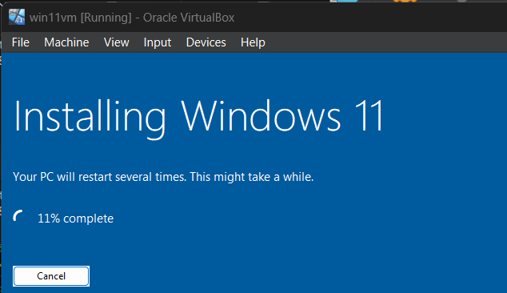

# VirtualBox for Windows

## 概要

背景：
- HTBでwindowsでの環境が必要になった

結果：
- 成功

## 1. 準備

- VirtualBoxのダウンロード&インストール
 - Extension packも同じく
- WindowsISOのダウロード

## 2. 起動

- 1 設定して起動
  - Errror 1: 
    - VirtualBoxのドライバ（VBoxDrv）が正常にロードされていない
    - ドライバの再インストール
      - `cd "C:\Program Files\Oracle\VirtualBox"`
      - `VBoxDrvInst.exe install`
        - 
      - 違う方法でインストール
        - `"C:\Program Files\Oracle\VirtualBox\drivers\vboxsup\VBoxSup.inf"`を右クリックでインストール
    - ドライバの確認と実行
      - `sc start vboxsup`
      - 
      - `sc start vboxsup` (要管理者権限)
      - 
  - Error 2:
    - 
    - エラー解消方法：`Press Any Key...`の部分が4秒ほど表示されるので、押す
- 2 インストール待機
  - 
- 3 画面サイズの自動調整
  - 仮想マシン起動
  - 上部のメニューから「デバイス」→「Guest Additions CD イメージを挿入」 を選択
  - Windows 11 内でエクスプローラーを開く
  - `VBoxWindowsAdditions.exe` を実行
    - 
    - インストール後に再起動し、「仮想スクリーンのリサイズを自動化」をクリック
    - 完了

## 参考

- [VMゲスト起動エラー](https://qiita.com/allan1024/items/8c12750df08d35b73b6d)

