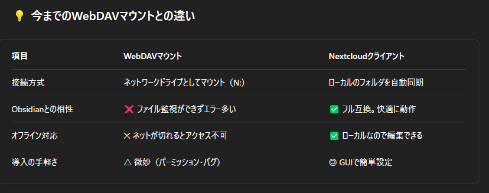

# Obsidian最適化

## 概要

- 背景：
  - 3つのvaultをNextcloud上に設置して外部ネットワークから全てのデバイスから管理&同期出来る状態になったが、今までノートに張り付けた画像が外部のフォルダを参照しており、Vaultを移した状態では参照できない。
  - 今までの画像を参照できるようにプラグイン等で最適化したい。

## Consistent Attachments and Links
- [Consistent Attachments and Links](https://github.com/dy-sh/obsidian-consistent-attachments-and-links)
- 既存ノートでVault外を参照している画像をコピー＋リンク書き換える
  - Settings → Files and links
    - Default location for new attachments: `in the folder specified below`
    - Attachment folder path: `assets/images`
  - Community plugins → "Consistent Attachments and Links"
    - Install & 有効化
    - `Ctrl + P`でコマンドパレットを開いて`Collect All Attachments`を実行
      - ノート内で使われている画像の元ファイルが `assets/images/` に移動される
      - リンクの自動修正（パス修正）: 
        - `Convert All Link Paths to Relative`を実行
        - `Convert All Embed Paths to Relative`を実行
    - `Reorganize Vault`で全て一括でやるのもよい。こちらを実行して成功。
## Nextcloudでの共有
- Windows11 laptop
  - Obsidianでnextcloud上のvaultをマウントした場所で指定してもエラーがでる
  - プロパティで権限を変えてもすぐに戻ってしまう
    - 中のファイル・サブフォルダの属性を一括解除
      - 管理者権限でコマンドプロンプトを開く
      - `attrib -R -S /D /S "N:\yk_vault\*"`
    - 失敗
    - WebDAVとObsidianの相性が悪いっぽい
  - Nextcloud 同期クライアントのセットアップ
    - 公式サイトから Nextcloud Sync Client をダウンロード
    - `https://nextcloud.local`を指定して接続
    - 
- Arch laptop
  - まずArchでの WebDAV 自動マウント設定を削除・無効化する
    -  systemdサービスとタイマーを停止
      - `sudo systemctl stop mount-nextcloud.timer`
      - `sudo systemctl stop mount-nextcloud.service`
    - systemdサービスとタイマーを無効化
      - `sudo systemctl disable mount-nextcloud.timer`
      - `sudo systemctl disable mount-nextcloud.service`
    - systemdユニットファイルを削除: これはスキップ
    - リロードして反映
      - `sudo systemctl daemon-reload`
    - `sudo nano /etc/davfs2/secrets`:認証情報をコメントアウト
  - Nextcloud 同期クライアントをインストールする
    - `sudo pacman -S nextcloud-client`: インストール
    - `nextcloud`: 起動して設定
    - windowsと同じようにローカルに同期
-2つのLaptopの自動同期が完了した。
  - しかし、外出先からは同期不可なので、今から外出先からでもこのサーバーのNextcloudと同期し、接続出来るようにする。
- 外出先からの接続と同期の設定：
  - Windows Laptop
    - tailscaleを起動しIPを確認
      - `tailscale ip`: serverのipを取得
    - Nextcloud同期クライアントを再設定
      - 同じ方法でNextcloud同期クライアントから接続
        - `https://{tailscale_ip}/`
      - 前のアカウントは削除しておく
    - 完了：同期も確認
  - Arch でも同じ設定をする
    - 完了：同期も確認
  - ボトルネック：
    - `tailscale`を常時起動させておかないと同期が出来ない
    - ローカルで作業する時も`tailscale`が必要。
