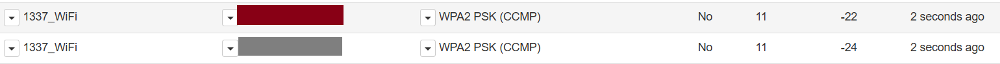
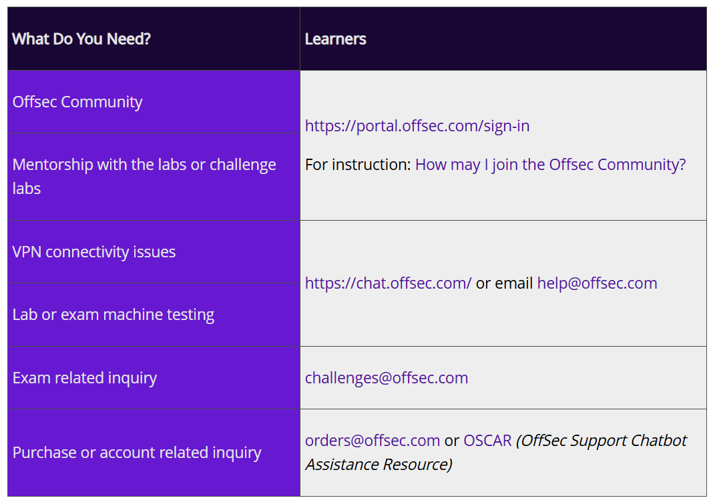
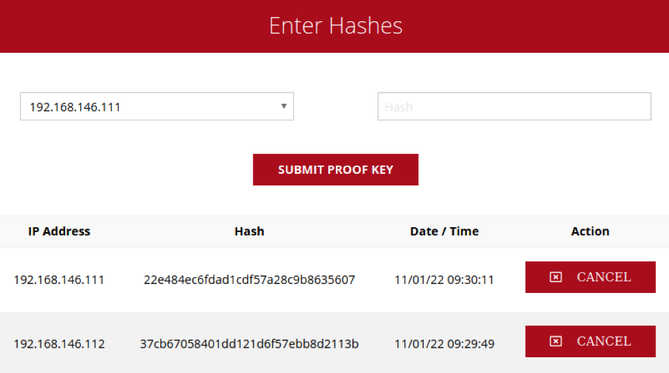
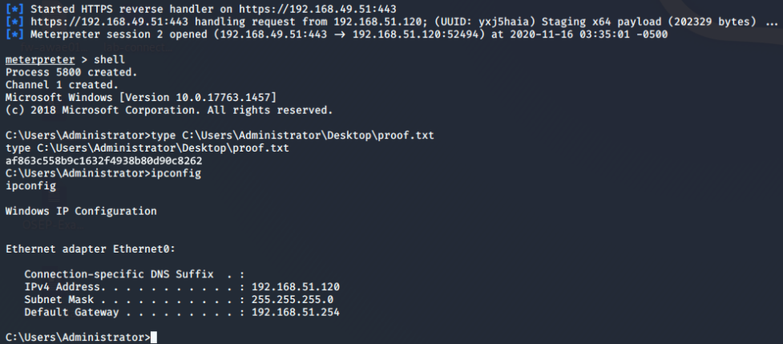
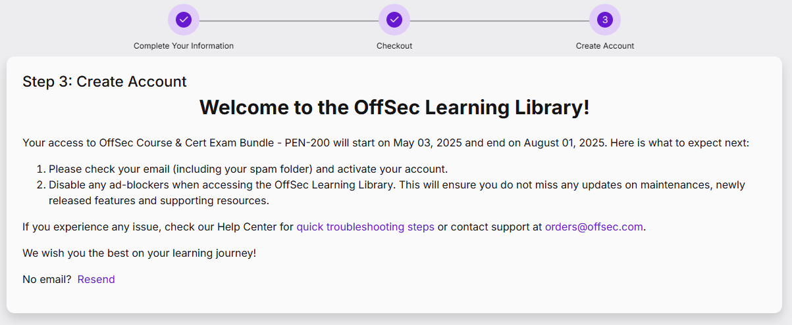

---
# the default layout is 'page'
icon: fas fa-user-secret
order: 6
---

# OSCP (PEN-200)対策

## 1. 公式

### 1.1 PEN-200 Onboarding - A Learner Introduction Guide to the OSCP
- Try Harder
  - Persistentであること（粘り強い）: 常にもう一度だけ試す
  - Creativeであること（創造的）: うまくいかない場合は、異なる問題解決のアプローチを創造的に考える
  - Perceptiveであること（知覚力がある）: 状況を把握して、より賢く試す
- Learn By Doing（実践による学習）
  - Enumeration（列挙）を習得: ペンテストの最も重要な側面であり、習得するのが最も難しい。適切にEnumerationを行う方法を学ぶ。
  - ラボ環境で200〜300時間以上費やすと合格の可能性があがる。
  - とにかくより多くのマシンを完了する。数をこなすこと：50台以上のラボマシンを完了した学習者は、試験の合格率が高い
    - 
    - PEN-200試験ではMetasploitの使用は制限されているので、ラボで使わない。
- コースを始めるのTips
  - ウェルカムメールを注意深く読む：コースPDFとビデオのダウンロードリンク、コントロールパネルのURL、ヘルプセンターの記事、VPN接続パックと資格情報が含まれている
  - Kali Linuxをセットアップ: VMwareを推奨
  - PEN-200ラボへの接続は、「Universal VPN Package」をKali Linuxマシンにダウンロードし、openvpnコマンドを使用: `sudo openvpn universal.ovpn`
    - [詳細な接続方法](https://help.offsec.com/hc/en-us/articles/9550819362964-Connectivity-Guide)
- ノートに関すること：
  - 失敗したものも含め、全ての手順、コマンド、コード、出力を文書化
  - ノートをセグメント化: 単一のターゲットを攻撃している場合、Enumeration、Interesting finds、Exploitation、Privilege Escalationなどのサブノートを作成
- Support Channels
  - 
- ソース：[PEN-200 Onboarding - A Learner Introduction Guide to the OSCP](https://help.offsec.com/hc/en-us/articles/4406841351316-PEN-200-Onboarding-A-Learner-Introduction-Guide-to-the-OSCP)

### 1.2 OSCP Exam Guide (Newly Updated)
- 注意：`試験前にもう一度確認する`
- 時間：
  - 試験時間は23時間45分
  - 試験終了後、ドキュメントをアップロードするためにさらに24時間
- 試験の構成と点数配分：
  - 各ターゲットに対する具体的な指示は、試験が開始されてからアクセス可能になる「試験コントロールパネル」に表示される
  - 試験は合計100点で、合格には70点が必要。
  - **スタンドアロンマシン**：3台の独立したターゲットがあり、各マシン20点。
    - 各マシンで初期アクセスに10点、権限昇格に10点が割り当てられる。
  - **Active Directoryセット**：3台のマシンを含むADセットが1つあり、合計40点。
    - ADセットでは、ユーザー名とパスワードが提供され、侵害シナリオをシミュレートする。
      - 10 points for machine #1
      - 10 points for machine #2
      - 20 points for machine #3
- 合格シナリオの例
  - AD 40点 + local.txtフラグ3つ（70点）
  - AD 40点 + local.txtフラグ2つ + proof.txtフラグ1つ（70点）
  - AD 20点 + local.txtフラグ3つ + proof.txtフラグ2つ（70点）
  - AD 10点 + 完全に攻略されたスタンドアロンマシン3台（70点）

#### SECTION 1: EXAM REQUIREMENTS - 試験要件
- 試験要件：
  - レポート作成: 各ターゲットの悪用プロセスを記述したプロフェッショナルなレポートを作成する必要がある
    - レポートには、すべての手順、実行されたコマンド、およびコンソール出力をペネトレーションテストレポートの形式で文書化する必要がある
    - レポートは、技術的に有能な読者がステップバイステップで攻撃を再現できるほど詳細である必要がある
    - レポートの要件は非常に厳格であり、不十分なドキュメントは減点またはゼロポイントにつながる。
    - 提出後のレポートの変更は不可
  - Exploitのコードについて
    - エクスプロイトに変更を加えていない場合は、そのエクスプロイトが掲載されている URL だけを記載する
    - エクスプロイトに変更を加えた場合は、以下を含める必要がある：
      - 修正済みのエクスプロイトコード
      - 元のエクスプロイトコードの URL
      - シェルコードを生成するために使用したコマンド（該当する場合）
      - 自分が加えた変更点のハイライト(赤い枠線で囲むなど)
      - なぜその変更が必要だったのかという説明
  - 試験用の証拠ファイル（Exam Proofs）
    - 各ターゲットマシンに対してエクスプロイトを行い、侵入の証拠（Proof）を提出すること
    - 各ターゲットには少なくとも1つの証拠ファイル（local.txt または proof.txt）が存在しており、これを取得してコントロールパネルに提出し、スクリーンショットに含めてレポートに記載する必要がある。
    - 証拠ファイルの内容は、ターゲットマシン上で対話型シェルを使い、type（Windows）または cat（Linux）コマンドでオリジナルの場所から表示して取得する必要がある
    - それ以外の方法（例：Webシェルなど）で証拠ファイルを取得した場合は、そのマシンの得点は無効になる
    - Windowsターゲットの場合（フルポイント取得条件）:
      - 以下のいずれかの権限を持つシェルである必要がある：
        - SYSTEM ユーザー
        - Administrator ユーザー
        - 管理者権限を持つ一般ユーザー
      - Linuxターゲットの場合：
        - root シェルを取得している必要がある
  - コントロールパネルへの提出（Control Panel Submission）
    - 試験のコントロールパネルには、証拠ファイル（proof files）を提出するためのセクションがある
    - 試験中に取得した各マシンの local.txt および proof.txt ファイルの内容は、試験終了前にコントロールパネルに提出しなければいけない
    - 提出した証拠が正しいかどうかは、コントロールパネル上では表示されない
      - 
  - スクリーンショットの要件: 
    - 各local.txtおよびproof.txtのスクリーンショットには、ファイルの内容と、ipconfig、ifconfig、またはip addrを使用したターゲットのIPアドレスを含める必要がある
      - 
  - 試験における禁止事項（Exam Restrictions）
    - スプーフィング（IP、ARP、DNS、NBNS など）
    - 商用ツールやサービス（Metasploit Pro、Burp Suite Pro など）
    - 自動エクスプロイトツール（例：db_autopwn、browser_autopwn、`SQLmap`、SQLninja など）
    - 大規模な脆弱性スキャナ（例：Nessus、NeXpose、OpenVAS、Canvas、Core Impact、SAINT など）
    - AIチャットボットの使用（OffSec KAI、`ChatGPT`、YouChat など）
    - 上記の禁止項目を利用する他ツールの機能も含む
    - `情報検索目的での Discord の使用は許可`されていますが、他人からの支援を求めたり受けたりすることは絶対に禁止
    - ローカル環境へのアプリ・ファイル・ソースコードのダウンロードは禁止: ただし、試験マシンの攻略に必要な場合に限り許可されます。使用後は必ず削除。
  - Metasploit に関する制限事項（Metasploit Restrictions）
    - Metasploit のモジュール（Auxiliary、Exploit、Post）および Meterpreter ペイロードは、`自分で選んだ1台のターゲットマシンに対してのみ使用可能`
    - 選択した1台のマシンに対しては、Metasploit や Meterpreter を何度でも使用可能
    - ピボット（pivoting）目的での Metasploit の使用も禁止です（結果的に複数マシンでの使用になるため）。
    - 以下のツールはすべてのターゲットマシンに対して使用可能ですが、Meterpreter ペイロードは1台に限定：
      - multi/handler（exploit/multi/handler とも呼ばれる）
      - msfvenom

#### SECTION 2: EXAM INFORMATION - 試験情報
- 試験情報
  - 試験への接続（Exam Connection）
    - 試験環境には Kali Linux と OpenVPN を使用して接続する
    - 試験接続用のパックおよび詳細は、試験開始時刻ぴったりにメールで送信される
    - 接続手順：
      - 1 試験メールに記載されたリンクから、exam-connection.tar.bz2 を Kali マシンにダウンロード
      - 2 ダウンロードしたファイルを展開: `tar xvfj exam-connection.tar.bz2`
        - 展開されるファイル例：
          - `OS-XXXXXX-OSCP.ovpn`
          - `troubleshooting.sh`
      - 3 OpenVPN を使って試験ラボに接続: `sudo openvpn OS-XXXXXX-OSCP.ovpn`
      - 4 試験メールに記載されたユーザー名とパスワードを入力して、VPN に認証接続
  - 試験コントロールパネル（Exam Control Panel）
    - 試験コントロールパネルには、試験メールに記載されたリンクからアクセスできる
    - 以下の操作が可能:
      - 証拠ファイル（proof files）の提出
      - ターゲットマシンのリバート（初期化）
      - 各ターゲットの目標および配点の確認
  - マシンのリバートについて（Machine Reverts）
    - リバートの回数制限：最大24回まで可能。
    - このリバート回数は、試験中に1度だけリセット可能。
    - すべてのマシンは試験開始時にすでに初期化済みのため、試験開始時にリバートする必要はない。
    - リバート実行時は、ボタンを1回だけクリックして結果を待つ。
    - マシンをリバートすると、状態が元に戻り、作業内容はすべて失われる。
  - 試験における証拠ファイル名（Exam Proof File names）
    - local.txt
      - このファイルは 一般ユーザー権限（un-privileged user）でもアクセス可能。
    - proof.txt
      - このファイルは root ユーザーまたは Administrator ユーザーのみがアクセス可能。
      - Linux では /root/ ディレクトリに、Windows では Administrator のデスクトップに配置されている
    - これらのファイルが格納されているターゲットについては、試験コントロールパネル内で確認できる
  - 配点が無効（0点）となるケース（Point Disqualification）
    - 使用禁止ツールを使った場合
    - Metasploit の Auxiliary / Exploit / Post モジュールを複数のマシンで使用した場合
    - Meterpreter ペイロードを複数のマシンで使用した場合
    - local.txt および proof.txt の内容をコントロールパネルに提出していない、または対話型シェルのスクリーンショットに含めていない場合
    - 文書化（ドキュメント提出）が不十分または欠如している場合
  - 推奨されるドキュメントテンプレート（Suggested Documentation Templates）
    - Microsoft Word
    - OpenOffice / LibreOffice
  - 試験中の予期せぬ事態への対応ガイドライン
    - 正当な理由で問題が発生した場合：
      - すぐに challenges@offsec.com に OSID を添えてメールしてください。
      - 電力会社や ISP からの書類など、必要な詳細と証拠を添付
  - 連絡手順（Contact Protocol）
    - VPN やターゲットマシンとの接続に問題が発生した場合は、すぐにプロクター（監督）チャット内で直接知らせる
    - 万が一、プロクター用ツールにアクセスできない場合は、以下のいずれかで連絡：
      - [オフセックのライブチャット](https://chat.offsec.com/)
      - メール：help [at] offsec [dot] com

#### SECTION 3: SUBMISSION INSTRUCTIONS - 提出手順
- 提出手順
  - 提出チェックリスト：
    - 試験レポートは PDF形式 で作成している
    - PDFファイル名は以下の形式に従っている：
      - OSCP-OS-XXXXX-Exam-Report.pdf（※OS-XXXXX はあなたのOSID）
    - PDFを パスワードなし の .7zファイル にアーカイブしている
      - `.7zファイル名`は以下の形式に従っている：
      - OSCP-OS-XXXXX-Exam-Report.7z
    - アーカイブファイルのサイズは 200MB以下
    - 次のURLにファイルをアップロードした：`https://upload.offsec.com `
    - ※ファイル名は 大文字・小文字を区別（case-sensitive）するので、形式に従うこと
  - 提出形式とファイル名:
    - 試験レポートは PDF形式 で、.7zファイルにアーカイブして提出する
    - スクリプトやPoC（概念実証コード）などは、すべてPDF内にテキストとして含める
    - .7zファイル内には PDF以外の形式のファイルは一切許可されていない。
  - 提出前の確認事項：
    - PDFを提出前に開き、書式崩れや内容の欠落がないか確認。
    - アップロードが完了すると、サイト上で アップロードされたファイルのMD5ハッシュ値 が表示される。
    - ローカルで以下のコマンドを使って、ハッシュ値を確認し、一致していることを確認する：`sudo md5sum OSCP-OS-XXXXX-Exam-Report.7z`
      - ハッシュが一致しない場合は、アップロードが正常に完了していないので、「Select a new file」をクリックし、再度アップロードする
  - アーカイブファイルについて
    - .7zファイルやPDFにパスワードをかけない
    - 試験ドキュメントは .7z形式のアーカイブファイル として提出する
      - アーカイブ方法：`sudo 7z a OSCP-OS-XXXXX-Exam-Report.7z OSCP-OS-XXXXX-Exam-Report.pdf`
  - 提出（アップロード）について
    - .7zファイルは、試験終了から24時間以内に 以下のURLからアップロード: `https://upload.offsec.com`
    - アップロード可能なファイルサイズの上限は 200MB
      - サイズ制限に引っかかる場合は、画像圧縮などでファイルサイズを縮小する方法を検討
    - ファイルアップロード後、「Submit File」ボタンが表示され、MD5ハッシュ値が表示される
    - ハッシュを確認したら、「Submit File」ボタンをクリックして提出を完了させる
    - 重要な注意事項（Windows 11ユーザー向け）
      - 一部の Windows 11 ユーザー がファイルを `https://upload.offsec.com`にアップロードしようとした際、「ファイル形式が不正です」というエラーが発生
      - 解決方法： Kali Linux の仮想マシン（VM）を使ってアップロードすること
  - 受領確認
    - レポートが正常にアップロードされると、受領確認のメールがすぐに送信される
  - 追加情報の提出について
    - まれに、試験レポートに関して追加の説明や情報提供をお願いする場合がある
    - その場合は、メールで連絡が届く
    - 要求された情報は、連絡があってから24時間以内に提出する
  - 試験結果について
    - 試験の合否（合格／不合格）は、レポート提出から10営業日以内にメールで通知される
- ソース[OSCP Exam Guide (Newly Updated)](https://help.offsec.com/hc/en-us/articles/360040165632-OSCP-Exam-Guide-Newly-Updated)

## 1. 試験までのスケジュール

- topic exercise → open-ended PEN-200 labs (PGは値段によってアクセス不可)
- 結局教科書読みとExerciseは18日 → Challenge Lab
- course access: 2025/05/03 - 2025/08/01
  - 
- 

- PG回答を参考する：[PG解法集](https://medium.com/@ardian.danny)
  - 
- update on your local Kali VM: 
  - Error: `Missing key 827C8569F2518CC677FECA1AED65462EC8D5E4C5`
  - fix: `sudo wget https://archive.kali.org/archive-keyring.gpg -O /usr/share/keyrings/kali-archive-keyring.gpg`

## 2. HTB Lab 攻略

### Labの進捗管理

- 2025/02/25 ~ 2025/03/30 : 達成
- OSCP用の32BOXを全て攻略(Aeroを除く)

### ルール

- 各Labは自力で挑む
- 毎日1つLabを攻略する
- 時間制限は2-3時間 (ADは4時間)
- 出来なくても良いが、トライしてノートにまとめる

### HTB進捗

- [x]  Busqueda, 2025/02/25, (10/20)
- [x]  Sau, 2025/02/26, (0/20)
- [x]  Help, 2025/02/27, (0/20)
- [x]  Broker, 2025/03/01, (0/20)
- [x]  Soccer, 2025/03/02, (0/20)
- [x]  Keeper, 2025/03/03, (10/20)
- [x]  BoardLight, 2025/03/04, (0/20)
- [x]  Networked, 2025/03/05, (0/20)
- [x]  CoztHosting, 2025/03/06, (0/20)
- [x]  Editorial, 2025/03/07, (0/20)
- [x]  Pandora, 2025/03/08, (0/20)
- [x]  LinkVortex, 2025/03/09, (10/20)
- [x]  Usage, 2025/03/10, (0/20)
- [x]  UpDown, 2025/03/11, (0/20)
- [x]  Monitored, 2025/03/12, (0/20)
- [x]  Magic, 2025/03/13, (0/20)
- [x]  Builder, 2025/03/14, (0/20)
- [x]  Intentions, 2025/03/15, (0/20)
- [x]  ServMon, 2025/03/17, (0/20)
- [x]  Support, 2025/03/18, (0/20)
- [x]  Access, 2025/03/19, (0/20)
- [x]  Mailing, 2025/03/20, (0/20)
- [x]  Escape, 2025/03/21, (0/20)
- [x]  StreamIO, 2025/03/22, (0/20)
- [x]  Intelligence, 2025/03/23, (0/20)
- [x]  Jeeves, 2025/03/25, (0/20)
- [x]  Manager, 2025/03/26, (0/20)
- [ ]  Aero, 2025/03/27, (0/20)
- [x]  Administrator, 2025/03/29, (0/20)
- [x]  Certified, 2025/03/30, (0/20)